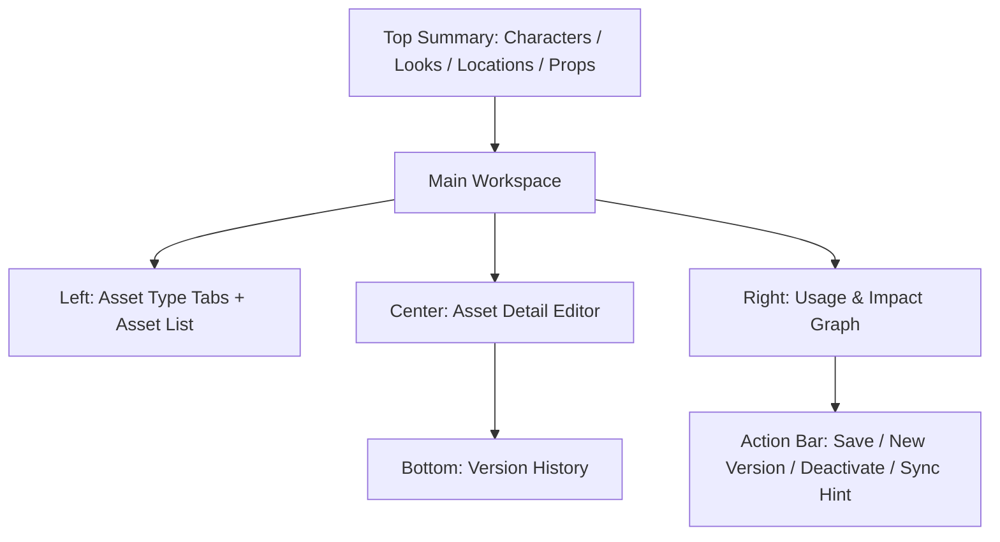

# Asset Ledger Spec v1.0

## 1. 文档目标

- 将 `设定台账` 细化到可直接进入 UI 设计与接口实现的粒度。
- 覆盖页面结构、字段定义、按钮动作、版本策略、引用关系、空态、错态、抽屉、弹窗和页面原型。
- 让角色、look、场景、道具成为稳定的事实层核心来源。

## 2. 模块定位

设定台账不是“资料编辑页”，而是：

- 角色真相源
- 造型版本真相源
- 场景与道具真相源
- 引用关系可追溯中心

它负责：

- 管理 `Character / CharacterLook / Location / Prop`
- 维护 continuity 规则
- 维护被 scene / shot 引用的可见性

它不负责：

- 直接生成 prompt
- 直接创建生产任务
- 自动修改分镜事实

## 3. 页面目标

用户进入后需要完成：

1. 创建和维护角色、look、场景、道具
2. 为角色维护多 look 版本及默认值
3. 查看某个资产被哪些 scene/shot 引用
4. 在变更资产时评估影响范围
5. 将资产变更同步给下游模块（通过提示，不直接强改）

## 4. 页面信息架构

### 4.1 页面区块

页面分为 6 个核心区域：

1. 顶部资产概览栏
2. 左侧类型导航与列表
3. 中央资产详情编辑区
4. 右侧引用关系图
5. 底部版本历史区
6. 全局资产动作栏

## 5. 页面主原型

## 6. 顶部资产概览栏规格

### 6.1 展示内容

- 角色总数
- look 总数
- 场景总数
- 道具总数
- 未同步变更数
- 引用冲突数

### 6.2 字段定义

- `characterCount`
- `lookCount`
- `locationCount`
- `propCount`
- `unsyncedChangesCount`
- `referenceConflictCount`

数据来源：

- 概览计数为**派生聚合**，由 `GET /api/projects/:projectId/characters`（及 locations/props）列表端点的项目级 summary 段返回，或由专用 usage 聚合计算，不落库
- `unsyncedChangesCount`：下游存在引用了失效造型（`look_id.is_current=false`）的 scene/shot 数（见 §15.3 检测口径）
- `referenceConflictCount`：被引用却处于 `disabled` 的资产数（见 §11.3 冲突判定）

## 7. 左侧类型导航与列表规格

### 7.1 类型导航

- `Characters`
- `Looks`
- `Locations`
- `Props`
- `Style Guide`

### 7.2 列表项公共字段

- `name`
- `status`
  - active / disabled
- `updatedAt`
- `usageCount`
  - 派生：该资产被 scene/shot 引用总数，由列表端点内联返回（复用 `GET /api/assets/:assetType/:assetId/usage` 的计数口径），不落库
- `unsyncedFlag`
  - 派生：该资产存在失效造型引用时为 true（见 §15.3），不落库

### 7.3 列表操作

- 搜索
- 按状态筛选
- 按最近更新排序
- 新建资产

### 7.4 空状态

- 当前类型无资产
  - 文案：`还没有该类型资产，先创建一个。`
  - 动作：`新建`

## 8. 中央资产详情编辑区规格

### 8.1 Character 详情

#### 字段

- `name`
- `roleType`
- `genderPresentation`
- `ageRange`
- `identitySummary`
- `personality`
- `motivation`
- `taboos`
- `speechStyle`
- `status`
- `version`

#### 动作

- 保存角色
- 停用角色
- 查看关联 look
- 新建 look

### 8.2 CharacterLook 详情

#### 字段

- `characterId`
- `lookGroupId`
- `versionNo`
- `previousLookId`
- `lookName`
- `lookType`
- `appearanceSpec`
- `hairSpec`
- `makeupSpec`
- `wardrobeSpec`
- `propsSpec`
- `continuityRules`
- `status`
- `isCurrent`
- `isDefault`
- `version`

#### 动作

- 保存 look（`PATCH /api/character-looks/:lookId`，必带 `version`）
- 设为默认 look
- 新建版本（`POST /api/characters/:characterId/looks`，携带 `sourceLookId`）
- 停用 look（`PATCH /api/character-looks/:lookId` 置 `status=disabled`）

#### 规则

- 同一角色只能有一个默认 look（由部分唯一索引 `idx_character_looks_default_current_unique` 保证 `is_default=1 AND is_current=1` 唯一）
- 停用默认 look 前必须指定新默认值
- look 采用“一版本一行”存储，`lookGroupId + versionNo` 唯一
- `isCurrent=true` 仅保留在最新版本，历史版本保留引用但不可直接覆盖

#### 写操作原子性

- **设为默认 look**：走 `PATCH /api/character-looks/:lookId`（`isDefault=true`），服务端在同一事务内把该角色其余 look 的 `is_default` 置 `false`，再置目标为 `true`；避免出现两个默认
- **新建版本**：同一事务内新增新行（`version_no+1`、`is_current=true`、`previous_look_id` 指向旧行）并把旧行 `is_current` 置 `false`；旧行保留供历史引用，不删除
- 两个写操作均带乐观锁 `version`，冲突返回 `version_conflict`

### 8.3 Location 详情

#### 字段

- `name`
- `locationType`
- `visualSpec`
- `spaceRules`
- `lightingRules`
- `continuityRules`
- `status`
- `version`

#### 动作

- 保存场景
- 停用场景

### 8.4 Prop 详情

#### 字段

- `name`
- `propType`
- `visualSpec`
- `ownership`
- `continuityRules`
- `status`
- `version`

#### 动作

- 保存道具
- 停用道具

### 8.5 Style Guide 详情

#### 字段

- `visualStyle`
- `cameraStyle`
- `colorScript`
- `forbiddenPatterns`
- `referenceNotes`
- `version`

#### 动作

- 保存风格规则
  - 端点：首次 `POST /api/projects/:projectId/style-guides`；后续 `PATCH /api/style-guides/:styleGuideId`（必带 `version`）
  - **V1 不做风格版本历史**：style_guides 仅 `version` 乐观锁列，无版本历史表 / 快照，不提供「新建风格版本」动作（见 §15.2）

## 9. 右侧引用关系图规格

### 9.1 模块目标

- 清晰展示当前资产被哪些 scene / shot 引用。

### 9.2 展示内容

- `Referenced Scenes`
- `Referenced Shots`
- `Reference Type`
  - character use
  - look use
  - prop use
  - location use
- `lastUsedAt`

### 9.3 影响提示

- 当前资产字段变更后：
  - 影响 scene 数
  - 影响 shot 数
  - 影响 confirmed prompt 数

### 9.4 动作

- 跳转到引用场景
- 跳转到引用镜头
- 查看所有受影响对象

数据来源：`GET /api/assets/:assetType/:assetId/usage`（返回 Referenced Scenes / Shots / Reference Type / lastUsedAt），为资产级反查唯一端点。

## 10. 底部版本历史区规格

### 10.1 版本对象

- **仅 `CharacterLook` 版本化**：版本历史区只对当前选中角色的 look 组（`look_group_id`）展示多版本行
- `characters / locations / props / style_guides` **V1 不做历史版本快照**：无版本历史表、无 snapshot 表，仅保留单个 `version` 乐观锁列
  - 选中这些类型时，版本历史区收起或显示「该资产类型不启用版本历史（V1）」，不提供「新建版本 / 复制为新版本」动作

### 10.2 列字段（仅 CharacterLook）

- `versionNo`
- `createdAt`
- `createdBy`
- `changeSummary`
- `isCurrent`

### 10.3 动作（仅 CharacterLook）

- 查看版本详情
- 对比前一版本
- 复制为新版本（= 新建 look 版本，见 §8.2）

### 10.4 规则

- 已引用的 look 版本不允许直接覆盖，通过新版本替代旧版本
- 非 look 资产的「变更」即原地 `PATCH`（乐观锁），不产生历史行

## 11. 全局资产动作栏规格

### 11.1 操作按钮

- `保存`
- `新建`
- `新建版本`（**仅 CharacterLook 可见**；非 look 资产不显示，见 §10.1）
- `停用`
- `重新启用`（仅当前对象 `status=disabled` 时显示）
- `查看影响`

### 11.2 启用条件

- `新建版本`
  - 当前对象为 CharacterLook 且已存在
- `停用`
  - 当前对象状态为 active
- `重新启用`
  - 当前对象状态为 disabled，端点 `PATCH` 置 `status=active`（必带 `version`）

### 11.3 停用规则与引用冲突

- V1 工作台不提供 Character / Location / Prop 的硬删除（无 DELETE 路由），统一 `PATCH status=disabled`
- **停用前置校验**：停用前调用 usage 反查，若对象仍被 scene/shot 引用：
  - 默认不允许直接停用，返回 `blocked_by_issue`（`details` 列出引用点），提示先替换引用或指定替代资产
  - 停用默认 look 前必须先指定新默认 look（见 §8.2）
- **referenceConflict 定义**：资产处于 `disabled` 但仍被 active scene/shot 引用，即为引用冲突，计入 §6.2 `referenceConflictCount`，需在引用处替换后消解

## 12. Create Asset Modal

### 用途

- 创建 Character / Look / Location / Prop。

### 字段

- `assetType`
- `name`
- `baseTemplate`（可选）
  - 语义：仅作为**新对象初始字段的预填模板**（如角色档位、场景类型的默认结构骨架），不复制任何外部作品的具体内容，与 reference-adoption-policy「禁止复制内容模板」边界一致
  - 为空时创建全空白资产

### 动作

- `创建`
- `取消`

### 重名与唯一约束

- `characters` / `props` 在库层有 `UNIQUE(project_id, name)`：同项目重名创建返回 `validation_failed`（重名提示，附「改名 / 打开已有」）
- `locations` V1 无库级唯一约束：创建前做同名软校验并二次确认，避免误建重复场景

## 13. New Look Version Modal

### 用途

- 基于当前 look 创建新版本。

### 字段

- `sourceLookVersion`
- `newVersionLabel`
- `changeReason`

### 动作

- `创建版本`
- `取消`

## 14. Impact Analysis Drawer

### 用途

- 在保存前展示影响范围。

### 展示内容

- 受影响 scenes
- 受影响 shots
- 受影响 confirmed prompts
- 需要重新编译建议

### 动作

- `继续保存`
- `返回修改`

### 数据来源

- 影响范围为**资产级**，来源 `GET /api/assets/:assetType/:assetId/usage`（受影响 scenes / shots，及其关联的 confirmed prompt 数）
- 与项目级 `POST /api/projects/:projectId/preview-impact`（Project Setup 用）作用域不同，本抽屉不复用项目级端点
- 「需要重新编译建议」由受影响 shot/scene 上存在 `status=confirmed` 的 PromptSpec 派生，仅提示不自动触发

## 15. 状态与版本策略

### 15.1 资产状态

- `active`
- `disabled`

### 15.2 look 版本策略

- 同一角色可有多个 look 版本
- 必须有且仅有一个默认 look
- 旧版本可保留引用，不强制迁移
- `lookGroupId + versionNo` 是版本主键语义，`id` 仅是行标识
- 版本升级通过“新建版本”完成，不允许覆盖历史行
- **仅 look 版本化**：`characters / locations / props / style_guides` 不做历史版本，仅 `version` 乐观锁（见 §10.1、data-and-api §7.4）

### 15.3 同步策略

- 资产变更后，不自动改写分镜
- 在分镜和 prompt 页面显示 `unsynced` 提示
- 由用户决定是否同步和重编译
- **下游 unsynced 检测口径**：`scene_characters` / `shot_characters` 记录 `look_id`。当某 look 被「新建版本」导致旧行 `is_current=false`，凡引用了该 `look_id`（`is_current=false`）的 scene/shot 即判为 `unsynced`，计入 §6.2 `unsyncedChangesCount` 与列表 `unsyncedFlag`
- 非 look 资产（character/location/prop 字段变更）不改变引用键，故仅提示影响范围（§14），不产生 look 式 unsynced 标记

### 15.4 并发保存策略

- Character / Look / Location / Prop / Style Guide 的保存请求都必须带当前 `version`（引用 adr-003）
- 服务端写入成功后递增 `version`
- 若返回 `version_conflict`，提供三动作：`比较差异` / `刷新并覆盖本地视图` / `重新编辑`（对齐 adr-003 §4.3），错误信封携带 `currentVersion` 与对象摘要

## 16. 空态 / 错态总表

### 16.1 无资产

- 文案：`当前没有资产。`
- 动作：`创建第一个资产`

### 16.2 引用数据加载失败

- 文案：`引用关系加载失败。`
- 动作：`重试`

### 16.3 保存失败

- 文案：`资产保存失败。`
- 动作：
  - `重试保存`
  - `查看错误详情`

### 16.4 版本冲突

- 文案：`当前对象已被更新，请刷新后再编辑。`
- 动作（对齐 adr-003 §4.3）：`比较差异` / `刷新并覆盖本地视图` / `重新编辑`

### 16.5 错误码映射（引用 adr-004）

- `validation_failed`：重名（characters/props 唯一约束）、必填缺失
- `version_conflict`：乐观锁冲突（见 §16.4）
- `blocked_by_issue`：停用仍被引用资产 / 停用默认 look 未指定替代（见 §11.3）
- `missing_resource`：资产 / 引用对象不存在
- 所有错态统一按 `ApiErrorEnvelope` 返回

### 16.6 首屏加载态（skeleton）

- 进入本页拉取资产概览 / 类型导航 / 资产详情 / 引用关系图快照期间，展示结构化骨架占位，不使用整页 spinner：
  - 顶部资产概览栏：指标卡骨架，保留概览分区结构
  - 左侧类型导航与列表：3~5 条灰条骨架，保留分组与列表轮廓
  - 中央资产详情编辑区：字段级骨架（名称 / 属性 / look 版本占位）
  - 右侧引用关系图：节点占位骨架，保留图区结构
- 局部刷新（切换资产、保存后回读、引用关系单独刷新）不清空已加载内容，仅对目标区域做局部 loading，避免闪烁与数据丢失
- 引用关系图作为独立数据块，可与主详情异步加载：主详情就绪后先展示，引用图区继续骨架直至就绪
- 首屏快照拉取失败时不停留在骨架态，走 §16 错态并提供 `重试`；重试成功后从骨架态平滑切换到真实内容

## 17. 页面交互链

### 17.1 标准主链

1. 选择资产类型
2. 新建或编辑资产
3. 查看引用关系
4. 评估影响范围
5. 保存
6. 下游模块看到 unsynced 提示

### 17.2 look 升级链

1. 选择角色默认 look
2. 新建 look 版本
3. 设为默认
4. 查看受影响镜头
5. 在分镜中决定是否替换

### 17.3 回跳上下文接收（navigation §6.3 握手，来自 Review Center）

- 入参：`scopeRef=artifactId`（命中的资产 id）+ `returnTo=review_center` + 固定 `projectId`。
- 接收行为：
  - 按 `scopeRef` 定位并选中对应资产（角色 / look / 场景 / 道具），展开其详情。
  - 顶部显示 `返回审查中心` 回跳入口，携带原始 `scopeRef`。
  - 用户修复后回到审查中心，可将对应 issue 标记 resolved / reopened。
- `returnTo` 缺失时不展示该回跳入口。

## 18. 页面级验收标准

- 角色、look、场景、道具均可稳定 CRUD
- look 版本规则正确执行
- 引用关系可追溯且跳转准确
- 停用策略不会造成悬空引用
- 资产变更后下游能收到同步提示

## 19. 接口契约（强绑定，权威见 data-and-api §7.4）

角色与 look：

- `GET /api/projects/:projectId/characters`
- `POST /api/projects/:projectId/characters`
- `PATCH /api/characters/:characterId`（必带 `version`；停用 / 重新启用走 `status`）
- `GET /api/characters/:characterId/looks`
- `POST /api/characters/:characterId/looks`（新建 look 版本）
- `PATCH /api/character-looks/:lookId`（必带 `version`；含「设为默认」）

场景 / 道具 / 风格：

- `GET|POST /api/projects/:projectId/locations`、`PATCH /api/locations/:locationId`（必带 `version`）
- `GET|POST /api/projects/:projectId/props`、`PATCH /api/props/:propId`（必带 `version`）
- `GET /api/projects/:projectId/style-guides`、`POST /api/projects/:projectId/style-guides`、`PATCH /api/style-guides/:styleGuideId`（必带 `version`）

反查：

- `GET /api/assets/:assetType/:assetId/usage`（引用反查 / 影响范围 / usageCount 计数来源）

契约边界：

- V1 **不暴露** characters / locations / props 的硬删除路由，统一 `PATCH status=disabled`
- 版本策略：仅 `character_looks` 造型版本化；`characters / locations / props / style_guides` 仅 `version` 乐观锁，**无历史版本表 / 版本 POST 端点**

## 20. 一句话结论

- 设定台账是平台事实层的“稳态底座”：如果这里不严谨，后续分镜、prompt、生产都会失稳；如果这里收敛好，整个平台才能真正可维护、可追溯。
