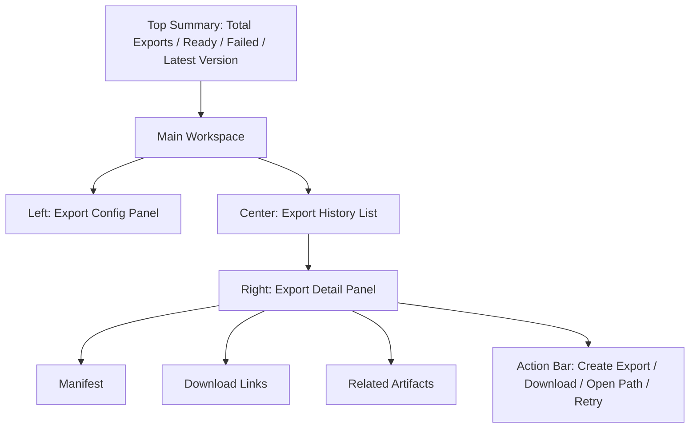

# Export Center Spec v1.0

## 1. 文档目标

- 将 `导出中心` 细化到可直接进入 UI 设计与接口实现的粒度。
- 覆盖页面结构、字段定义、按钮动作、导出状态、空态、错态、抽屉、弹窗和页面原型。
- 让导出成为平台统一的交付与归档出口。

## 2. 模块定位

导出中心不是“下载页”，而是：

- 文本交付包出口
- 媒体素材包出口
- 成片与 bundle 归档页
- 版本可追溯的交付记录中心

它负责：

- 创建导出任务
- 展示导出状态
- 提供 manifest 预览
- 提供下载和路径查看

它不负责：

- 编辑内容
- 修复任务失败
- 修改 artifact 数据

> 导出编排：创建导出经 Job Orchestrator 生成一个 `compose_export` 任务，由 Compose Worker 执行（FFmpeg 拼接 / 字幕烧录 / 打包，见 job-orchestrator §10.5）；`export_bundle.status` 由该任务状态驱动（见 adr-006 §5、§7.6、§14.3）。导出中心自身不执行拼包，也不修复任务失败。

## 3. 页面目标

用户进入后需要完成：

1. 选择导出类型和范围
2. 创建导出任务
3. 查看导出任务状态
4. 打开导出详情
5. 查看 manifest
6. 下载导出包或打开本地路径

## 4. 页面信息架构

### 4.1 页面区块

页面分为 5 个核心区域：

1. 顶部导出概览栏
2. 左侧导出配置区
3. 导出历史列表区
4. 右侧导出详情区
5. 全局导出动作栏

## 5. 页面主原型



## 6. 顶部导出概览栏规格

### 6.1 展示内容

- 导出总数
- 在途（queued / running）数
- ready 数
- failed 数
- latest bundle version
- latest export time

### 6.2 字段定义

- `exportCount`
- `inflightCount`（`status ∈ {queued, running}` 计数，体现在途导出）
- `readyCount`
- `failedCount`
- `latestVersion`
- `latestExportAt`

### 6.3 操作

- `只看失败导出`
- `打开最新导出`

## 7. 左侧导出配置区规格

### 7.1 支持导出类型

- `script_bundle`
- `asset_bundle`
- `episode_delivery_bundle`
- `project_archive_bundle`
- `final_video_bundle`

### 7.2 配置字段

- `bundleType`
- `scopeType`
  - project
  - episode
  - scene
- `scopeRef`
- `versionLabel`
- `includeManifest`
- `includeReviewSummary`
- `includeOriginalPrompts`
- `includeArtifacts`

### 7.3 规则

- `final_video_bundle` 需要存在可用视频 artifact
- `episode_delivery_bundle` 需要存在该集相关产物
- `project_archive_bundle` 可跨多集
- **创建前预检**：对所需 artifact 按 `data-and-api-v1.md` §6.1 做文件存在性检查；缺失时返回 `path_missing` 错误信封并**阻断创建**（不写 bundle、不建任务），提示回生产中心补齐
- **门禁**：存在阻塞 issue（Review §12.4）时返回 `blocked_by_issue`，阻断导出

### 7.4 动作

- `创建导出任务`
- `重置配置`

### 7.5 空状态

- 无可导出对象
  - 文案：`当前没有可导出的对象或产物。`
  - 动作：`前往生产中心`

### 7.6 创建导出编排流程（经 Job Orchestrator）

依 adr-006 §5，`创建导出任务` = `POST /api/exports`，在同一请求内：

1. 写入 `export_bundles` 记录（初始 `status=queued`，服务端生成 `version`，见 §7.7）
2. 经 Job Orchestrator 创建一个 `compose_export` 任务（Compose Worker 执行，见 job-orchestrator §10.5）
3. 返回 `exportId` 与 `composeTaskId`

- **1:1 关联**：`export_bundles.compose_task_id` 关联该 `compose_export` 任务
- **status 由任务驱动**：`export_bundle.status` 随任务状态映射（见 §14.3），bundle 不引入独立于任务的状态真相
- **创建前预检 / 门禁**：按 §7.3 执行 `path_missing` 预检与 `blocked_by_issue` 门禁，未通过不写 bundle、不建任务
- **成功回写**：任务 `succeeded` 时同事务写入 `output_path` / `manifest` / `bundle_size_bytes` 并生成 bundle artifact（job-orchestrator §12.1）

### 7.7 version 生成规则

- `export_bundles.version` 为 NOT NULL 必填，由**服务端生成**，不依赖用户手填
- 用户可选填 `versionLabel`（语义标签，如 `v1-final`）；`version` = 规范化时间序版本号（如 `YYYYMMDD-HHmmss` 或按 `bundleType + scope` 递增序号），保证唯一
- `versionLabel` 为空时 `version` 仍必然生成；同一 scope 重复导出生成新的 `version`

### 7.8 从 Production Hub 预填与回跳

- 从 Production Hub 携带 `sourceRefs` / `artifactRefs` 进入时（navigation §6.4），预填 `scopeType` / `scopeRef` 并勾选相关 artifact
- 完成或取消后按 `returnTo=export_center` / `returnTo=production_hub` 回跳来源页

## 8. 导出历史列表区规格

### 8.1 展示形式

- 默认 `history table`
- 支持 `compact card view`

### 8.2 列定义

- `exportId`
- `bundleType`
- `scopeLabel`
- `version`
- `status`
- `outputPath`
- `createdAt`
- `finishedAt`

### 8.3 行级动作

- 查看详情
- 下载
- 打开路径
- 重试导出

### 8.4 状态定义

- `queued`
- `running`
- `ready`
- `failed`

### 8.5 加载态与中断恢复

- 列表首屏拉快照期间展示骨架行（table skeleton），保留列结构占位
- 应用关闭后重启：`queued` / `running` 的在途导出按关联 `compose_export` 任务实际状态回填展示，不丢失在途记录（对齐 §14.3 状态映射）

## 9. 右侧 Export Detail Panel 规格

### 9.1 区块 A：导出头信息

字段：

- `exportId`
- `bundleType`
- `version`
- `status`
- `createdAt`
- `finishedAt`

### 9.2 区块 B：Scope 信息

字段：

- `scopeType`
- `scopeRef`
- `scopeLabel`

### 9.3 区块 C：Manifest 预览

字段：

- `manifestVersion`
- `includedArtifactsCount`
- `includedPromptCount`
- `includedReviewIssueCount`
- `sourceVersions`

### 9.4 区块 D：下载与路径

字段：

- `outputPath`
  - 存储为项目数据目录下的相对路径
- `downloadUrl`
- `bundleSize`

动作：

- `下载`
- `打开路径`
- `复制路径`

### 9.5 区块 E：关联资源

展示：

- 关联 artifact 列表
- 关联 promptSpec 列表
- 关联 review summary

## 10. 全局导出动作栏规格

### 10.1 操作按钮

- `创建导出`
- `下载当前导出`
- `打开本地路径`
- `重试当前导出`

### 10.2 启用条件

- `下载当前导出`
  - 当前状态为 `ready`
- `打开本地路径`
  - `outputPath` 存在
- `重试当前导出`
  - 当前状态为 `failed`

## 11. Create Export Modal

### 用途

- 在创建前再次确认导出范围和内容。

### 展示字段

- `bundleType`
- `scopeLabel`
- `versionLabel`
- `includeManifest`
- `includeArtifacts`
- `includeReviewSummary`

### 动作

- `确认创建`
- `取消`

## 12. Export Manifest Drawer

### 用途

- 以结构化方式查看 manifest 内容。

### 展示内容

- 版本信息
- 文件列表
- source versions
- prompt versions
- artifact refs
- review summary refs

### 动作

- `复制 manifest JSON`
- `下载 manifest`

## 13. Retry Export Modal

### 用途

- 对 failed 的导出任务重新执行。

### 展示字段

- `exportId`
- `failedReason`
- `bundleType`
- `scopeLabel`

### 动作

- `确认重试`
- `取消`

### 规则

- retry = 对同一 `export_bundle` 经 `POST /api/exports/:exportId/retry` 重新创建一个 `compose_export` 任务，复用原 `version` / 配置，刷新 bundle `status` 回 `queued`，**不新建 bundle 记录**（`compose_task_id` 指向新任务）
- 仅 `failed` 导出可重试；非法状态返回 `invalid_state`
- 与 §14.2「同一 `versionLabel` 再导出」区分：retry 是原 bundle 原地重跑，不触发版本覆盖确认

## 14. 导出状态机

### 14.1 状态定义

- `queued`
- `running`
- `ready`
- `failed`

### 14.2 规则

- ready 状态导出不可被静默覆盖
- 同一 `versionLabel` 再次导出需弹出**覆盖确认弹窗**（提示已存在同标签导出，确认后生成新 `version` 的新 bundle，不覆盖原 ready bundle）
- failed 导出允许重试

### 14.3 状态映射（由 compose_export 任务驱动）

依 adr-006 §5，`export_bundle.status` 由关联 `compose_export` 任务状态映射，导出中心只读该映射结果：

- task `queued` → bundle `queued`
- task `running` → bundle `running`
- task `succeeded` → bundle `ready`（同事务写入 `output_path` / `manifest` / `bundle_size_bytes`，并生成 bundle artifact）
- task `failed` → bundle `failed`（写入 `error_message` 与错误码）
- task `cancelled` → bundle `failed`（视为导出中止）

## 15. manifest 约束

### 15.1 每个导出包必须包含

- `bundleType`
- `version`
- `createdAt`
- `scope`
- `includedFiles`
- `sourceRefs`
- `artifactRefs`
- `promptRefs`
- `reviewRefs`

### 15.2 目标

- 让导出包具备完全可追溯性

### 15.3 manifest 结构定义

`export_bundles.manifest` 的唯一权威结构为 `data-and-api-v1.md` §6 `ExportManifest`；本页不另立字段，结构如下（与权威同步，仅供本页阅读）：

```ts
// 权威见 data-and-api-v1.md §6 ExportManifest
interface ExportManifest {
  bundleType: string;
  version: string;
  createdAt: string;
  scope: { scopeType: string; scopeRefId?: string; scopeLabel?: string };
  includedFiles: Array<{ path: string; sizeBytes?: number; artifactId?: string }>;
  sourceRefs: Array<{ entityType: string; entityId: string; version?: number }>;
  artifactRefs: string[];
  promptRefs: string[];
  reviewRefs: string[];
  counts: {
    includedArtifactsCount: number;
    includedPromptCount: number;
    includedReviewIssueCount: number;
  };
}
```

- §9.3 Manifest 预览字段与 §15.1 必备字段均为该结构的投影：`manifestVersion = version`，`includedArtifactsCount / includedPromptCount / includedReviewIssueCount = counts.*`，`sourceVersions` 取自 `sourceRefs[].version`，二者不再各自维护一套字段列表

## 16. 空态 / 错态总表

### 16.1 无导出记录

- 文案：`还没有导出记录。`
- 动作：`创建第一次导出`

### 16.2 导出失败

- 文案：`导出未完成。`
- 触发：关联 `compose_export` 任务 `failed` / `cancelled`
- 展示 `error_message` 与错误码（对齐 adr-004 §4，如 `provider_unavailable` / `path_missing` / `internal_error`）
- 半成品清理：失败时 Compose Worker 已写入的临时文件由任务失败回写清理，bundle 保留记录与 `error_message` 以便 retry
- 动作：
  - `查看错误`
  - `重试导出`

### 16.3 路径失效（path_missing）

- 文案：`导出记录存在，但文件路径不可用。`
- 触发：`ready` bundle 的 `output_path` 存在性检查失败（data-api §6.1），返回 `path_missing`
- 动作：
  - `重新校验路径`
  - `重新导出`

### 16.4 下载未就绪（export_not_ready）

- 触发：bundle 未 `ready` 时调用 `GET /api/exports/:exportId/download`
- 服务端返回 `export_not_ready` 错误信封（adr-004 §6.2），前端提示等待导出完成，不提供下载入口

## 17. 页面交互链

### 17.1 标准主链

1. 选择导出类型
2. 设置范围和版本号
3. 创建导出任务
4. 等待导出完成
5. 查看 manifest
6. 下载或打开路径

### 17.2 失败返工链

1. 导出 failed
2. 查看失败原因
3. 判断缺少 artifact 还是文件写入失败
4. 重试导出或返回生产中心补齐（携带 `sourceRefs` / `artifactRefs` 与 `returnTo=export_center`，navigation §6.4）

### 17.3 实时更新（先快照 + SSE + 轮询兜底）

- 首屏：先拉快照（`GET /api/projects/:projectId/exports` 列表 + 选中 `GET /api/exports/:exportId`），再订阅 SSE（adr-002 §7）
- **复用 `task.status.changed`**（adr-002 §5）：Export Center 通过 `composeTaskId` 订阅任务事件，刷新 bundle `status` 与进度；V1 **不新增导出专用事件主题**
- 兜底：SSE 不可用时按 `data-and-api-v1.md` §7.12 定频轮询 `GET /api/exports/:exportId`

## 18. 页面级验收标准

- 所有导出都有唯一 `exportId` 和 `version`
- 所有 ready 导出都能找到有效 outputPath
- manifest 信息完整可追溯
- failed 导出可重试
- 历史导出可查询

## 19. 后续接口映射建议

- `POST /api/exports`
  - 写 `export_bundle` + 经 Job Orchestrator 建 `compose_export` 任务，返回 `exportId` 与 `composeTaskId`
- `GET /api/projects/:projectId/exports`
- `GET /api/exports/:exportId`
  - `status` 由关联 `compose_export` 任务驱动
- `POST /api/exports/:exportId/retry`
  - 原 bundle 重新建 `compose_export` 任务
- `GET /api/exports/:exportId/manifest`
- `GET /api/exports/:exportId/download`
  - 未 `ready` 时返回 `export_not_ready` 错误信封

## 20. 一句话结论

- 导出中心不是下载页，而是平台最终交付和归档的出口：它必须把 bundle、manifest、版本和路径全部可追溯化，保证任何一次交付都能被完整回放。
