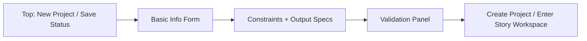
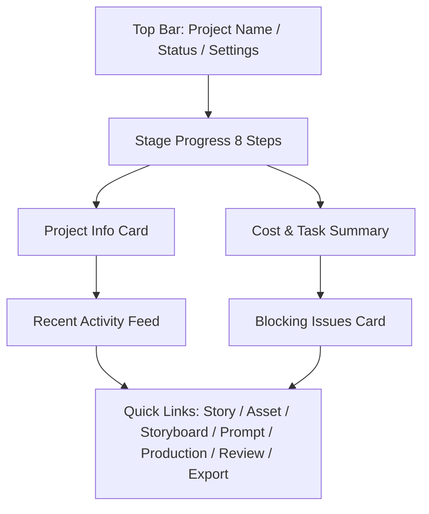
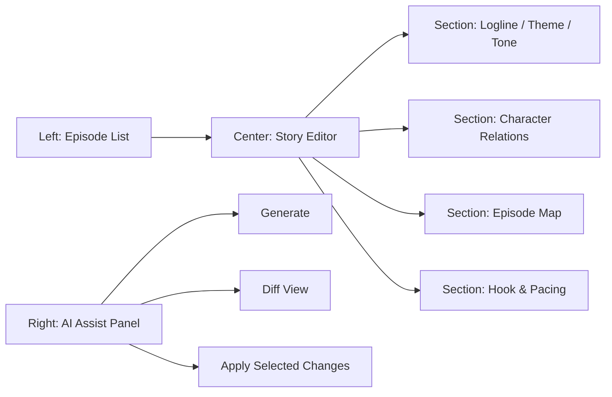
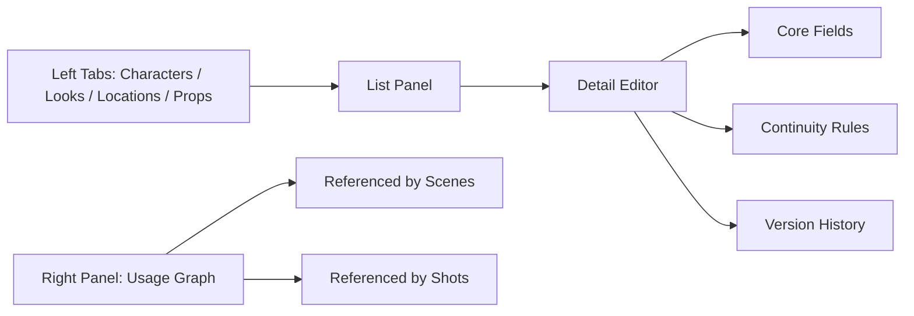
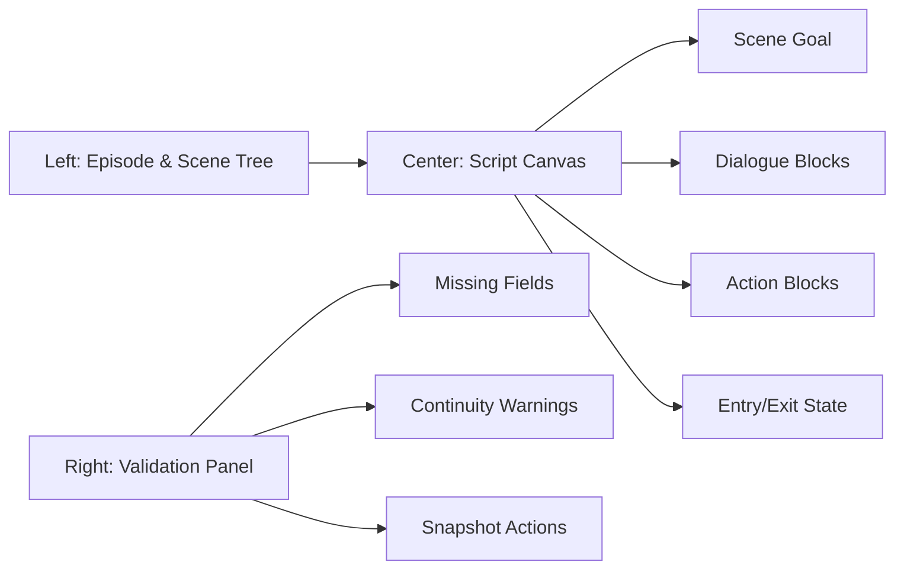
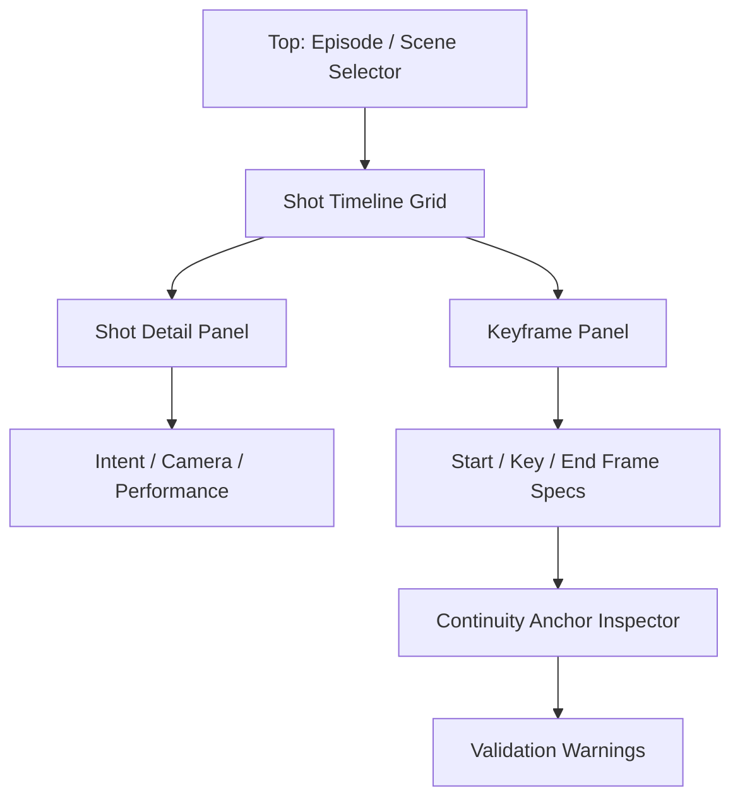
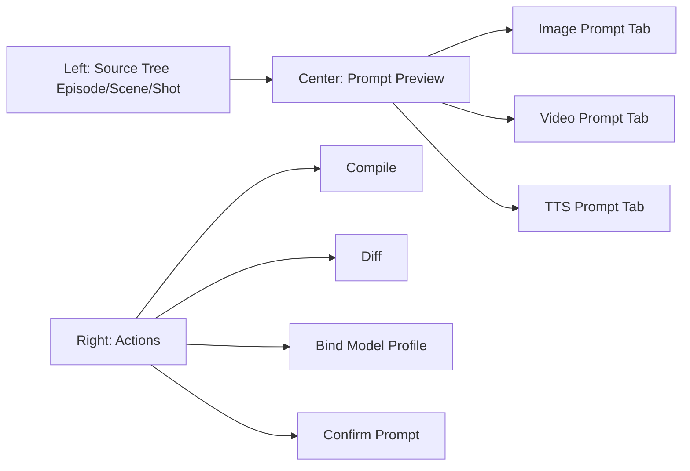
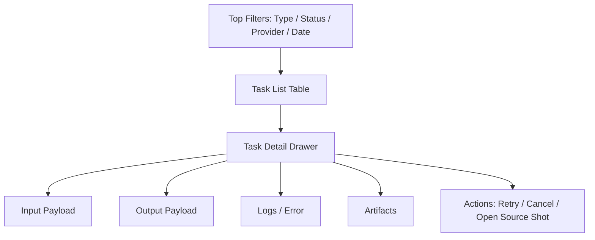
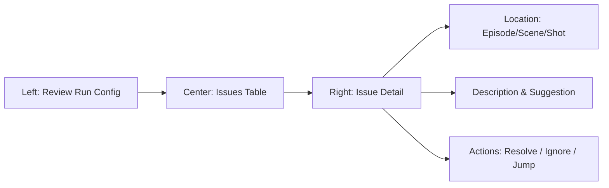
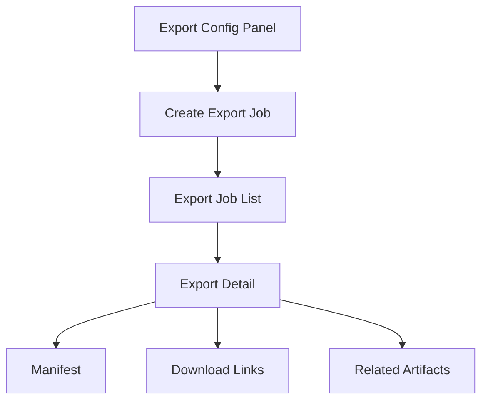

# PRD Modules and Prototypes v1.0

## 1. 文档说明

- 目标：把 PRD 细化到可开发粒度，并给每个模块对应页面级原型图。
- 形式：`功能规格 + 交互效果 + 验收标准 + Mermaid 线框原型`。
- 范围：覆盖 V1 全部模块。

## 2. 全模块清单

1. 项目初始化模块（Project Setup）
2. 项目总览模块（Project Dashboard）
3. 故事开发模块（Story Workspace）
4. 设定台账模块（Asset Ledger）
5. 剧本编辑模块（Script Editor）
6. 分镜导演台模块（Storyboard Studio）
7. Prompt 中心模块（Prompt Center）
8. 生产中心模块（Production Hub）
9. 审查中心模块（Review Center）
10. 导出中心模块（Export Center）

---

## 3. 模块 0：项目初始化（Project Setup）

### 3.1 模块目标

- 提供项目级事实输入入口，完成项目初始化与设置。

### 3.2 功能明细

- 基础信息
  - 项目名、题材、受众、语言、画幅、集数、单集时长。
- 创作约束
  - 风格方向、世界规则、合规级别、目标地区。
- 输出规格
  - 导出预设、字幕语言、默认模型策略。
- 项目设置编辑
  - 支持后续进入编辑模式并进行影响评估。

### 3.3 实际效果要求

- 初始化后可直接进入故事开发。
- 关键字段变更时必须展示影响范围。

### 3.4 验收标准

- 必填字段校验完整。
- 初始化结果可稳定持久化并可回显。
- 编辑模式与新建模式行为明确。

### 3.5 页面原型图

---

## 4. 模块 1：项目总览（Project Dashboard）

### 4.1 模块目标

- 提供项目当前阶段、健康度、成本、阻塞项的一屏总览。

### 4.2 功能明细

- 项目基础信息卡
  - 展示项目名、题材、集数、画幅、语言、状态。
  - 支持进入项目设置编辑。
- 阶段进度条
  - 展示 9 个阶段状态：未开始 / 进行中 / 已完成 / 阻塞。
  - 点击阶段可跳转对应模块页面。
- 最近活动流
  - 按时间倒序展示最近编辑、任务、审查、导出事件。
- 风险与阻塞卡
  - 展示高优先级 review issue。
  - 支持一键跳转到问题定位页面（scene / shot）。
- 成本与任务摘要
  - 展示今日任务数、成功率、失败率、累计成本。
  - 支持跳转生产中心查看详情。

### 4.3 实际效果要求

- 首屏 3 秒内可判断项目是否可继续生产。
- 阻塞项必须在首屏可见，不可埋到二级页面。
- 所有关键卡片支持深链跳转。

### 4.4 验收标准

- 用户进入后 1 次点击内可到达任一阶段页面。
- 风险卡点击后可直接定位到具体 issue。
- 阶段状态与真实数据一致，无缓存错位。

### 4.5 页面原型图

---

## 5. 模块 2：故事开发（Story Workspace）

### 5.1 模块目标

- 让故事从“想法”变为结构化可生产的故事事实层。

### 5.2 功能明细

- 项目故事定位
  - logline、主题、受众、情绪基调、商业目标。
- 角色关系与主线副线
  - 角色关系图、冲突轴、成长线。
- 分集地图
  - 每集目标、冲突、钩子、结尾悬念。
- 节奏与钩子规划
  - 快慢节奏分布、强钩子位置校验。
- AI 辅助生成
  - 生成故事骨架、分集摘要、角色关系建议。
  - 支持“保留人工内容，仅补全缺失字段”。

### 5.3 实际效果要求

- 任何 AI 生成都不能覆盖人工已确认内容。
- 每集必须有可追踪“集目标 + 集钩子 + 集结尾”。
- 允许逐字段确认，不强制整页确认。

### 5.4 验收标准

- 故事页保存后可稳定回显。
- 分集地图可用于后续剧本/分镜生成输入。
- 关键字段缺失时阻止推进到下阶段。

### 5.5 页面原型图

---

## 6. 模块 3：设定台账（Asset Ledger）

### 6.1 模块目标

- 建立角色、服装、场景、道具的统一真相源。

### 6.2 功能明细

- 角色管理
  - 角色基本信息、性格、动机、说话风格。
- 角色外观版本管理
  - look 版本、默认 look、连续性规则。
- 场景管理
  - 场景视觉、空间规则、光线规则。
- 道具管理
  - 所属角色、道具状态、连续性规则。
- 引用关系检查
  - 哪些 scene/shot 正在引用某 look/prop。
  - 修改前提示影响范围。

### 6.3 实际效果要求

- 任一 look 变更必须可追踪版本。
- 被引用资产删除时必须拦截或引导替换。
- 资产变更不会自动覆盖已确认分镜，仅标记“待同步”。

### 6.4 验收标准

- 资产详情页可查看引用关系。
- look 版本切换后，引用镜头显示同步提示。
- 删除资产时不会出现悬空引用。

### 6.5 页面原型图

---

## 7. 模块 4：剧本编辑（Script Editor）

### 7.1 模块目标

- 把故事层转化为可分镜的 scene 级剧本结构。

### 7.2 功能明细

- 单集剧本编辑
  - 场次顺序、场次目标、场次摘要。
- 场景角色绑定
  - 为每个 scene 绑定角色和默认 look。
- 对白与动作描述
  - 支持角色台词与动作块编辑。
- 结构校验
  - 自动检查场次是否缺目标、缺冲突、缺承接。
- 版本快照
  - 支持保存里程碑版本用于回滚比对。

### 7.3 实际效果要求

- 场次顺序调整后，分镜页实时反映顺序变化。
- scene 信息变更不直接覆盖 shot，标记为“分镜待更新”。

### 7.4 验收标准

- 剧本可完整导出为结构化 scene 列表。
- 缺关键字段场次无法推进到分镜确认态。

### 7.5 页面原型图

---

## 8. 模块 5：分镜导演台（Storyboard Studio）

### 8.1 模块目标

- 以 shot 为核心管理镜头、关键帧、运镜与 continuity。

### 8.2 功能明细

- scene -> shot 拆分
  - 自动草拟 shot 列表，支持人工改写。
- 镜头详情编辑
  - shot type、意图、运镜、表演说明、时长。
- 关键帧管理
  - start / key / end frame 规格。
- continuity anchor
  - 明确与上一镜承接关系。
- 镜头检查
  - 检查角色 look 连续性、道具状态连续性、动作闭环。

### 8.3 实际效果要求

- 每个 shot 必须可定位关键帧和承接锚点。
- continuity 冲突必须可视化提示并可跳修。
- 分镜确认后才能进入 prompt 确认流程。

### 8.4 验收标准

- shot 列表可稳定排序并持久化。
- 关键帧状态与 shot 状态联动正确。
- continuity issue 能定位到具体 shot 字段。

### 8.5 页面原型图

---

## 9. 模块 6：Prompt 中心（Prompt Center）

### 9.1 模块目标

- 作为 Prompt Compiler 的 UI 承载层，实现“编译、对比、确认”。

### 9.2 功能明细

- 编译入口
  - 按 shot 或 scene 执行 image/video/tts 编译。
- prompt 结果预览
  - 展示结构化段落，不只一段纯文本。
- 差异对比
  - 对比当前版本与上次 confirmed 版本。
- 模型配置绑定
  - 为 prompt 绑定 model profile。
- 确认流转
  - draft -> confirmed -> superseded。

### 9.3 实际效果要求

- 所有生成任务必须引用 confirmed prompt。
- prompt 重新编译时，旧版本自动标记 superseded。
- UI 不允许手工拼接最终 prompt 段落。

### 9.4 验收标准

- 编译后生成 PromptSpec 并可追溯版本。
- 只有 confirmed 的 prompt 可创建任务。
- diff 视图能正确显示字段级变化。

### 9.5 页面原型图

---

## 10. 模块 7：生产中心（Production Hub）

### 10.1 模块目标

- 统一管理任务创建、执行状态、失败重试、产物回填。

### 10.2 功能明细

- 任务创建
  - 从 confirmed prompt 创建 image/video/tts/compose 任务。
- 队列管理
  - queued/running/succeeded/failed/cancelled 分类。
- 任务详情
  - 输入参数、模型信息、日志、错误信息、耗时、成本。
- 重试与取消
  - 对 failed 任务重试，对 queued/running 任务取消。
- 产物回填
  - 任务成功后自动生成 artifact 并绑定 source entity。

### 10.3 实际效果要求

- 任务状态变化实时可见。
- 失败原因可追踪到 provider 返回。
- 产物和任务必须一一可追溯。

### 10.4 验收标准

- 任务状态机合法，不出现非法跳转。
- 重试不污染原任务记录。
- 任务详情页可直接预览关联产物。

### 10.5 页面原型图

---

## 11. 模块 8：审查中心（Review Center）

### 11.1 模块目标

- 把剧情、资产、continuity、prompt、合规问题结构化管理。

### 11.2 功能明细

- 审查任务发起
  - 选择项目范围和审查类型运行。
- 问题列表
  - 按 severity、type、状态筛选。
- 问题详情
  - 展示定位信息、问题描述、修复建议。
- 修复闭环
  - 支持标记 resolved / ignored 并记录备注。
- 快速跳转
  - 一键跳到相关 scene/shot/prompt 页面。

### 11.3 实际效果要求

- issue 必须绑定明确定位维度（episode/scene/shot）。
- 高优先级 issue 在总览页同步显示。
- 忽略 issue 必须填写原因。

### 11.4 验收标准

- 审查运行后 issue 入库完整。
- issue 状态流转可追踪。
- 跳转定位准确，不出现死链。

### 11.5 页面原型图

---

## 12. 模块 9：导出中心（Export Center）

### 12.1 模块目标

- 提供标准化交付包导出能力与版本记录。

### 12.2 功能明细

- 导出配置
  - 选择导出类型：文本包 / 素材包 / 成片包。
- 导出任务
  - 创建导出任务并查看状态。
- 导出结果
  - 下载文件、查看 manifest、查看版本号。
- 导出历史
  - 按时间和类型查看历史导出记录。

### 12.3 实际效果要求

- 每次导出必须有 manifest，可追溯输入版本。
- 导出失败必须保留错误上下文。
- 同一版本导出不可被静默覆盖。

### 12.4 验收标准

- 导出完成后可下载且文件路径有效。
- 导出记录与任务、artifact 数据一致。
- 历史版本可查询并可再次下载。

### 12.5 页面原型图

---

## 13. 全局交互与状态规范

### 13.1 全局状态

- `empty`：无数据引导创建。
- `loading`：操作中显示进度。
- `error`：提供可重试入口与错误详情。
- `success`：有明确反馈且可继续下一步。

### 13.2 权限与动作约束（V1 单用户）

- 默认单用户，无复杂权限。
- 破坏性动作必须二次确认：
  - 停用资产（V1 工作台不提供硬删除）
  - 删除分镜
  - 覆盖 confirmed prompt

### 13.3 导航一致性

- 左侧模块导航固定。
- 顶部面包屑固定展示：项目 > 集 > 场 > 镜。
- 页面右上角统一提供“保存状态 + 最近保存时间”。

## 14. 开发映射（从原型到实现）

- 项目总览 -> `Project Dashboard feature`
- 故事开发 -> `Story feature`
- 设定台账 -> `Asset feature`
- 剧本编辑 -> `Script feature`
- 分镜导演台 -> `Storyboard feature`
- Prompt 中心 -> `Prompt feature`
- 生产中心 -> `Production feature`
- 审查中心 -> `Review feature`
- 导出中心 -> `Export feature`

## 15. 一句话结论

- 该文档把 V1 所有模块都细化到“可开发、可验收、可对照原型”的粒度，可直接作为下一步页面实现与接口联调基线。
