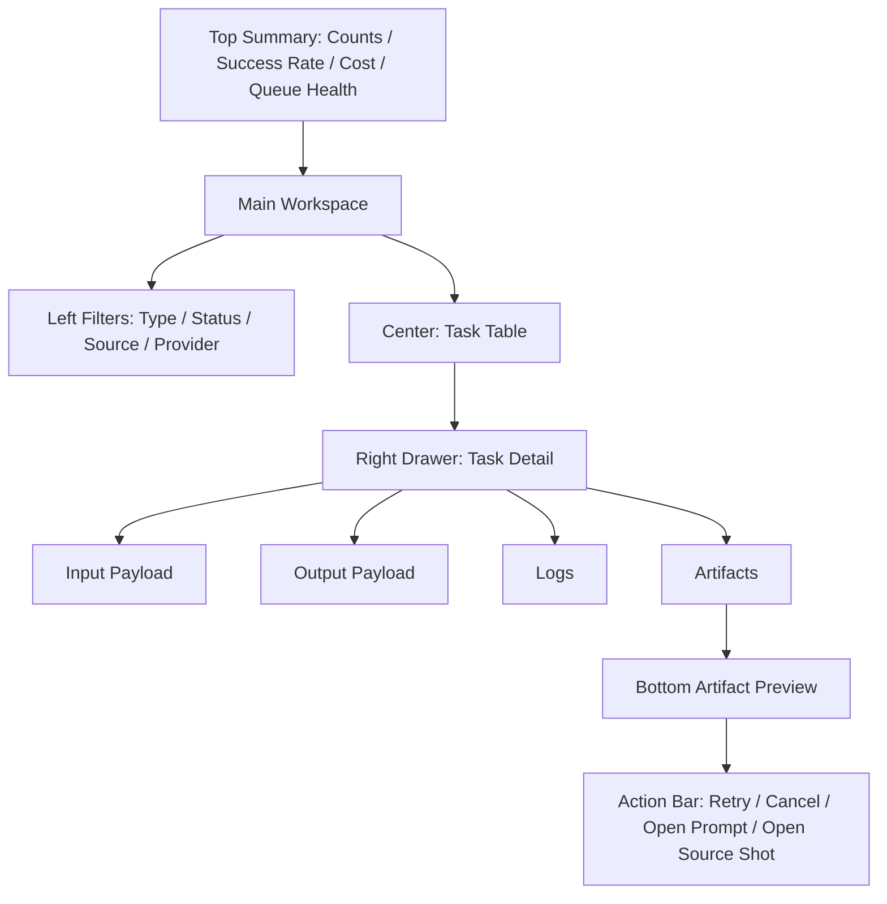

# Production Hub Spec v1.0

## 1. 文档目标

- 将 `生产中心` 细化到可直接进入 UI 设计与接口实现的粒度。
- 覆盖页面结构、字段定义、按钮动作、任务状态机映射、空态、错态、抽屉、弹窗和页面原型。
- 让 `Production Hub` 成为 `Prompt Center -> Job Orchestrator -> Artifact Service` 的统一 UI 入口。

## 2. 模块定位

生产中心不是“日志列表页”，而是：

- 执行任务的统一入口
- 任务状态和重试的控制台
- 产物回填的可视化面板

它负责：

- 从 confirmed prompt 创建任务
- 展示任务状态和错误
- 支持重试、取消、过滤、检索
- 展示 artifact 和 source entity 的关联

它不负责：

- 编译 prompt
- 修改故事、设定、分镜事实
- 直接拼接 provider 请求参数

## 3. 页面目标

用户进入该页面后，需要完成：

1. 查看所有任务的执行状态
2. 对任务按类型、状态、来源进行筛选
3. 查看单个任务的输入、输出、日志和产物
4. 对失败任务执行 retry
5. 对 queued / running 任务执行 cancel
6. 从任务反查 source shot / prompt / artifact

## 4. 页面信息架构

### 4.1 页面区块

页面分为 6 个核心区域：

1. 顶部上下文与统计栏
2. 左侧筛选与任务类型面板
3. 中央任务列表
4. 右侧任务详情抽屉
5. 底部产物预览区
6. 全局任务动作栏

## 5. 页面主原型

## 6. 顶部上下文与统计栏规格

### 6.1 展示内容

- 今日任务总数
- queued 数
- running 数
- failed 数
- succeeded 数
- success rate
- estimated cost
- latest error summary

### 6.2 字段定义

- `todayTaskCount`
- `queuedCount`
- `runningCount`
- `failedCount`
- `succeededCount`
- `successRate`
- `estimatedCost`
- `latestFailureTitle`

### 6.3 操作

- `只看失败任务`
- `只看运行中任务`
- `跳到最新错误`

### 6.4 数据来源与响应结构

- 统计栏数据取自 `GET /api/projects/:projectId/dashboard-metrics`，字段一一对应 §6.2
- 响应 schema（生产相关字段）：
  - `todayTaskCount` / `queuedCount` / `runningCount` / `failedCount` / `succeededCount`：整数计数
  - `successRate`：`succeededCount / (succeededCount + failedCount)`，分母为 0 时返回 `null`
  - `estimatedCost`：所选范围内任务 `costEstimate` 之和
  - `latestFailureTitle`：最近一条 `failed` 任务的摘要标题
- 该统计为**派生态**（不落库），统计口径以「今日」自然日 + 当前项目为默认范围
- 计数随 `task.status.changed`（adr-002 §5）被动刷新，SSE 不可用时随轮询兜底刷新

## 7. 左侧筛选面板规格

### 7.1 筛选维度

- `taskType`
  - image_generate
  - video_generate
  - tts_generate
  - compose_export（**只读展示**：由 Export Center 经 Job Orchestrator 创建，Production Hub 不提供该类型的创建入口，仅用于筛选与追踪，见 adr-006 §5）
- `status`
  - queued
  - running
  - succeeded
  - failed
  - cancelled
- `sourceEntityType`
  - episode
  - scene
  - shot
- `provider`
- `modelProfile`
- `dateRange`

### 7.2 快捷视图

- `我的失败任务`
- `待重试任务`
- `最近成功任务`
- `当前场相关任务`

### 7.3 空状态

- 没有匹配任务
  - 文案：`当前筛选条件下没有任务。`
  - 动作：`清空筛选`

### 7.4 列表查询 Contract

- `GET /api/tasks` 复用 `data-and-api-v1.md` 的统一列表 query contract
- `filters.taskType` / `filters.status` / `filters.sourceEntityType` / `filters.provider` / `filters.modelProfileId` 对应本页筛选项
- `createdFrom` / `createdTo` 对应日期范围
- `sortBy` 允许：`createdAt` / `startedAt` / `finishedAt` / `costEstimate`

## 8. 中央任务列表规格

### 8.1 模块目标

- 成为任务浏览和切换的主工作区。

### 8.2 展示形式

- V1 默认使用 `table view`
- 支持切换 `compact card view`

### 8.3 列定义

- `taskId`
- `taskType`
- `status`
- `sourceEntityLabel`
- `promptSpecVersion`
- `modelProfileName`
- `provider`
- `retryCount`
- `retryOfTaskId`
- `startedAt`
- `finishedAt`
- `durationMs`
- `usage`
- `costEstimate`

派生列来源说明：

- `sourceEntityLabel` / `promptSpecVersion` / `modelProfileName` / `provider` 为列表查询时 join `generation_tasks` 关联对象得到的**派生展示字段**，不单独落库
- `usage` 为 `generation_tasks.usage` 结构化对象，列表内展示为摘要（如 token / 时长 / 调用次数），完整内容在详情抽屉区块 E 查看

### 8.4 行级动作

- 查看详情
- 重试
- 取消
- 打开 source prompt
- 打开 source shot

### 8.5 状态显示规则

- `queued`
  - 灰色或中性色
- `running`
  - 高亮进行中
- `succeeded`
  - 成功态
- `failed`
  - 错误态
- `cancelled`
  - 低强调态

### 8.6 排序规则

- 默认按 `createdAt desc`
- 可按：
  - 最新开始
  - 最长耗时
  - 重试次数
  - 成本

### 8.7 空状态

- 没有任何任务
  - 文案：`还没有执行任务，先去 Prompt 中心确认 prompt。`
  - 动作：`前往 Prompt 中心`

### 8.8 加载态

- 列表首屏拉快照期间展示骨架行（table skeleton），保留列结构占位
- 分页 / 筛选切换时展示行级 loading，不清空已加载数据
- 快照加载失败复用 §16 错态处理

## 9. 右侧 Task Detail Drawer 规格

### 9.1 模块目标

- 展示单个任务的全部执行上下文。

### 9.2 区块 A：任务头信息

字段：

- `taskId`
- `taskType`
- `status`
- `priority`
- `retryCount`
- `createdAt`
- `startedAt`
- `finishedAt`

### 9.3 区块 B：Source Context

字段：

- `projectId`
- `sourceEntityType`
- `sourceEntityId`
- `sourceEntityLabel`
- `promptSpecId`
- `promptSpecVersion`

动作：

- `打开 source entity`
- `打开 source prompt`

跳转均携带 `taskId` 与 `returnTo=production_hub`（navigation §6.1），支持从来源页 / Prompt 中心回跳生产中心并定位原任务。

#### 9.3.1 回跳上下文接收（navigation §6.3 / §6.4 握手）

Production Hub 既是回跳的**发起方**，也是被回跳的**接收方**：

- **来自 Review Center（§6.3）**：入参 `scopeRef=shotId` / `promptSpecId` + `returnTo=review_center` + 固定 `projectId`。
  - 接收行为：定位并选中该 shot / prompt 关联的任务，顶部显示 `返回审查中心` 回跳入口（携带原始 `scopeRef`）。
- **来自 Export Center（§6.4）**：入参 `sourceRefs` / `artifactRefs` + `returnTo=export_center` + 固定 `projectId`。
  - 接收行为：过滤展示缺失 artifact 关联的任务，顶部显示 `返回导出中心` 回跳入口（携带原始 `sourceRefs` / `artifactRefs`）。
  - 用户补齐产物（重新生成成功）后，回跳入口可用，回到 Export Center 重试导出。
- 上述回跳入口按本次进入携带的 `returnTo` 互斥展示；`returnTo` 缺失时不展示。

### 9.4 区块 C：Model Context

字段：

- `modelProfileId`
- `provider`
- `modelType`
- `modelName`
- `defaultParams`

### 9.5 区块 D：Input Payload

展示：

- 标准化 `inputPayload`
- 只读 JSON 视图
- 可复制

### 9.6 区块 E：Output Payload

展示：

- 标准化 `outputPayload`
- provider 返回摘要
- 可复制

### 9.7 区块 F：Error & Logs

字段：

- `errorMessage`：面向用户的失败摘要，取自 `generation_tasks.error_message`
- `errorCode`：标准错误码，取自 `generation_tasks.error_code`（对齐 adr-004 §4 必备错误码，如 `provider_unavailable` / `validation_failed` / `task_not_retryable` / `invalid_state` / `internal_error`）；UI 依据 `errorCode` 决定错态文案与是否可重试，不再依赖对自由文本的解析
- `taskLogEvents[]`

日志行字段：

- `eventType`
- `timestamp`
- `message`
- `payload`
- `retryable`：数据层 `task_logs` 不持久该字段，由前端按 `eventType` 与任务 `errorCode` **派生**（如 `errorCode ∈ {provider_unavailable, internal_error}` 视为可重试，`task_not_retryable` / `validation_failed` / `invalid_state` 视为不可重试）

### 9.8 区块 G：Artifacts

字段：

- `artifactCount`
- 每个 artifact 的：
  - `artifactType`
  - `filePath`
  - `previewPath`
  - `status`：枚举 `ready` / `deleted` / `broken`
    - `ready`：可预览、可下载
    - `deleted`：记录保留但文件已被清理，仅展示元信息
    - `broken`：产物元信息存在但文件解析失败
- 读取 artifact 详情时按 `data-and-api-v1.md` §6.1 做文件存在性检查；文件缺失映射为 `path_missing` 语义，UI 展示为独立错态（见 §16.5）并提供「回生产重建」动作

动作：

- 预览
- 打开所在路径
- 下载 / 复制路径

## 10. 底部 Artifact Preview 规格

### 10.1 模块目标

- 快速查看当前任务产物，而不用跳页面。

### 10.2 支持类型

- 图片预览
- 视频缩略预览
- 音频信息卡
- bundle 文件信息卡

### 10.3 空状态

- 文案：`当前任务还没有可预览产物。`

## 11. 全局任务动作栏规格

### 11.1 操作按钮

- `创建任务`
- `重试当前任务`
- `取消当前任务`
- `打开 source prompt`
- `打开 source shot`
- `打开审查中心`
- `打开导出中心`

下游主链入口（navigation §5.6）：

- `打开审查中心`：携带 `scopeType` / `scopeRef` 与当前任务的 `sourceRefs`，进入 Review Center 复查
- `打开导出中心`：携带 `sourceRefs` / `artifactRefs` 与 `returnTo=production_hub`，进入 Export Center 预填导出配置

### 11.2 按钮启用条件

- `创建任务`
  - 当前上下文存在 confirmed prompt
- `重试当前任务`
  - 当前任务为 `failed`
- `取消当前任务`
  - 当前任务为 `queued` 或 `running`

### 11.3 任务创建入口

支持从两个入口进入：

- 从 Prompt 中心带入 `promptSpecId`
- 在生产中心直接选择已 confirmed 的 prompt

## 12. 任务创建弹窗规格

### 12.1 Create Task Modal

#### 用途

- 从 confirmed prompt 创建标准任务。

#### 字段

- `taskType`
- `promptSpecId`
- `sourceEntityLabel`
- `modelProfile`
- `priority`
- `inputPayload preview`

#### 规则

- 只允许选择 `confirmed` prompt
- taskType 必须与 prompt targetType 匹配
- `taskType` 仅可选 `image_generate` / `video_generate` / `tts_generate`；**不提供 `compose_export`**（导出任务只能在 Export Center 经 Job Orchestrator 创建，adr-006 §5），同样**不提供 `story_generate` / `prompt_compile`**（文本/编译类任务由来源页/系统创建，见 `data-and-api-v1.md` §8.6）。上述由来源页/系统创建的任务，Production Hub 仅只读展示并支持查看日志/产物

#### 动作

- `创建任务`
- `取消`

## 13. Retry Task Modal

### 用途

- 确认是否对失败任务重新入队。

### 展示内容

- 原 taskId
- 原失败原因
- promptSpecVersion
- modelProfile
- retryCount

### 动作

- `重试`
- `取消`

### 规则

- retry 不修改原 PromptSpec
- retry 创建新任务并写入 `retryOfTaskId`
- 仅 `failed` 任务可重试；对非 `failed` 或不可重试任务（如 `errorCode = task_not_retryable`）发起 retry，服务端返回 `task_not_retryable` 错误信封，按钮置灰并提示原因

## 14. Cancel Task Modal

### 用途

- 确认取消 queued / running 任务。

### 展示内容

- taskId
- currentStatus
- startedAt
- 是否已存在部分产物

### 动作

- `确认取消`
- `返回`

### 规则

- succeeded / failed / cancelled 不能再次取消
- 取消合法态统一为**仅 `queued` / `running`**：终态（succeeded/failed/cancelled）不提供取消入口，`failed` 只走 retry；job-orchestrator §8.2 中「failed→cancelled」为可选内部流转，不在 UI 暴露，避免口径分歧
- 部分产物处置：取消 `running` 任务时已生成的部分 artifact **默认保留**并标记来源任务为 `cancelled`，不自动删除；如需清理由用户在产物区手动删除
- 取消动作对非法状态返回 `invalid_state` 错误信封

## 15. 任务状态机映射到 UI

### 15.1 queued

- 列表可见
- 可取消
- 不展示 output payload

### 15.2 running

- 列表高亮
- 显示最新日志滚动
- 可取消
- 默认走 SSE 增量更新，失败时回退轮询

### 15.3 succeeded

- 展示 output payload
- 展示 artifacts
- 可打开产物

### 15.4 failed

- 展示错误详情
- 可重试
- 若无 artifact，预览区为空态

### 15.5 cancelled

- 展示取消时间
- 不允许继续动作

### 15.6 实时更新（先快照 + SSE + 轮询兜底）

- 首屏：先拉一次快照（`GET /api/tasks` 列表 + 选中任务 `GET /api/tasks/:taskId`），再订阅 SSE（adr-002 §7）
- SSE 事件主题到区块映射（adr-002 §5）：
  - `task.status.changed` → 顶部统计栏计数、中央列表行状态、任务头 `status`
  - `task.log.appended` → 区块 F Error & Logs 日志区增量滚动
  - `artifact.created` → 区块 G Artifacts 与底部产物预览区
- 兜底：SSE 不可用时按 §7.12 横切契约定频轮询 `GET /api/tasks/:taskId`
- `compose_export` 任务同样通过上述主题被动刷新（只读），Production Hub 不额外定义导出专用事件

## 16. 空态 / 错态总表

### 16.1 无任务

- 文案：`还没有执行任务。`
- 动作：`前往 Prompt 中心`

### 16.2 任务详情加载失败

- 文案：`任务详情加载失败。`
- 动作：`重试`

### 16.3 artifact 预览失败

- 文案：`产物存在，但预览失败。`
- 动作：
  - `打开文件路径`
  - `重新生成预览`

### 16.4 provider 返回错误

- 展示：
  - provider 名称
  - error code
  - error message
  - 建议重试或检查上游

- 统一使用 `ApiErrorEnvelope`：`code/message/details/retryable/suggestedTarget`

### 16.5 产物文件缺失（path_missing）

- 文案：`产物记录存在，但文件已不可用。`
- 触发：artifact `status = deleted` 或存在性检查返回 `path_missing`
- 动作：
  - `回生产中心重建`
  - `查看关联任务`

### 16.6 产物损坏（broken）

- 文案：`产物文件存在，但已损坏或无法解析。`
- 触发：artifact `status = broken`
- 动作：
  - `重新生成`
  - `打开文件路径`

## 17. 页面交互链

### 17.1 标准主链

1. 从 Prompt 中心带入 confirmed prompt
2. 创建任务
3. 任务进入 queued / running
4. 查看日志与状态
5. 成功后查看 artifact
6. 返回 source shot 或继续下一任务

### 17.2 失败返工链

1. 任务 failed
2. 查看错误详情
3. 判断是 provider 问题还是上游问题
4. 若为上游问题，跳回 Prompt 中心 / 分镜导演台
5. 若为执行问题，直接 retry

## 18. 页面级验收标准

- 所有任务都可追溯到唯一 `PromptSpecId` 和 `sourceEntity`
- 所有产物都可追溯到唯一 `taskId`
- 重试不覆盖原任务记录
- 取消只对合法状态生效
- UI 能完整展示标准化日志与错误

## 19. 后续接口映射建议

- `POST /api/tasks`
- `GET /api/tasks`
- `GET /api/tasks/:taskId`
- `POST /api/tasks/:taskId/retry`
- `POST /api/tasks/:taskId/cancel`
- `GET /api/tasks/:taskId/logs`
- `GET /api/tasks/:taskId/artifacts`
- `GET /api/projects/:projectId/dashboard-metrics`

## 20. 一句话结论

- 生产中心不是“任务表格”，而是整个平台的执行控制台：它必须把任务、日志、错误、重试和产物全部收口到一处，并且始终保持对上游 prompt 与 source entity 的可追溯性。
