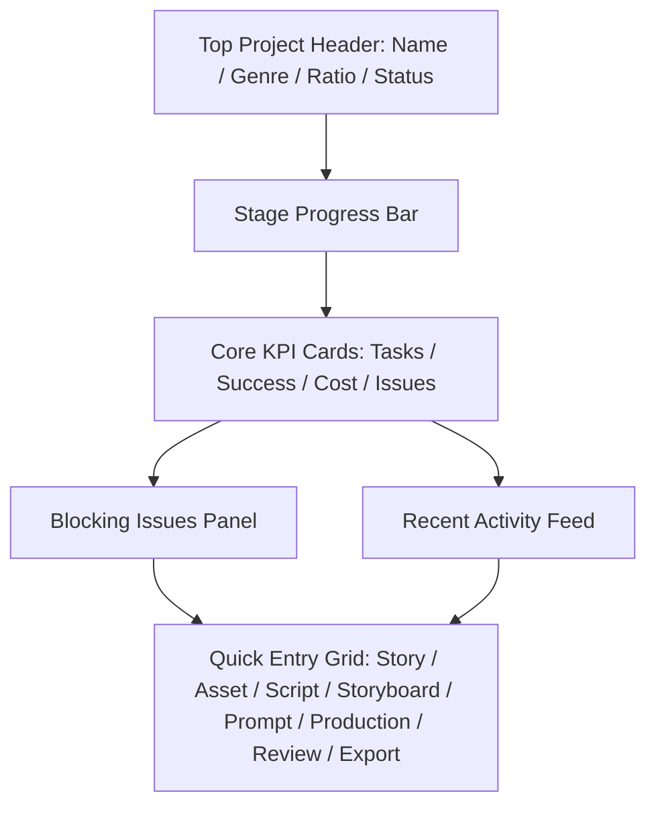

# Project Dashboard Spec v1.0

## 1. 文档目标

- 将 `项目总览` 模块细化到可直接进入 UI 设计与接口实现的粒度。
- 覆盖页面结构、字段定义、按钮动作、阶段导航、风险卡、空态、错态和页面原型。
- 让项目总览成为平台的运营驾驶舱。

## 2. 模块定位

项目总览不是“欢迎页”，而是：

- 项目全局状态看板
- 阶段推进导航页
- 阻塞风险入口页
- 任务和成本摘要页

它负责：

- 聚合各模块状态
- 显示阻塞项
- 提供快速跳转

它不负责：

- 编辑具体业务内容
- 承载复杂表单

## 3. 页面目标

用户进入后要在 1 屏内完成：

1. 判断项目是否可继续推进
2. 确认当前应进入哪个模块
3. 识别是否存在阻塞 issue
4. 查看任务与成本健康度
5. 一键跳到关键工作位

## 4. 页面信息架构

### 4.1 页面区块

1. 顶部项目信息栏
2. 阶段进度条
3. 核心指标卡区
4. 阻塞问题卡区
5. 最近活动流
6. 快捷入口区

## 5. 页面主原型



## 6. 顶部项目信息栏规格

### 6.1 展示字段

- `projectName`
- `projectStatus`
- `genre`
- `audience`
- `aspectRatio`
- `episodeCount`
- `updatedAt`

### 6.2 操作

- `编辑项目设置`
  - 跳转 Project Setup 编辑模式
- `归档项目`
  - 经 `PATCH /api/projects/:projectId` 将 `status` 置 `archived`（必带 `version`，受乐观锁约束，见 adr-003）
  - 二次确认弹窗：`归档后项目将只读，可随时解档。确定归档？`，动作 `归档` / `取消`
  - 归档后行为：进入只读态，隐藏所有写动作；顶部提供 `解档`（`status` 回 `active`）入口

## 7. 阶段进度条规格

### 7.1 阶段定义

9 个阶段卡与其状态派生规则**直接引用** `data-and-api-v1.md` §6.2「派生规则：Dashboard 9 阶段」表，本 spec 不另立阶段口径。阶段顺序与命名以该表为准：

1. Setup（项目初始化）
2. Story Bible（故事圣经）
3. Episodes（分集大纲）
4. Script（剧本编辑）
5. Assets（设定台账）
6. Storyboard（分镜导演台）
7. Prompt（Prompt 中心）
8. Production（生产中心）
9. Export（导出中心）

### 7.2 每个阶段字段

- `stageName`
- `stageStatus`（`UI 派生态`，取值与派生规则见 `data-and-api-v1.md` §6.2 表）
  - `locked`：上游阶段未 `done`（该表统一规则：上游未 done 时下游为 locked）
  - `in_progress`
  - `done`
  - `blocked`（优先级高于 `in_progress`，任一阻塞条件命中即置 `blocked`）
- `completionPercent`
  - 按各阶段 done 判定的分子/分母比例派生（如 Script = 已 `confirmed` 集数 / 总集数），口径随 §6.2 表的 done 判定对象
- `blockingIssueCount`
  - 该阶段命中的高优先级 issue 数，来源 `blocking-issues`

> `stageStatus` 不新增同名持久字段；旧版 `not_started/completed` 措辞作废，统一为 `locked/done`。

### 7.3 数据来源

- 阶段状态与完成度：`GET /api/projects/:projectId/stage-status`（每阶段返回 `stageStatus` + `completionPercent` + `blockingIssueCount`）
- 阻塞计数明细：`GET /api/projects/:projectId/blocking-issues`

### 7.4 交互

- 点击阶段跳转对应模块；`locked` 阶段置灰不可跳转，hover 提示前置未完成
- hover 显示阶段缺失项（来自 `stage-status` 明细）

## 8. 核心指标卡区规格

### 8.1 卡片定义

数据来源统一为 `GET /api/projects/:projectId/dashboard-metrics`（响应结构见 §8.3）。

- `任务概览卡`
  - queued / running / failed / succeeded / cancelled（补 `cancelled` 展示）
  - 统计时间窗：默认全项目累计；「今日」维度按本地自然日
- `成本卡`
  - 今日成本 / 累计成本 / 最近 provider 成本异常
  - 成本来源：`generation_tasks.cost_estimate` 聚合（V1 无实际成本，标注为「预估」）；provider 维度按任务关联 `model_profiles.provider` 分组
  - 成本异常口径：单 provider 当日预估成本环比 > 阈值（默认 3×近 7 日均值）标记异常
- `质量卡`
  - open issue / critical issue（来源 `review_issues`，`severity=critical` 计入 critical）
- `进度卡`
  - 已确认 scene / keyframe 门禁通过 shot / confirmed prompt 比例（shots 表无确认字段，改以 scene 确认、keyframe 门禁、prompt confirmed 三维度派生，不依赖不存在的 shot 确认状态）

### 8.2 交互

- 点击指标卡进入对应详情页

### 8.3 dashboard-metrics 响应结构

响应结构为 `DashboardMetrics`，唯一权威定义见 `data-and-api-v1.md` §6.3；本页不另立字段口径，结构如下（与权威同步，仅供本页阅读）：

```ts
// 权威见 data-and-api-v1.md §6.3 DashboardMetrics
interface DashboardMetrics {
  tasks: { queued: number; running: number; failed: number; succeeded: number; cancelled: number };
  cost: { todayEstimate: number; totalEstimate: number; anomalies: Array<{ provider: string; amount: number }> };
  quality: { openIssues: number; criticalIssues: number };
  progress: { sceneConfirmedRatio: number; shotProducibleRatio: number; promptConfirmedRatio: number };
}
```

- 派生口径与 §6.2 表一致；`shotProducibleRatio` 复用 `shotProducible` 派生态（见 `data-and-api-v1.md` §6.2）
- 业务错误按 adr-004 信封返回，部分统计不可用时对应字段置 `null` 并触发 §12.3 空态

## 9. 阻塞问题卡区规格

### 9.1 展示内容

- 高优先级 issue 列表
- 每条 issue 的：
  - `issueType`
  - `severity`
  - `title`
  - `locationLabel`

### 9.2 操作

- `一键跳转修复`
- `查看全部问题`

### 9.3 规则

- 数据来源 `GET /api/projects/:projectId/blocking-issues`，只展示 `status ∈ {open, reopened}` 的高优先级问题
- 「高优先级」判定：`severity ∈ {high, critical}`（对齐 `review_issues.severity` 枚举 `low/medium/high/critical`）
- `locationLabel` 为派生字段（由 issue 的 `targetRef` join 目标对象名生成），非 `review_issues` 表列
- 分页：首屏最多展示 5 条，超出经「查看全部问题」进入 Review Center；`blocking-issues` 端点遵循 §7.0 列表分页约定

## 10. 最近活动流规格

### 10.1 事件类型

- story updated
- asset updated
- script snapshot created
- storyboard confirmed
- prompt confirmed
- task failed/succeeded
- export ready
- issue resolved/reopened

### 10.2 事件字段

- `eventType`
- `summary`
- `actor`
- `timestamp`
- `targetRef`
- `payload`

### 10.3 交互

- 点击事件跳转目标页面，跳转由 `targetRef` 路由

### 10.4 targetRef 结构与路由

- 数据来源 `GET /api/projects/:projectId/recent-activities`（append-only，不走乐观锁）
- `targetRef` 标准化结构：

```ts
interface ActivityTargetRef {
  type: "project" | "episode" | "scene" | "shot" | "keyframe" | "asset" | "prompt" | "task" | "reviewIssue" | "export";
  ids: Record<string, string>;   // 定位所需 id 集，如 { projectId, episodeId, sceneId }
}
```

- 各 `eventType` → 跳转目标：`story updated`→Story Workspace；`asset updated`→Asset Ledger；`script snapshot created`→Script Editor；`storyboard confirmed`→Storyboard Studio；`prompt confirmed`→Prompt Center；`task failed/succeeded`→Production Hub；`export ready`→Export Center；`issue resolved/reopened`→Review Center
- 跳转携带对应 `ids` 作为上下文参数

### 10.5 分页

- 首屏展示最近 20 条，底部「加载更多」按 §7.0 分页约定翻页（`pageSize` 默认 20）

## 11. 快捷入口区规格

### 11.1 入口卡

- 项目设置
- 故事开发
- 设定台账
- 剧本编辑
- 分镜导演台
- Prompt 中心
- 生产中心
- 审查中心
- 导出中心

### 11.2 卡片字段

- `moduleName`
- `moduleStatus`
  - **阶段型入口**（项目设置 / 故事开发 / 设定台账 / 剧本编辑 / 分镜导演台 / Prompt 中心 / 生产中心 / 导出中心）：复用对应阶段 `stageStatus`（见 §7 / §6.2 派生表）。「故事开发」映射 §6.2 的 `Story Bible` + `Episodes` 两阶段，取二者中较靠前的未完成阶段状态。
  - **非阶段型入口（审查中心）**：审查是横跨各阶段的中控，不在 §6.2 九阶段之列，`moduleStatus` **不复用阶段状态**，改由审查态派生（`UI 派生态`）：
    - `blocked`：存在 `severity ∈ {high, critical}` 的 open `review_issues`（角标显示阻塞数）
    - `in_progress`：存在 `status=running` 的 review-run，或有 open issue 但无高优阻塞
    - `done`：最近一次 review-run `status=succeeded` 且 `verdict=passed`、无 open 阻塞 issue
    - 数据来源：`blocking-issues` + `GET /api/review-runs/:runId`（最近一次），口径与 Review Center §7.6 一致
- `todoHint`
  - `UI 派生态`，由对应阶段 `stage-status` 明细的首要缺失项生成（如 Script 阶段「3 集待确认」）；审查中心的 `todoHint` 取首要阻塞 issue 摘要（如「2 项高优待修复」）

### 11.3 可用性与置灰规则

- **阶段型入口**：前置条件对齐 `navigation-matrix` §7.1 / §5：对应阶段 `stageStatus=locked`（上游未 `done`）时入口卡置灰不可点，hover 提示前置未完成
- `blocked` 阶段入口卡可点但高亮告警角标
- 已 `done`/`in_progress` 阶段正常可进入
- **审查中心**：作为常驻中控**始终可进入**（不置灰）；`blocked` 时高亮告警角标，无阻塞时正常展示

## 12. 实时更新（引用 adr-002）

### 12.1 客户端策略

- 首屏：先拉一次快照（`stage-status` + `dashboard-metrics` + `recent-activities` + `blocking-issues`），再订阅 SSE（对齐 adr-002 §7 「先拉快照再订阅」）
- SSE 订阅事件主题（限定 adr-002 §5）：
  - `dashboard.metrics.changed` → 刷新核心指标卡区（§8）
  - `task.status.changed` → 刷新任务概览卡与相关阶段状态
  - `review.issue.changed` → 刷新质量卡与阻塞问题卡（§9）
  - `review.run.finished` → 触发阶段状态与质量卡重算
- SSE 不可用时切轮询兜底：定频轮询 `GET /stage-status` 与 `GET /dashboard-metrics`（对齐 `data-and-api-v1.md` §7.12）
- 页签隐藏时降低处理频率；SSE 断开按指数退避重连，超阈值切轮询

### 12.2 局部刷新原则

- 事件只驱动对应区块被动刷新，不整页重载
- 阶段进度条、指标卡、阻塞卡、活动流各自独立订阅与降级

## 13. 空态 / 错态总表

### 13.1 空项目态

- 文案：`项目刚创建，先从故事开发开始。`
- 动作：`进入故事开发`

### 13.2 数据加载失败

- 文案：`总览数据加载失败。`
- 动作：`重试`
- 错误码映射：`missing_resource`（项目不存在）/ `internal_error`（对齐 adr-004）

### 13.3 指标缺失

- 文案：`部分统计暂不可用。`
- 动作：`刷新统计`
- 触发：`dashboard-metrics` 某字段为 `null`（见 §8.3）

### 13.4 首屏加载态

- 顶部信息栏、阶段条、指标卡、阻塞卡、活动流均展示骨架占位，快照返回后替换

### 13.5 页面健康度徽标

- 顶部按派生态展示健康度：任一阶段 `blocked` → 顶部红色 `attention_needed` 徽标并高亮该阶段；无阻塞时展示 `healthy`
- 该徽标为 `UI 派生态`，由 `stage-status` 聚合，不落库

## 14. 页面交互链

1. 进入总览
2. 查看阶段状态
3. 查看阻塞问题
4. 点击目标模块入口
5. 修复后返回总览复查

## 15. 页面级验收标准

- 一屏可看清项目健康状态
- 阻塞问题可直接跳转
- 阶段状态与真实模块状态同步
- 快捷入口稳定可用

## 16. 接口契约（强绑定）

> 端点权威定义见 `data-and-api-v1.md` §7.1；本节固化本页动作/区块 → 端点映射，不再是「建议」。

- `GET /api/projects/:projectId` — 顶部项目信息栏（§6）
- `GET /api/projects/:projectId/stage-status` — 阶段进度条（§7），轮询兜底端点
- `GET /api/projects/:projectId/dashboard-metrics` — 核心指标卡（§8，响应见 §8.3），轮询兜底端点
- `GET /api/projects/:projectId/recent-activities` — 最近活动流（§10，分页见 §10.5）
- `GET /api/projects/:projectId/blocking-issues` — 阻塞问题卡（§9）
- `PATCH /api/projects/:projectId` — 归档/解档（§6.2，必带 `version`）
- 实时事件主题见 §12 / adr-002 §5；业务错误统一 adr-004 信封

## 17. 一句话结论

- 项目总览页必须让用户在最短时间做对下一步决策：继续推进、先修阻塞，还是先补关键输入。
