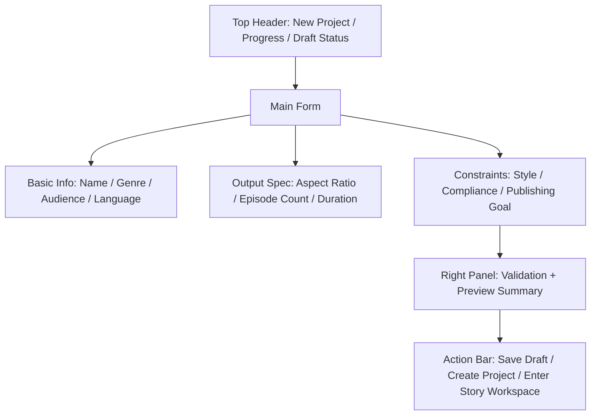

# Project Setup Spec v1.0

## 1. 文档目标

- 将 `项目初始化/设置` 页面细化到可直接进入 UI 设计与接口实现的粒度。
- 覆盖页面结构、字段定义、按钮动作、校验规则、空态、错态、弹窗和页面原型。
- 让“项目初始化”从流程概念变成可执行页面。

## 2. 模块定位

项目初始化不是简单表单，而是：

- 项目级事实层入口
- 后续 Story / Asset / Script / Storyboard 的上游约束来源
- 本地运行与云端模型策略的基础配置入口

它负责：

- 创建项目基础信息
- 定义创作边界与生产目标
- 定义默认模型策略与输出规格
- 定义 `projects` 表拥有的项目级字段

它不负责：

- 直接生成故事
- 直接生成分镜
- 直接创建生产任务
- 编辑 `project_story_bibles` 持有的 `tone` / `worldRules`

## 3. 页面目标

用户进入后要完成：

1. 输入项目基本信息
2. 定义创作与输出规格
3. 定义项目级风格与合规约束
4. 完成初始化并进入故事开发

## 4. 页面信息架构

### 4.1 页面区块

页面分为 5 个核心区域：

1. 顶部项目创建引导栏
2. 中央基础信息表单区
3. 中央创作约束与输出规格区
4. 右侧预览与校验区
5. 底部确认动作栏

## 5. 页面主原型



## 6. 顶部引导栏规格

### 6.1 展示字段

- `mode`
  - 新建项目 / 编辑项目设置
- `progress`
- `saveStatus`
  - saved / saving / error

### 6.2 操作

- 返回项目列表
- 放弃当前编辑

## 7. 基础信息表单区规格

### 7.1 必填字段

- `projectName`
- `genre`
- `audience`
- `language`
- `aspectRatio`
- `episodeCount`
- `targetDurationSec`

### 7.2 可选字段

- `projectSlug`
- `distributionPlatform`
- `description`

### 7.3 字段规则

- `projectName`
  - 必填，2-60 字符
- `projectSlug`
  - 可选，不填自动生成，唯一
- `episodeCount`
  - 必填，1-500，语义为「计划集数」（规划目标），落 `projects.episode_count`
  - 实际集数由 `episodes` 行数聚合派生，Dashboard 阶段与故事层展示以派生实际集数为准；本字段不随实际集数自动变化
- `targetDurationSec`
  - > 0，与 §8.2 `output_spec_json.targetDurationSec` 同值
- `aspectRatio`
  - 9:16 / 16:9 / 1:1

## 8. 创作约束与输出规格区规格

> 本节三类字段一一对应 `projects` 表的三个 JSON 列，结构对齐 `data-and-api-v1.md` §6 类型定义。落库时机：`创建项目` / `保存草稿` / 编辑模式 `PATCH /api/projects/:projectId` 时整体写入对应 JSON 列。本页不新增任何独立配置表，也不悬空无落库字段。

### 8.1 创作约束字段

落库位置：`projects.creative_constraints_json`；结构 = `ProjectCreativeConstraints`（`data-and-api-v1.md` §6）。

#### 字段与类型

- `forbiddenGenres: string[]`
  - 题材红线（禁止出现的题材/桥段），默认 `[]`
- `styleTaboos: string[]`
  - 风格禁忌，默认 `[]`
- `contentBoundaries: string[]`
  - 内容边界（合规红线描述），默认 `[]`

#### 校验规则

- 三者均为字符串数组，允许为空数组
- 单项去除首尾空白后长度 1-40 字符，空串自动剔除
- 每个数组最多 50 项，超出报 `validation_failed`
- 数组内去重（大小写不敏感）

字段归属规则：

- `genre` / `audience` 的唯一编辑入口在本页面，持久化到 `projects`
- `tone` / `worldRules` 的唯一编辑入口在 `Story Workspace`，本页面不直接写入故事圣经

### 8.2 输出规格字段

落库位置：`projects.output_spec_json`；结构 = `ProjectOutputSpec`（`data-and-api-v1.md` §6）。

#### 字段、类型与默认值

- `resolution: "720p" | "1080p" | "4k"`
  - 默认 `1080p`
- `fps: 24 | 25 | 30`
  - 默认 `24`
- `targetDurationSec?: number`
  - 可选；与基础信息 §7.1 `targetDurationSec` 同口径同值，写库时以基础信息值为准，二者不得冲突
- `subtitle: "burned" | "sidecar" | "none"`
  - 字幕策略，默认 `burned`
- `voiceover: "tts" | "none"`
  - 配音策略，默认 `tts`

#### 校验规则

- 枚举字段取值必须落在上述集合内，否则 `validation_failed`
- `targetDurationSec` 若提供须 `> 0`，且与基础信息值一致
- `voiceover=tts` 但项目无可用 TTS 模型策略时，校验区给 `warning`（不阻断创建）

### 8.3 模型策略字段

落库位置：`projects.model_policy_json`；结构 = `ProjectModelPolicy`（`data-and-api-v1.md` §6）。

#### 字段、类型与默认值

- `imageProvider?: string`
  - 默认图像 provider 偏好，允许为空
- `videoProvider?: string`
  - 默认视频 provider 偏好，允许为空
- `ttsProvider?: string`
  - 默认 TTS provider 偏好，允许为空
- `quality?: "draft" | "standard" | "high"`
  - 默认档位，缺省视为 `standard`

#### 校验与去冗余规则

- 四个字段全部可空；为空时后续在 Prompt 中心按 target type 绑定
- provider 取值须存在于 `model_profiles` 可用列表，否则 `validation_failed`；无任何可用配置时见 §13.4 空态
- 本结构取代旧版散落的 `defaultModelPolicy` 与 `llmProfileId/imageProfileId/videoProfileId/ttsProfileId`：模型策略仅以 `ProjectModelPolicy` 单一结构落项目级，LLM 档位不在项目级落库，消除语义重复

## 9. 右侧预览与校验区规格

### 9.1 预览内容

- 项目摘要卡
- 输出规格摘要卡
- 模型策略摘要卡

### 9.2 校验清单

- 基础字段完整性
- 输出规格可执行性
- 文本长度与格式校验

### 9.3 状态

- `ok`
- `warning`
- `error`

规则：

- 有 `error` 不允许创建项目

## 10. 底部动作栏规格

### 10.1 操作按钮

- `保存草稿`
- `创建项目`
- `创建并进入故事开发`

### 10.2 启用条件

- `保存草稿`
  - 至少填写项目名
- `创建项目`
  - 必填项完整且无 error
- `创建并进入故事开发`
  - 创建项目成功

## 11. 编辑模式差异

### 11.1 新建模式

- 允许填写全部字段
- 完成后生成 `projectId`

### 11.2 编辑模式

- 允许更新基础信息和约束
- 若修改关键规格（如画幅、集数）需二次确认
- 需要提示影响范围

#### 并发与乐观锁（引用 adr-003）

- `projects` 表含 `version`，编辑保存类动作（`PATCH /api/projects/:projectId` 及 `保存草稿` 在编辑态）请求体必须携带当前 `version`，见 `data-and-api-v1.md` §7.12 横切契约。
- 服务端仅在 `version` 匹配时写入，成功后 `version += 1`。
- 版本不匹配时返回 `version_conflict` 错误信封（`details.currentVersion` + 对象摘要 + 最近变更时间），前端弹版本冲突提示，提供三个客户端动作（对齐 adr-003 §4.3）：
  - `比较差异`：并列展示本地编辑与服务端最新值
  - `刷新覆盖`：用服务端最新值覆盖本地视图后重新编辑
  - `重新编辑`：保留本地草稿，用户手动合并
- 冲突态不展示「重试」（`retryable=false`）。

#### 项目 status 生命周期

- 权威取值见 `page-state-machine` §3.1：`draft | active | archived`。
- 新建保存草稿 → `draft`；`创建项目` 成功后置 `active`（同事务）。
- `归档项目`（Dashboard 触发）→ `archived`；解档回 `active`。
- 状态迁移经 `PATCH /api/projects/:projectId`，同样受乐观锁约束。

## 12. 关键变更确认弹窗

### 12.1 Confirm Critical Project Change Modal

#### 用途

- 修改项目级关键字段前显示影响范围。

#### 关键字段

- `aspectRatio`
- `episodeCount`
- `targetDurationSec`
- `language`

#### 展示内容

- 受影响模块
- 受影响对象数量
- 建议后续动作

#### 动作

- `确认修改`
- `取消`

## 13. 空态 / 错态总表

### 13.1 新建空态

- 文案：`从项目名称开始，定义你的短剧生产边界。`

### 13.2 保存失败

- 文案：`项目保存失败。`
- 动作：`重试`

### 13.3 slug 冲突

- 文案：`项目标识已存在，请更换。`
- 错误码：`validation_failed`（`details.field="slug"`），`retryable=false`
- slug 自动生成规则（P2）：项目名转小写、去空白与特殊字符、中文按拼音转写，非法字符转 `-`；冲突时追加 `-2`、`-3` 递增后缀重试直至唯一

### 13.4 无可用模型配置空态

- 触发：`model_profiles` 无任何可用配置
- 文案：`暂无模型配置，可先留空，稍后在 Prompt 中心按类型绑定。`
- §8.3 provider 选择器置灰，允许留空创建，不阻断

### 13.5 编辑模式加载态 / 加载失败

- 加载态：表单区骨架占位
- 加载失败：文案 `项目设置加载失败。`，动作 `重试`；错误码映射 `missing_resource`（项目不存在）/ `internal_error`

### 13.6 放弃编辑二次确认

- §6.2「放弃当前编辑」在存在未保存改动（dirty）时弹二次确认：`有未保存的修改，确定放弃？`，动作 `放弃` / `继续编辑`
- 无 dirty 时直接返回，不弹窗

### 13.7 错误码统一约束

- 本页所有 `POST/PATCH` 业务错误一律按 adr-004 `ApiErrorEnvelope` 返回，`code` 仅取 adr-004 §4 必备错误码，不自造文案码
- 主要映射：必填/取值非法 → `validation_failed`；版本冲突 → `version_conflict`；项目不存在 → `missing_resource`；服务端异常 → `internal_error`

## 14. 页面交互链

1. 打开项目初始化页
2. 填写基础信息
3. 填写约束与输出规格
4. 运行校验
5. 创建项目
6. 跳转故事开发页

## 15. 页面级验收标准

- 项目初始化后可稳定进入故事开发
- 必填字段校验准确
- 关键字段变更有影响提示
- 编辑模式和新建模式行为清晰

## 16. 接口契约（强绑定）

> 端点权威定义见 `data-and-api-v1.md` §7.1；本节固化本页动作 → 端点 → 请求/响应/错误码映射，不再是「建议」。

### 16.1 动作 → 端点映射

- `创建项目` → `POST /api/projects`
- 读取项目设置 → `GET /api/projects/:projectId`
- `保存草稿` / 编辑保存 → `PATCH /api/projects/:projectId`（必带 `version`，见 §11.2）
- 运行校验 → `POST /api/projects/:projectId/validate-setup`
- 关键字段变更影响预览 → `POST /api/projects/:projectId/preview-impact`

### 16.2 validate-setup 契约

- 请求体：完整草稿快照，含基础信息字段 + `outputSpec` / `modelPolicy` / `creativeConstraints`（结构同 §8）
- 响应：结构以 `data-and-api-v1.md` §6.3 `ProjectSetupValidationResult` 为权威（与下方同构）

```ts
interface ValidateSetupResult {         // = data-api §6.3 ProjectSetupValidationResult
  status: "ok" | "warning" | "error";
  items: Array<{
    field: string;         // 出错/告警字段路径，如 "outputSpec.fps"
    level: "warning" | "error";
    code: string;          // 复用 adr-004 code，主要为 validation_failed
    message: string;
  }>;
}
```

- 规则：存在任一 `level=error` 时 `status=error`，`创建项目` 按钮置灰（对齐 §9.3）
- 端点自身业务错误按 adr-004 信封返回（如 `missing_resource`）

### 16.3 preview-impact 契约

- 用途：编辑模式修改关键字段（`aspectRatio`/`episodeCount`/`targetDurationSec`/`language`）前预览影响范围，喂给 §12 关键变更确认弹窗
- 请求体：`{ version, changes: Partial<ProjectSetupDraft> }`
- 响应：

```ts
interface PreviewImpactResult {            // = data-api §6.3 ProjectSetupImpactResult
  affectedModules: string[];                 // 受影响模块
  affectedCounts: Record<string, number>;    // 受影响对象数量（按模块）
  suggestedActions: string[];                // 建议后续动作
}
```

- 错误码映射同 §13.7；`version` 不匹配返回 `version_conflict`

## 17. 一句话结论

- 项目初始化页是整个系统的第一道 contract：如果这里不把项目级约束定义清楚，后续所有模块都会反复返工。
