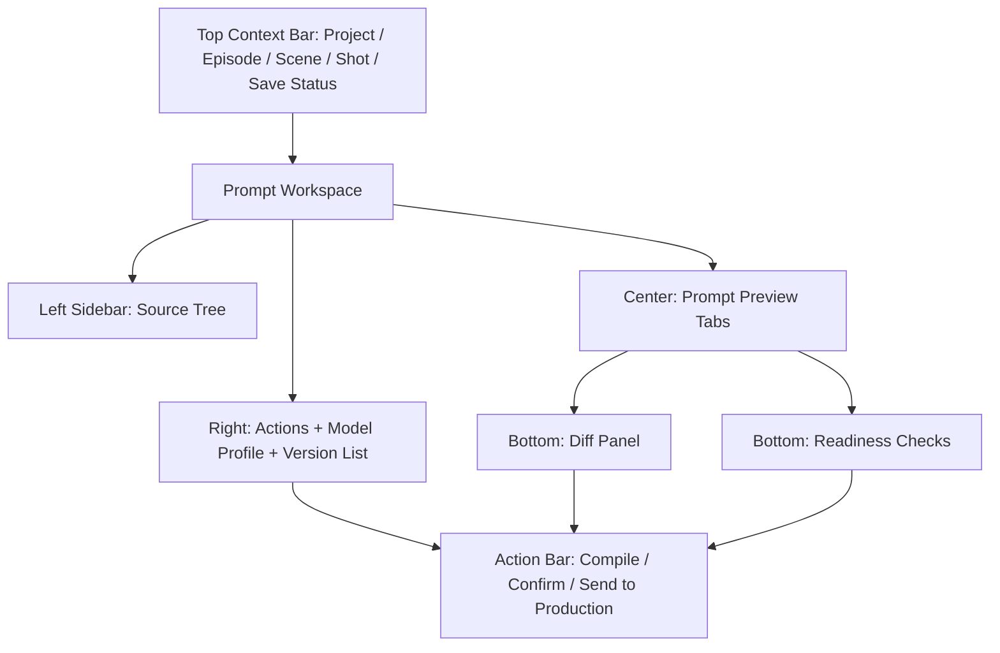

# Prompt Center Spec v1.0

## 1. 文档目标

- 将 `Prompt 中心` 细化到可直接进入 UI 设计与接口实现的粒度。
- 覆盖页面结构、字段定义、按钮动作、版本流转、空态、错态、抽屉、弹窗和页面原型。
- 让 `Prompt Center` 成为 `Storyboard Studio -> Prompt Compiler -> Production Hub` 之间的唯一确认中间层。

## 2. 模块定位

Prompt 中心不是“手工写 prompt 的文本页”，而是：

- `Prompt Compiler` 的 UI 承载层
- `PromptSpec` 的版本管理层
- 执行前的确认层

它负责：

- 按 source entity 编译 prompt
- 展示结构化 prompt 结果
- 对比版本差异
- 绑定 model profile
- 确认当前版本是否可进入任务系统

它不负责：

- 手工拼最终 prompt
- 直接调用模型
- 直接创建 provider-specific payload
- 修改故事、设定、分镜事实

## 3. 页面目标

用户进入该页面后，需要在一个统一界面完成：

1. 选择 source entity（episode / scene / shot / keyframe）
2. 查看 image / video / tts 三类 prompt
3. 执行编译
4. 对比新旧版本差异
5. 选择或绑定 model profile
6. 将 prompt 从 `draft` 确认为 `confirmed`
7. 从 confirmed prompt 进入生产中心创建任务

## 4. 页面信息架构

### 4.1 页面区块

页面分为 6 个核心区域：

1. 顶部上下文栏
2. 左侧 source tree
3. 中央 prompt 预览区
4. 右侧操作与版本区
5. 底部差异与引用区
6. 全局确认与生产入口栏

### 4.2 页面布局说明

- 顶部固定展示当前项目和 source context。
- 左侧选择当前编译对象。
- 中间用 tab 展示 image / video / tts 三类 prompt。
- 右侧承载编译动作、模型绑定和版本列表。
- 底部显示 diff、引用和进入生产前检查结果。

## 5. 页面主原型



## 6. 顶部上下文栏规格

### 6.1 展示内容

- 项目名
- 当前集 / 场 / 镜上下文
- 当前 source entity 类型
- 当前 prompt 状态摘要
- 最近编译时间

### 6.2 字段定义

- `projectName`
- `episodeNo`
- `sceneNo`
- `shotNo`
- `sourceEntityType`
  - `episode`
  - `scene`
  - `shot`
  - `keyframe`
- `currentPromptStatus`
  - `not_compiled`（UI 派生态）
  - `draft`
  - `confirmed`
  - `superseded`
- `lastCompiledAt`

#### 6.2.1 UI 派生态字典（引用 page-state-machine §9.2，统一不另立）

本页所有派生态一律引用 state-machine §9.2 词表，不新增同名持久字段：

- `not_compiled`：source entity + target type 尚不存在 PromptSpec（data-api §6.2）
- `source_outdated`：存在 confirmed PromptSpec 但上游 source `version` 已变（检测算法见 §16.4）
- `model_unbound`：PromptSpec 未绑定合法 `ModelProfile`
- `ready_to_confirm`：存在 `draft` 且 readiness checks 无 `error`
- `ready_to_produce`：当前 target 为 `confirmed` 且 model profile 合法
- `blocked`：存在高优先级 review issue 阻塞

其中 `not_compiled` / `superseded` 与持久态 `PromptSpec.status` 组合展示；其余为纯派生态。

### 6.3 操作

- `返回分镜导演台`
- `打开 source entity`
- `查看当前对象的生产任务`
- `返回生产中心`
  - 仅当本次进入携带 `returnTo=production_hub` 时出现（Production Hub failed task 反查 prompt 回跳，见 navigation §6.1）
- `返回审查中心`
  - 仅当本次进入携带 `returnTo=review_center` 时出现（Review Center issue 定位修复回跳，见 navigation §6.3）

#### 6.3.1 回跳上下文接收（navigation §6.1 / §6.3 握手）

- **来自 Production Hub（§6.1）**：入参 `taskId` + `returnTo=production_hub` + 固定 `projectId` / 目标 `shotId` 或 `sceneId`。
  - 接收行为：定位并选中 `taskId` 关联的 source PromptSpec，顶部显示 `返回生产中心` 回跳入口（携带原始 `taskId`）。
  - 用户在本页修复并重新 `confirm` prompt 后，回跳入口可用，回到 Production Hub 重新发起任务。
- **来自 Review Center（§6.3）**：入参 `scopeRef=promptSpecId` + `returnTo=review_center` + 固定 `projectId`。
  - 接收行为：定位并选中该 `promptSpecId`，顶部显示 `返回审查中心` 回跳入口（携带原始 `scopeRef`）。
  - 用户修复后回到审查中心，可将对应 issue 标记 resolved / reopened。
- 两类回跳入口互斥展示，以本次进入携带的 `returnTo` 为准；`returnTo` 缺失时不展示回跳入口。

## 7. 左侧 Source Tree 规格

### 7.1 模块目标

- 帮助用户按层级选择要编译和确认的对象。

### 7.2 视图层级

- Episode
  - Scene
    - Shot
      - Keyframe

### 7.3 每个节点展示字段

- `label`
- `entityType`
- `promptCoverage`
  - image / video / tts 是否存在
- `confirmedCount`
- `warningCount`
- `productionReady`

### 7.4 交互

- 点击节点进入当前 source entity
- 只看“未确认 prompt”
- 只看“可生产对象”

### 7.5 筛选器

- `entityType filter`
- `prompt status filter`
- `targetType filter`

### 7.6 空状态

- 当前项目没有可编译对象
  - 文案：`还没有可用于编译的 scene 或 shot，请先完成分镜。`
  - 动作：`前往分镜导演台`

## 8. 中央 Prompt Preview 区规格

### 8.1 模块目标

- 展示结构化 prompt 结果，而不是裸文本堆叠。

### 8.2 Tab 结构

- `Image Prompt`
- `Video Prompt`
- `TTS Script`

#### 8.2.1 sourceEntityType → tab 可用性前置矩阵

三个 tab 恒定展示，但按当前 `sourceEntityType` 决定可用 / 置灰，避免对不支持的层级发起编译：

| sourceEntityType | Image | Video | TTS | 说明 |
|------------------|-------|-------|-----|------|
| `keyframe` | ✅ | ❌ | ❌ | 关键帧仅图片；video 以 shot 为单位 |
| `shot` | ✅ | ✅ | ❌ | video 前置见 §12.2；TTS 绑定在场级 |
| `scene` | ❌ | ❌ | ✅ | TTS 权威 source 为场级（含对白 / 旁白），端点 `compile-tts` 即场级 |
| `character` / `location` | ✅ | ❌ | ❌ | 资产参考图 |
| `episode` | ❌ | ❌ | ❌ | 仅作为 source tree 分组节点，不直接编译 |

- 不可用 tab 置灰并提示「当前对象不支持该类型编译」。
- **TTS source 层级收口**：TTS 绑定 `sourceEntityType=scene`，`compile-tts` 端点为 `POST /api/scenes/:sceneId/prompts/compile-tts`；在 shot / keyframe 节点选中时，TTS tab 指向其所属 scene 的 TTS PromptSpec（只读跳转到场级）。

### 8.3 每个 tab 内部结构

#### A. Header

- target type
- 当前版本号
- 当前状态
- 绑定 model profile

#### B. Structured Sections

- **数据契约**：结构化段落直接引用 `PromptSpec.sections`（data-api §6 `PromptSection[]`），不再解析裸文本。每个 `PromptSection` 字段：
  - `key`：段落标识（如 `subject` / `look` / `scene` / `composition` / `continuity` / `negative`）
  - `label`：面向用户的段落标题（即下列各 section 名）
  - `content`：该段落编译后的文本
  - `sourceRefs`：`Array<{ entityType; entityId; version? }>`，标注该段落引用的事实层实体与版本，用于溯源与 `source_outdated` 判定（§16.4）
- 各 target type 的段落 `key/label` 由 compiler 固定产出，UI 按 `sections` 顺序渲染；下列为推荐段落集：

##### Image Prompt sections

- `Subject`
- `Look`
- `Scene`
- `Composition`
- `Continuity`

##### Video Prompt sections

- `Shot Goal`
- `Characters & Look`
- `Scene & Space`
- `Action & Performance`
- `Camera & Motion`
- `Continuity & Handoff`

##### TTS Script sections

- `Speaker`
- `Speech Style`
- `Dialogue / Narration`
- `Emotion Target`
- `Delivery Notes`

#### C. Raw Output

- 允许折叠查看完整 `compiledPrompt`
- **`compiledPrompt` 是 `sections` 的拼接快照**（data-api §6 / §8.2 Prompt Contract）：即所有 `PromptSection.content` 按顺序拼接的成品文本，UI 只读展示，不允许反向编辑（§8.6）
- 默认不直接大面积展示原始长文本

### 8.4 显示字段

- `promptSpecId`
- `targetType`
- `sections`（结构化分段，见 §8.3 B）
- `compiledPrompt`（sections 拼接快照）
- `compilerVersion`（结构化三段版本，见 §8.4.1）
- `status`
- `negativePrompt`
- `modelProfileName`
- `updatedAt`

#### 8.4.1 compilerVersion 三段版本口径（引用 prompt-compiler-contract §12.1）

- `compilerVersion` **不是单一字符串**，而是三段结构化版本，与 compiler-contract §12.1 一致：
  - 编译器主版本（如 `prompt-compiler@1.0.0`）
  - 模板版本（按 target type，如 `image-compiler@1.0.0` / `video-compiler@1.0.0`）
  - 规则版本（prompt 规则集版本）
- 库中 `prompt_specs.compiler_version` 以结构化编码存储（如三段以 `|` 连接或 JSON），UI 分行展示三段；版本对比（§10 diff / §9.4 version list）按三段分别比对。

### 8.5 交互动作

- 切换 tab
- 展开 raw output
- 复制当前 prompt
- 查看上一个 confirmed 版本

### 8.6 原则

- UI 只能展示 compiler 结果，不允许直接编辑最终 prompt 字段。
- 允许编辑上游结构化 policy，但不允许直接改写最终成品文本。

## 9. 右侧 Actions + Model Profile + Version List 规格

### 9.1 模块目标

- 聚合 prompt 的编译、版本、模型绑定与状态动作。

### 9.2 区块 A：编译动作

字段与动作：

- `compile target`
  - image / video / tts / all
- `compile scope`
  - current shot / current scene / current episode
- `compile mode`
  - full recompile / only missing / refresh superseded

按钮：

- `编译当前 tab`
- `编译当前对象全部类型`

#### 9.2.1 权威端点集与逐 tab / scope 映射（data-api §7.6）

- 权威端点集（`§19` 与本节一致）：
  - `POST /api/prompts/compile`：统一入口，按请求体 `target` / `scope` / `mode` 分发；`编译当前对象全部类型` 用此端点（`target=all`）。
  - `POST /api/shots/:shotId/prompts/compile-image`：`编译当前 tab` 且 Image tab、source 为 shot / keyframe。
  - `POST /api/shots/:shotId/prompts/compile-video`：`编译当前 tab` 且 Video tab、source 为 shot。
  - `POST /api/scenes/:sceneId/prompts/compile-tts`：`编译当前 tab` 且 TTS tab、source 为 scene。
- `编译当前 tab` 依当前 tab + `sourceEntityType`（§8.2.1）选择上述具体端点；不可用组合按矩阵置灰。

#### 9.2.2 compile 请求体契约（`POST /api/prompts/compile`）

```jsonc
{
  "target": "image | video | tts | all",
  "scope": { "type": "shot | scene | episode", "id": "entityId" },
  "mode": "full | only_missing | refresh_superseded"
}
```

- `mode` 语义：`full` 全量重编译；`only_missing` 仅编译缺失 target；`refresh_superseded` 仅刷新已 `superseded` 的 target。
- 前置校验失败按 adr-004 信封返回（见 §12 / §16.2）。

#### 9.2.3 同步 / 异步与进度态

- 编译为**异步任务**（data-api `TaskType=prompt_compile`）：请求返回 `taskId`，PromptSpec 在任务 `succeeded` 后落为 `draft`。
- 期间当前 tab 展示 `compiling` 加载态与进度；失败进入 §16.2 编译失败态。
- 实时进度复用 adr-002 `task.status.changed`（先拉快照 + SSE + 轮询兜底，轮询用 `GET /api/tasks/:taskId`）。

### 9.3 区块 B：Model Profile 绑定

展示字段：

- `currentModelProfileId`
- `provider`
- `modelType`
- `modelName`
- `defaultParams summary`

动作：

- `绑定 model profile`
  - 绑定端点：`POST /api/prompts/:promptId/bind-model-profile`，请求体带 `modelProfileId` 与当前 PromptSpec `version`（adr-003）；冲突返回 `version_conflict`
- `更换 model profile`
- `查看 profile 详情`

规则：

- image tab 只能绑定 image model profile
- video tab 只能绑定 video model profile
- tts tab 只能绑定 tts model profile
- target 与 profile 的 `modelType` 不匹配时返回 `validation_failed`
- **候选列表来源**：model profile 的创建 / 密钥绑定由 `model-settings-spec-v1.md` 统一管理；本页候选 = `isActive=true` 且 `credentialBound=true` 且 `modelType` 与当前 target 匹配的 Profile，密钥缺失的 Profile 置灰不可选

### 9.4 区块 C：Version List

每个 version item 展示：

- `versionNo`
- `compilerVersion`（三段版本，见 §8.4.1）
- `status`
- `createdAt`
- `createdBy`
  - **UI 派生展示**：V1 `prompt_specs` 无 `created_by` 列，编译由系统触发时展示「系统」，用户手动触发时展示当前用户名（取自触发动作上下文，不落 PromptSpec）
- `diffFromPrevious`

动作：

- 查看版本
- 与当前版本比较
- 将某个历史版本设为当前查看对象

### 9.5 Version 状态

- `draft`
- `confirmed`
- `superseded`

## 10. 底部 Diff Panel 规格

### 10.1 模块目标

- 对比当前版本和上一次 confirmed 版本的差异。

### 10.2 对比粒度

- section 级
- 字段级
- raw prompt 文本级

### 10.3 Diff 分类

- `added`
- `removed`
- `changed`
- `unchanged`

### 10.4 显示规则

- 默认先显示结构化 section diff
- 原始文本 diff 折叠展示

### 10.5 空状态

- 没有上一版本
  - 文案：`这是第一个版本，没有历史差异可比较。`

## 11. 底部 Readiness Checks 规格

### 11.1 模块目标

- 在进入生产前展示当前 prompt 是否满足执行条件。

### 11.2 检查项

- 是否存在 `PromptSpec`
- 状态是否为 `confirmed`
- 是否绑定合法 `ModelProfile`
- source entity 是否仍为最新分镜版本
- 是否存在高优先级 review issue
- 对应 target type 的必备字段是否齐全

### 11.3 展示结果

- `ok`
- `warning`
- `error`

### 11.4 关键规则

- 存在 `error` 时，不允许进入生产。
- 存在 `warning` 时，可进入生产，但需要二次确认。

## 12. Prompt 编译前置条件

### 12.1 Image Prompt 前置条件

- 当前 source entity 合法
- 若为 shot，则角色和 look 已齐
- 若为 keyframe 关联镜头，则至少有 start 或 end frame

### 12.2 Video Prompt 前置条件

- 当前 source entity 为 shot
- shot 已具备 intent
- 角色 / look / scene 已齐
- **keyframe 门禁：对应 shot 已通过 adr-006 §4 keyframe 门禁**——即该 shot 同时存在 `frameType=start` 与 `frameType=end` 且均 `status=confirmed`（`shotProducible=true`）。
  - 该门禁由**所属场已 `Scene.storyboardStatus=confirmed` 保证**（场级 confirm 已硬校验全部 shot 的 start/end，见 storyboard-studio §12.4）；本页不另立第三套 keyframe 前置口径。
  - 因此 video 编译前置实际等价于「所属场已 confirmed」；未 confirmed 时置灰并引导回分镜导演台。
- continuity error 不为高优先级阻塞

### 12.3 TTS 前置条件

- 当前 source entity 存在可用对白或旁白文本
- 若有 speaker，则 speaker 角色存在

## 13. Prompt 版本流转

### 13.1 状态机

- `not_compiled`（UI 派生态）
- `draft`
- `confirmed`
- `superseded`

### 13.2 流转规则

- 首次编译：
  - `not_compiled -> draft`
- 用户确认：
  - `draft -> confirmed`
- 重新编译：
  - 新版本生成 `draft`
  - 旧 `confirmed` 自动标记为 `superseded`
  - 旧 `draft` 自动标记为 `superseded`

### 13.3 关键约束

- 任一时刻，某个 source entity + target type 最多只有一个 `confirmed`
- `superseded` 不能直接进入生产
- 进入生产的 prompt 必须来自 `confirmed`

## 14. 全局操作栏规格

### 14.1 操作按钮

- `编译`
- `确认当前版本`
- `进入生产中心`

### 14.2 按钮启用条件

- `编译`
  - 当前 tab 依 §8.2.1 矩阵可用（`sourceEntityType` 支持该 target）
  - 对应 target 的编译前置满足（§12）：Image 见 §12.1，Video 见 §12.2（等价于所属场已 confirmed），TTS 见 §12.3
  - 前置不满足时置灰并提示缺失项与回跳入口（§16.4）
- `确认当前版本`
  - 当前 tab 存在 `draft`
  - readiness checks 没有 `error`
- `进入生产中心`
  - 当前 tab 为 `confirmed`
  - model profile 合法

### 14.3 行为效果与端点契约

- `确认当前版本` → `POST /api/prompts/:promptId/confirm`
  - 请求体带当前 PromptSpec `version`（adr-003）；冲突返回 `version_conflict`
  - 当前 `draft -> confirmed`；同 source + target 的旧 confirmed -> superseded（受 `idx_prompt_specs_confirmed_unique` 唯一约束保证唯一 confirmed）
  - readiness 存在 `error` 时返回 `invalid_state` / `blocked_by_issue`
- `重新编译`
  - 走 §9.2 编译端点；生成新 `draft`，旧 `draft` / `confirmed` 自动变为 `superseded`
- `进入生产中心` → 前置 `POST /api/prompts/:promptId/send-to-production-check`
  - 校验通过后带 `promptSpecId` 和 `sourceEntityRef` 跳转；未 confirmed / 未绑模型 / source 过期时返回 `invalid_state`，并给对应修复动作（§16）

## 15. 抽屉与弹窗设计

### 15.1 Bind Model Profile Drawer

#### 用途

- 为当前 target type 选择合法 model profile。

#### 字段

- `provider`
- `modelName`
- `modelType`
- `defaultParams`
- `isActive`

#### 动作

- `绑定`
- `取消`

#### 规则

- 只展示 target type 匹配的 profile

### 15.2 Confirm Prompt Modal

#### 用途

- 确认当前 draft 进入 confirmed 前的最终检查。

#### 展示内容

- target type
- version summary
- model profile
- warnings
- source freshness

#### 动作

- `返回检查`
- `确认版本`

#### 规则

- 存在 blocking error 不允许确认

### 15.3 Send To Production Modal

#### 用途

- 从当前 confirmed prompt 跳转前确认目标任务类型和范围。

#### 展示内容

- promptSpecId
- source entity
- model profile
- suggested task type

#### 动作

- `发送到生产中心`
- `取消`

## 16. 空态 / 错态总表

### 16.1 未编译

- 文案：`当前对象还没有 prompt，先执行编译。`
- 动作：`编译当前对象`

### 16.2 编译失败

- 文案：`编译失败，请检查 source 完整度或重试。`
- 动作：
  - `查看失败原因`
  - `重试编译`
  - `跳回分镜导演台`

### 16.3 未绑定 model profile

- 文案：`当前 prompt 尚未绑定可用模型。`
- 动作：`绑定 model profile`

### 16.4 Source 已过期（`source_outdated`）

- 文案：`上游分镜已变更，当前 prompt 不是最新版本。`
- **检测规则（version 快照对比，复用 adr-003 version 语义）**：
  - 编译时将各引用实体的 `version` 写入 `PromptSpec.sourceVersionSnapshot`（即 `source_version_snapshot_json`），并在 `sections[].sourceRefs[].version` 记录段级引用版本。
  - 每次进入 / 刷新时，比较快照中各实体 `version` 与当前 source 实体最新 `version`：任一实体当前 `version` 大于快照值 → 判为 `source_outdated`（UI 派生态，见 §6.2.1）。
- 动作：
  - `重新编译`（走 §9.2，`mode=full` 或 `refresh_superseded`）
  - `回分镜修复`：携带 `keyframeId`（可选）+ `returnTo=prompt_center` 回跳 Storyboard Studio（navigation §6.2），修复并重新 confirmed 后回本页重编译

### 16.5 存在 review 阻塞

- 文案：`当前对象存在高优先级问题，暂不可进入生产。`
- 动作：`前往审查中心`

## 17. 页面交互链

### 17.1 标准主链

1. 从分镜导演台进入当前 shot
2. 打开 Prompt 中心
3. 编译 image / video / tts
4. 查看结构化结果
5. 比较与上一版本差异
6. 绑定 model profile
7. 运行 readiness checks
8. 确认当前版本
9. 发送到生产中心

### 17.2 返工链

1. 上游分镜修改
2. Prompt 中心检测 source 过期
3. 当前 confirmed 标记需更新
4. 重新编译生成新 draft
5. 再次确认

## 18. 页面级验收标准

- 用户可在单页内完成 prompt 的编译、对比、确认、进入生产。
- 任一进入生产的 prompt 都有唯一 `PromptSpecId`。
- UI 不提供手工编辑最终 prompt 的入口。
- 版本流转正确，不会出现多个 confirmed 并存。
- 上游 source 变更后，旧 confirmed 会被标记为过期或待更新。

## 19. 接口映射（动作 → 端点强绑定，data-api §7.6）

- 编译（§9.2.1）
  - `POST /api/prompts/compile`（统一入口，`target=all` / 按 scope 分发）
  - `POST /api/shots/:shotId/prompts/compile-image`（Image tab，shot / keyframe）
  - `POST /api/shots/:shotId/prompts/compile-video`（Video tab，shot）
  - `POST /api/scenes/:sceneId/prompts/compile-tts`（TTS tab，scene）
- 读取
  - `GET /api/prompts/:promptId`
  - `GET /api/source-entities/:type/:id/prompts`（source tree 与 tab 覆盖）
- 确认 / 绑定 / 送生产（§9.3 / §14.3）
  - `POST /api/prompts/:promptId/confirm`（必带 version）
  - `POST /api/prompts/:promptId/bind-model-profile`（必带 version）
  - `POST /api/prompts/:promptId/send-to-production-check`
- 编译进度轮询兜底：`GET /api/tasks/:taskId`（adr-002）

## 20. 横切契约（乐观锁 / 错误信封 / 实时更新）

本页所有写动作统一遵守 data-api §7.12 横切契约，只引用不另立：

- 乐观锁（adr-003）：`confirm` / `bind-model-profile` 等确认类端点请求体必带当前 PromptSpec `version`；版本不匹配返回 `version_conflict` 信封（含 `currentVersion` 与对象摘要），提供 `刷新覆盖 / 比较差异 / 重新编辑` 三动作。
- 错误信封（adr-004）：所有 `POST/PATCH` 业务错误按 `ApiErrorEnvelope` 返回，`code` 限定于 adr-004 §4 必备错误码。本页高频 `code`：`validation_failed`（前置 / 模型类型不匹配）、`version_conflict`、`invalid_state`（未 confirmed / readiness error / 未过 keyframe 门禁）、`blocked_by_issue`（review 阻塞）、`missing_resource`、`provider_unavailable` / `internal_error`（编译失败）。
- 实时更新（adr-002）：编译任务进度「先拉快照 + SSE(`task.status.changed`) + 轮询兜底(`GET /api/tasks/:taskId`)」。

## 21. 一句话结论

- Prompt 中心不是 prompt 编辑器，而是平台执行前最关键的“编译结果确认台”：它必须把版本、模型、可执行性和上游新鲜度全部收口到一个页面内。
