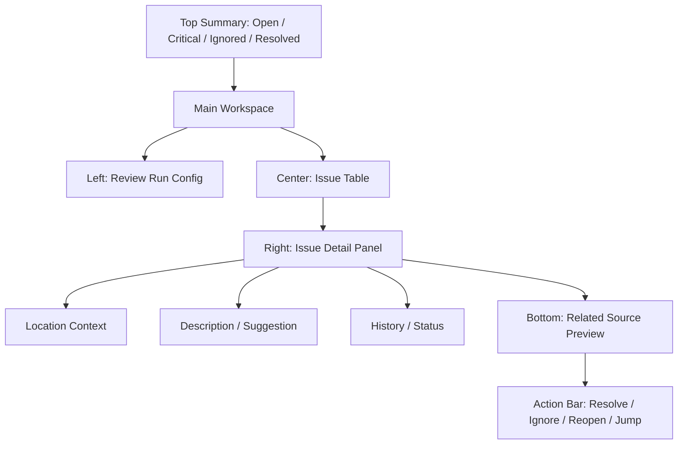

# Review Center Spec v1.0

## 1. 文档目标

- 将 `审查中心` 细化到可直接进入 UI 设计与接口实现的粒度。
- 覆盖页面结构、字段定义、按钮动作、问题流转、空态、错态、抽屉、弹窗和页面原型。
- 让 `Review Center` 成为平台质量闭环的统一入口。

## 2. 模块定位

审查中心不是“报错列表页”，而是：

- 剧情问题管理台
- 资产与 continuity 风险管理台
- prompt 执行前门禁中心
- 合规问题归档与处理台

它负责：

- 发起结构化审查
- 统一展示 issue
- 让 issue 与 episode / scene / shot / prompt 可追溯绑定
- 支持 resolve / ignore / reopen

它不负责：

- 直接修改故事、分镜、prompt
- 直接发起生产任务

## 3. 页面目标

用户进入后需要完成：

1. 选择审查范围和类型
2. 运行审查
3. 查看问题列表
4. 查看单个问题详情
5. 跳转到对应模块修复
6. 将问题标记为 resolved / ignored / reopened

## 4. 页面信息架构

### 4.1 页面区块

页面分为 6 个核心区域：

1. 顶部审查概览栏
2. 左侧审查运行配置区
3. 中央问题列表区
4. 右侧问题详情区
5. 底部相关上下文预览区
6. 全局问题动作栏

## 5. 页面主原型

## 6. 顶部审查概览栏规格

### 6.1 展示内容

- open issue 数
- critical 数
- warning 数
- resolved 数
- ignored 数
- 最近一次审查时间
- 当前阻塞摘要

### 6.2 字段定义

- `openCount`：`status ∈ {open, reopened}` 的 issue 总数
- `criticalCount`：open issue 中 `severity = critical`
- `warningCount`：open issue 中 `severity ∈ {high, medium}`（`low` 视为提示，不计入警示计数）
- `resolvedCount`
- `ignoredCount`
- `lastReviewRunAt`
- `blockingSummary`：阻塞项摘要，**阻塞阈值 = `severity ∈ {high, critical}` 的 open issue**
- `latestReviewRunId`

> severity 四档为 `low | medium | high | critical`（对齐 `data-and-api-v1.md` §6 `ReviewIssue.severity`）；概览计数与「阻塞」阈值统一以此口径派生。

### 6.3 操作

- `只看阻塞问题`：过滤 `severity ∈ {high, critical}` 且 `status ∈ {open, reopened}` 的 issue
- `打开最近一次审查结果`：以 `latestReviewRunId` 打开最近一次 run 的结果快照（§8.4 `filters.reviewRunId`）

## 7. 左侧审查运行配置区规格

### 7.1 模块目标

- 发起一次结构化审查运行。

### 7.2 字段

- `scopeType`
  - project
  - episode
  - scene
  - shot
- `scopeRef`
- `reviewRunId`（运行后回填）
- `reviewTypes[]`
  - story
  - asset
  - continuity
  - prompt
  - compliance
- `runMode`
  - full run
  - only open issues recheck
  - target type only

### 7.3 动作

- `运行审查`
- `仅重跑 continuity`
- `仅重跑 prompt`

### 7.4 规则

- scene / shot 级审查必须有对应 source entity
- prompt 审查要求当前对象存在 PromptSpec

### 7.5 空状态

- 没有可审查对象
  - 文案：`当前没有可用于审查的对象。`

### 7.6 Review Run 状态机与查询闭环

- **两条正交轴（对齐 `data-and-api-v1.md` §6 `ReviewRunStatus` / `ReviewRunVerdict` 与 §7.10 `GET /api/review-runs/:runId`）**：
  - **执行生命周期 `status`（`ReviewRunStatus`）**：`queued → running → succeeded | failed`
    - `queued`：`POST /api/reviews/run` 创建后的初始态，已入队未开始
    - `running`：审查执行中
    - `succeeded`：审查运行正常结束（无论是否命中阻塞项）
    - `failed`：审查运行自身异常终止（超时 / 服务错误 / 中断），非"内容不过审"
  - **审查结论 `verdict`（`ReviewRunVerdict`，仅 `status=succeeded` 时有值）**：
    - `passed`：无阻塞项（无 `high` / `critical` 的 open issue）
    - `blocked`：存在阻塞项
  - ⚠️ 关键区分：`status=succeeded` + `verdict=blocked`（运行成功但内容有阻塞项）与 `status=failed`（运行本身失败）是两种不同结果，UI 文案与后续动作必须分别处理
- **闭环端点**：
  - `POST /api/reviews/run`：创建 run，返回 `runId` 与初始 `status=queued`，回填 §7.2 `reviewRunId` 与 §6.2 `latestReviewRunId`
  - `GET /api/review-runs/:runId`：查询单次 run 的 `status` / `verdict` / 进度 / 结果摘要（issue 按 severity 分档计数）
  - `GET /api/projects/:projectId/review-runs`：run 历史列表，支撑 §6.3「打开最近一次审查结果」
- **结果快照来源**：run `status=succeeded` 后 issue 列表按 `reviewRunId` 关联查询（§8.4 `filters.reviewRunId`）；顶部概览计数取自 `GET /api/review-runs/:runId` 的结果摘要，保证 run → 结果回显闭环
- **运行失败错态**：run 异常终止时 `status=failed`，按 `ApiErrorEnvelope` 返回并携带失败摘要（错误码对齐 adr-004 §4）；此时 `verdict` 为空，UI 提示"审查运行失败，可重跑"，区别于"审查完成但存在阻塞项"

### 7.7 Review Run 实时更新（先快照 + SSE + 轮询兜底）

- 首屏：进入页面先拉一次快照（最近 run `GET /api/review-runs/:runId` + issue 列表），再订阅 SSE（adr-002 §7）
- SSE 事件主题到区块映射（adr-002 §5）：
  - `review.run.finished` → 刷新 run `status` / `verdict`、顶部概览计数与结果回显
  - `review.issue.changed` → 刷新中央 Issue Table 行与右侧详情面板
- 兜底：SSE 不可用时按 `data-and-api-v1.md` §7.12 定频轮询 `GET /api/review-runs/:runId`

## 8. 中央 Issue Table 规格

### 8.1 列定义

- `issueId`
- `issueType`
- `severity`
- `title`
- `locationLabel`
- `status`
- `createdAt`
- `updatedAt`
- `sourceVersion`

### 8.2 筛选维度

- `issueType`
- `severity`
- `status`
- `episode`
- `scene`
- `shot`
- `createdAt`

### 8.3 排序维度

- 最新创建
- 最新更新
- 最高 severity
- 同一 location 聚合

### 8.4 列表查询 Contract

- `GET /api/projects/:projectId/review-issues` 复用 `data-and-api-v1.md` 的统一列表 query contract
- `filters.issueType` / `filters.severity` / `filters.status` / `filters.episodeId` / `filters.sceneId` / `filters.shotId` 对应本页筛选项
- `filters.reviewRunId` 支撑「打开最近一次审查结果」，按指定 run 过滤 issue 快照
- `createdFrom` / `createdTo` 对应时间区间筛选
- `sortBy` 允许：`createdAt` / `updatedAt` / `severity`

### 8.5 行级动作

- 查看详情
- 标记 resolved
- 标记 ignored
- 打开 source

### 8.6 状态显示

- `open`
- `resolved`
- `ignored`
- `reopened`

### 8.7 severity 视觉规则

- `critical`：最高强调（红色实心标签）
- `high`：高强调（橙色标签），与 critical 同属阻塞项
- `medium`：中等强调（黄色标签）
- `low`：低强调（中性色标签）
- 阻塞项（`high` / `critical`）在行首附加阻塞标记，便于「只看阻塞问题」定位

### 8.8 批量操作

- 支持多选 issue 后批量 `标记 resolved` / `标记 ignored`
- 批量 ignore 复用单条 ignore 的必填原因约束（见 §15）
- 批量操作按 issue 逐条应用状态流转规则；部分失败时返回逐条结果，不整体回滚

## 9. 右侧 Issue Detail Panel 规格

### 9.1 区块 A：问题头信息

字段：

- `issueId`
- `issueType`
- `severity`
- `status`
- `title`

### 9.2 区块 B：定位信息

字段：

- `projectId`
- `episodeId`
- `sceneId`
- `shotId`
- `promptSpecId`
- `artifactId`

### 9.3 区块 C：问题描述

字段：

- `description`
- `suggestion`
- `reviewEvidence`
- `ruleCode`
- `sourceVersion`

### 9.4 区块 D：状态历史

字段：

- `issueEvents[]`
  - action
  - old status
  - new status
  - changedAt
  - changedBy
  - note

### 9.5 区块 E：相关引用

动作：

- `打开故事开发页`
- `打开设定台账`
- `打开分镜导演台`
- `打开 Prompt 中心`
- `打开生产中心`

跳转上下文映射（navigation §6.3）：每个按钮以 issue 的定位 ID 携带 `scopeRef` 与 `returnTo=review_center`：

- `打开故事开发页`：用 `episodeId`
- `打开设定台账`：用 `artifactId` 关联资产 / 命中的 asset issue 定位
- `打开分镜导演台`：用 `sceneId` / `shotId`
- `打开 Prompt 中心`：用 `promptSpecId`
- `打开生产中心`：用 `shotId` / `promptSpecId` 反查关联任务
- 目标定位 ID 缺失时按钮置灰，并复用 §18.3「源上下文不可用」错态

## 10. 底部 Related Source Preview 规格

### 10.1 模块目标

- 在当前页快速预览与 issue 关联的上下文。

### 10.2 预览类型

- story issue
  - 显示相关 episode summary / scene summary
- asset issue
  - 显示相关 character / look / prop
- continuity issue
  - 显示前后镜头摘要
- prompt issue
  - 显示当前 PromptSpec 摘要
- compliance issue
  - 显示命中的规则和文本片段

## 11. 全局问题动作栏规格

### 11.1 操作按钮

- `标记 resolved`
- `标记 ignored`
- `重新打开`
- `跳转修复`

### 11.2 启用条件

- `标记 resolved`
  - 当前 issue 为 `open` 或 `reopened`
- `标记 ignored`
  - 当前 issue 为 `open` 或 `reopened`
- `重新打开`
  - 当前 issue 为 `resolved` 或 `ignored`

### 11.3 规则

- ignore 必须填写原因
- reopen 建议填写原因
- resolve 可选填写修复说明

## 12. 问题状态流转

### 12.1 状态机

- `open`
- `resolved`
- `ignored`
- `reopened`

### 12.2 流转规则

- `open -> resolved`
- `open -> ignored`
- `resolved -> reopened`
- `ignored -> reopened`
- `reopened -> resolved`
- `reopened -> ignored`

### 12.3 关键约束

- ignored 不代表删除
- resolved 不代表自动消失
- reopened 后应进入高优先处理视图

### 12.4 状态动作端点与门禁

- 动作端点（属 append-only 系统写入，不走乐观锁，见 adr-003 §6）：
  - `POST /api/review-issues/:issueId/resolve`
  - `POST /api/review-issues/:issueId/ignore`
  - `POST /api/review-issues/:issueId/reopen`
- 非法流转（如对 `resolved` 再次 resolve）返回 `invalid_state` 错误信封（adr-004 §4）
- **下游门禁（blocked_by_issue）**：存在 `severity ∈ {high, critical}` 且 `status ∈ {open, reopened}` 的阻塞 issue 时，下游动作（Prompt 编译 / 生产任务创建 / 导出）被阻断，服务端返回 `blocked_by_issue` 错误信封，`details` 列出阻塞 issue，`suggestedTarget` 指向 Review Center
- **reopen / 去重规则**：再次审查（§19.3）命中与已 `resolved` issue 相同 `ruleCode + location` 的问题时，自动 `reopen` 原 issue（不新建重复项）；无匹配则新建 issue

## 13. 典型 issue 类型定义

### 13.1 story

示例：

- 当前集钩子不成立
- 场景目标不清
- 角色动机断裂

### 13.2 asset

示例：

- shot 缺少 look 引用
- 道具状态缺失
- 场景与时间设定冲突

### 13.3 continuity

示例：

- 上一镜与本镜角色状态不连续
- 服装版本突变
- 道具持有关系突变

### 13.4 prompt

示例：

- 当前 prompt 未绑定 model profile
- 当前 prompt 不是最新 source 编译结果
- 当前 confirmed prompt 仍缺关键段落

### 13.5 compliance

示例：

- 敏感内容风险
- 平台发布规范风险
- 指定题材限制违规

## 14. 审查运行弹窗规格

### 14.1 Run Review Modal

#### 用途

- 确认本次审查的范围和类型。

#### 字段

- `scopeType`
- `scopeRef`
- `reviewTypes[]`
- `runMode`

#### 动作

- `开始审查`
- `取消`

## 15. Ignore Issue Modal

### 用途

- 标记问题忽略时补充原因。

### 字段

- `ignoreReason`
- `note`

### 动作

- `确认忽略`
- `取消`

### 校验

- `ignoreReason` 必填，长度 1–200 字符，空白或纯空格视为无效，前端阻止提交
- 校验不通过时服务端返回 `validation_failed` 错误信封（adr-004 §4）

## 16. Resolve Issue Modal

### 用途

- 标记问题已修复时记录说明。

### 字段

- `resolutionNote`

### 动作

- `确认已解决`
- `取消`

## 17. Reopen Issue Modal

### 用途

- 对 `resolved` / `ignored` 的问题重新打开时补充原因。

### 字段

- `reopenReason`（建议填写）
- `note`

### 动作

- `确认重新打开`
- `取消`

### 规则

- reopen 仅对 `resolved` / `ignored` 生效，非法状态返回 `invalid_state`
- reopen 后 issue 进入高优先处理视图（§12.3）
- 系统触发的自动 reopen（§12.4 去重规则）不弹此弹窗，直接写入 issue event

## 18. 空态 / 错态总表

### 18.1 无 issue

- 文案：`当前范围内没有问题。`
- 动作：`重新运行审查`

### 18.2 issue 列表加载失败

- 文案：`问题列表加载失败。`
- 动作：`重试`

### 18.3 issue 详情缺失上下文

- 文案：`问题存在，但源上下文不可用。`
- 动作：
  - `刷新关联`
  - `打开最近可用对象`

### 18.4 审查运行失败

- 文案：`本次审查未完成。`
- 动作：
  - `查看错误`
  - `重试`
- 错误返回遵循 `ApiErrorEnvelope`

### 18.5 首屏加载态（skeleton）

- 进入本页拉取审查概览 / run 配置 / issue 列表 / issue 详情 / 关联源预览快照期间，展示结构化骨架占位，不使用整页 spinner：
  - 顶部审查概览栏：`status` / `verdict` 与统计指标占位骨架
  - 左侧审查运行配置区：范围与配置项占位骨架
  - 中央 Issue Table：3~5 行表格骨架，保留列结构
  - 右侧 Issue Detail Panel：字段级骨架
  - 底部 Related Source Preview：预览卡占位骨架
- 局部刷新（切换 issue、run 完成后回读、issue 状态变更后刷新）不清空已加载内容，仅对目标区域做局部 loading，避免闪烁与数据丢失
- run 执行期间以 `status` 派生态（`running` 等）驱动进度提示，不复用首屏骨架态；骨架态仅用于页面/局部数据拉取
- SSE `review.run.finished` 到达后刷新 `status / verdict` 与 issue 列表，刷新期间对受影响区域做局部 loading，不回退整页骨架
- 首屏快照拉取失败时不停留在骨架态，走 §18 错态并提供 `重试`；重试成功后从骨架态平滑切换到真实内容

## 19. 页面交互链

### 19.1 标准主链

1. 选择范围
2. 运行审查
3. 查看 issue 列表
4. 选中 issue
5. 查看定位和建议
6. 跳转修复
7. 回到 issue
8. 标记 resolved

### 19.2 忽略链

1. 选中 issue
2. 判断暂不处理
3. 输入 ignore 原因
4. 标记 ignored

### 19.3 返工链

1. resolved 后再次运行审查
2. 同类问题仍存在
3. issue reopened
4. 重新进入修复流程

## 20. 页面级验收标准

- 所有 issue 都有明确定位维度
- issue 状态流转完整可追溯
- ignore 必须有原因
- 从 issue 到 source 页面跳转准确
- 高优先级 issue 可被总览页聚合显示

## 21. 后续接口映射建议

- `POST /api/reviews/run`
- `GET /api/review-runs/:runId`
- `GET /api/projects/:projectId/review-runs`
- `GET /api/projects/:projectId/review-issues`
- `GET /api/review-issues/:issueId`
- `PATCH /api/review-issues/:issueId`
- `POST /api/review-issues/:issueId/resolve`
- `POST /api/review-issues/:issueId/ignore`
- `POST /api/review-issues/:issueId/reopen`
- `GET /api/review-issues/:issueId/events`

## 22. 一句话结论

- 审查中心不是“看问题的地方”，而是平台质量闭环的控制台：它必须让问题结构化、可定位、可流转、可追溯，并持续把高风险问题推回上游模块修复。
