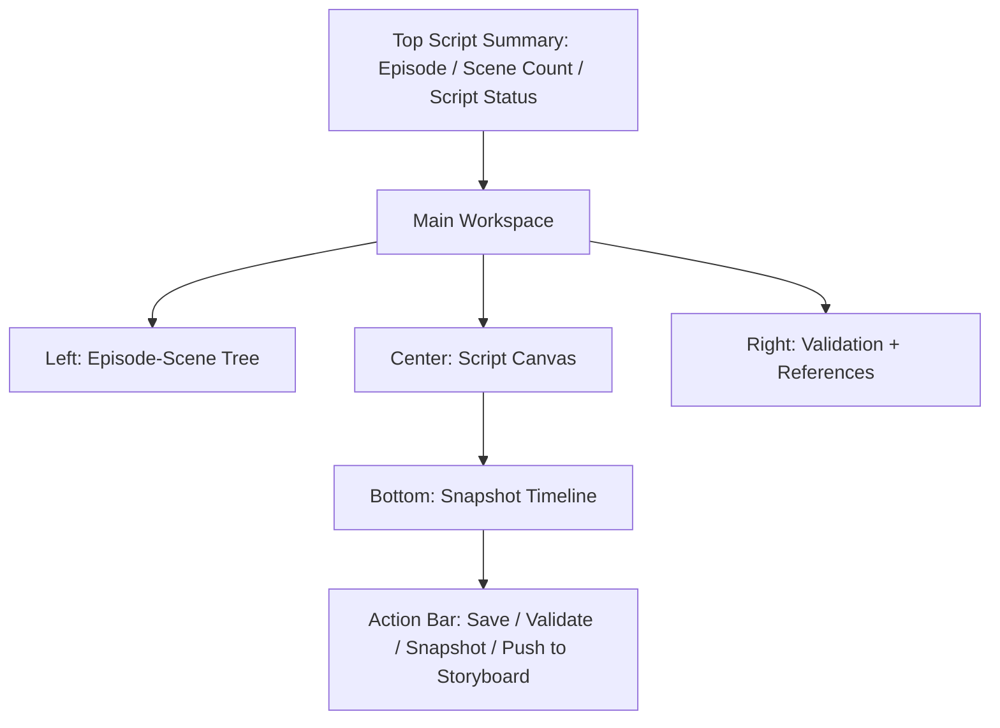

# Script Editor Spec v1.0

## 1. 文档目标

- 将 `剧本编辑` 模块细化到可直接进入 UI 设计与接口实现的粒度。
- 覆盖页面结构、字段定义、按钮动作、版本快照、空态、错态、抽屉、弹窗和页面原型。
- 让剧本页成为故事层到分镜层之间的结构化桥梁。

## 2. 模块定位

剧本编辑不是自由文本编辑器，而是：

- scene 级叙事结构编辑台
- 对白与动作块管理台
- 分镜输入预处理层

它负责：

- 管理 episode 下 scene 列表
- 管理 scene 目标与状态
- 管理对白和动作块
- 输出结构化 scene 数据给分镜导演台

它不负责：

- 直接拆 shot
- 直接编译 prompt
- 直接发起任务

## 3. 页面目标

用户进入后需要完成：

1. 维护 scene 列表和顺序
2. 编辑每个 scene 的目标、冲突、承接
3. 编辑对白与动作块
4. 校验 scene 完整性
5. 保存剧本快照
6. 将 scene 推入分镜阶段

## 4. 页面信息架构

### 4.1 页面区块

1. 顶部剧本概览栏
2. 左侧 episode/scene 树
3. 中央 script canvas
4. 右侧结构校验与引用面板
5. 底部快照历史区
6. 全局动作栏

## 5. 页面主原型

## 6. 顶部剧本概览栏规格

### 6.1 展示字段

- `episodeNo`
- `episodeTitle`
- `sceneCount`
- `scriptStatus`
  - `draft | confirmed`（持久状态）
- `scriptReadiness`
  - `incomplete | ready_for_storyboard`（UI 派生态）
- `updatedAt`

## 7. 左侧 Episode-Scene Tree 规格

### 7.1 展示字段

- episode 节点：
  - `episodeNo`
  - `title`
  - `status`
- scene 节点：
  - `sceneNo`
  - `title`
  - `location`
  - `validationStatus`
  - `storyboardSyncFlag`

### 7.2 动作

- 新建 scene
- 复制 scene
- 删除 scene
- 拖拽 scene 排序
- 跳转 scene 编辑

### 7.3 规则

- scene 删除前需检查是否已生成 shot
- 已生成 shot 的 scene 删除需二次确认

## 8. 中央 Script Canvas 规格

### 8.1 Section A：场次基础信息

- `sceneNo`
- `title`
- `locationId`
- `timeOfDay`
- `summary`
- `dramaticGoal`
- `conflict`
  - 场次核心冲突（§3.2 编辑目标与 §9.1「scene 是否有冲突」校验共用此字段）
  - 落库：`scenes.scene_conflict`（TEXT），领域类型 `Scene.conflict`
  - 校验：`conflict` 为空时 §9.1 冲突校验产出 `warning`（非阻塞），确认剧本前建议补齐
- `version`

字段落库：Section A 各字段落 `scenes` 表对应列，保存走 `PATCH /api/scenes/:sceneId`，必带 `version`（乐观锁，见 §15.2）

### 8.2 Section B：场次进入 / 退出状态

- `entryState`
- `exitState`

### 8.3 Section C：对白块（Dialogue Blocks）

每个块字段（落 `scene_dialogue_blocks`，领域类型 `SceneDialogueBlock`）：

- `speakerCharacterId`
  - 落 `speaker_character_id`，关联 `characters.id`；可空（旁白 / 未指派）
- `text`
  - 落 `text`（NOT NULL），**必填非空**；为空时该块保存返回 `validation_failed`
- `emotion`
  - 落 `emotion`；自由文本（V1 不强制枚举），建议取值如 `calm / angry / anxious / joyful`
- `deliveryNote`
  - 落 `delivery_note`；台词处理提示，可空
- `order`
  - 落 `sort_order`（NOT NULL）；同 scene 内连续整数，由 reorder 端点统一重排

端点：

- `GET /api/scenes/:sceneId/dialogue-blocks`
- `POST /api/scenes/:sceneId/dialogue-blocks`
- `PATCH /api/dialogue-blocks/:blockId`
- `DELETE /api/dialogue-blocks/:blockId`
- `POST /api/scenes/:sceneId/dialogue-blocks/reorder`（请求体：有序 `blockId` 列表）

### 8.4 Section D：动作块（Action Blocks）

每个块字段（落 `scene_action_blocks`，领域类型 `SceneActionBlock`）：

- `actionText`
  - 落 `action_text`（NOT NULL），**必填非空**
- `actorRefs[]`
  - 落 `actor_refs_json`（默认 `[]`）；元素为 `characters.id`
- `propRefs[]`
  - 落 `prop_refs_json`（默认 `[]`）；元素为 `props.id`
- `order`
  - 落 `sort_order`（NOT NULL）；同 scene 内连续整数，由 reorder 端点统一重排

端点：

- `GET /api/scenes/:sceneId/action-blocks`
- `POST /api/scenes/:sceneId/action-blocks`
- `PATCH /api/action-blocks/:blockId`
- `DELETE /api/action-blocks/:blockId`
- `POST /api/scenes/:sceneId/action-blocks/reorder`（请求体：有序 `blockId` 列表）

块级契约说明：对白块 / 动作块为独立行、独立端点管理，**不随 `PATCH /scenes` 嵌套保存**；块为 append-only 结构外的可编辑对象，自身不带 `version`，其增删改不改变 `scenes.version`。

### 8.5 Section E：场次标签

- `sceneTags[]`
  - exposition
  - conflict
  - reversal
  - hook

### 8.6 操作

- 新增对白块（`POST /api/scenes/:sceneId/dialogue-blocks`）
- 新增动作块（`POST /api/scenes/:sceneId/action-blocks`）
- 调整块顺序（对应 `dialogue-blocks/reorder` 或 `action-blocks/reorder`）
- 删除块（`DELETE /api/dialogue-blocks/:blockId` 或 `.../action-blocks/:blockId`）
- 保存当前 scene（`PATCH /api/scenes/:sceneId`，必带 `version`）

## 9. 右侧 Validation + References 面板规格

### 9.1 Validation 检查项

- scene 是否有目标（`dramaticGoal` 非空）
- scene 是否有冲突（`conflict` 非空，对应 §8.1；缺失产出 `warning`）
- entry/exit state 是否齐全
- 是否存在对白或动作（至少 1 个 dialogue 或 action 块）
- 角色引用是否有效
  - 有效性判定：对白块 `speakerCharacterId`、动作块 `actorRefs` 引用的角色必须存在且 `status=active`
  - 引用到 `status=disabled` 角色，或引用 `look_id` 已 `is_current=false`（失效造型）判为**无效引用**，产出 `error` 并可定位到具体块
- 端点：`POST /api/scenes/:sceneId/validate`，响应结构为 `SceneValidateResult`（唯一权威见 `data-and-api-v1.md` §6.3）：逐检查项 `ok/warning/error` 与定位 `ref`

### 9.2 References 预览

- 当前 scene 引用角色
- 当前 scene 引用道具
- 当前 scene 对应分镜同步状态

`scene_characters` 写入时机（角色 / look 出场关联）：

- 在保存对白块 / 动作块时，由服务端据块内 `speakerCharacterId` / `actorRefs` **派生 upsert** `scene_characters`（`look_id` 取该角色当前默认 `is_current` look）
- 删除相关块后，若某角色不再被任何块引用，则同事务移除对应 `scene_characters` 行
- 该表是下游分镜 References 与角色出场的唯一来源，不由用户手动维护

### 9.3 状态定义

- `ok`
- `warning`
- `error`

## 10. 底部快照历史区规格

### 10.1 快照字段

- `snapshotId`
- `versionLabel`
- `createdAt`
- `createdBy`
- `changeSummary`
- `snapshotPayloadVersion`
  - `script_snapshots` 表无独立列，作为 `snapshot_payload_json` 内部字段存储（payload schema 版本号），随 payload 一并读写

### 10.2 动作与端点

- 创建快照：`POST /api/episodes/:episodeId/snapshots`
- 查看快照列表：`GET /api/episodes/:episodeId/snapshots`（返回 `versionLabel` / `changeSummary` / 时间）
- 查看单个快照：`GET /api/episodes/:episodeId/snapshots/:snapshotId`（返回完整 `snapshotPayload`）
- 恢复快照：`POST /api/episodes/:episodeId/snapshots/:snapshotId/restore`

### 10.3 规则

- 快照作用域为**集级**：payload 覆盖该集全部 scene / 对白块 / 动作块结构
- **恢复语义**：
  - 恢复前服务端**自动创建一次当前状态快照**（`change_summary` 标注为「恢复前自动快照」），保证可回滚
  - 再以指定快照 payload 覆盖当前剧本内容
  - 恢复后当前工作区重载
- 恢复后各 scene 的 `version` 递增（视为一次写入），并遵循乐观锁：若恢复期间集内 scene 被他处修改产生冲突，返回 `version_conflict`
- 若 scene 已有下游分镜，恢复快照后标记 storyboard unsynced
- 快照恢复不覆盖历史快照记录，而是生成新的当前版本

## 11. 全局动作栏规格

### 11.1 操作按钮

- `保存剧本`
- `运行结构校验`
- `创建快照`
- `确认剧本`
- `推送到分镜`

### 11.2 启用条件

- `确认剧本`
  - 无 error
  - 端点 `POST /api/episodes/:episodeId/script/confirm`（必带该集 `version`）
- `推送到分镜`
  - scriptStatus 为 `confirmed`
  - 或 `scriptReadiness=ready_for_storyboard`
  - 端点 `POST /api/episodes/:episodeId/script/push-to-storyboard`
  - 推送粒度为**集级**（一次推送该集全部 confirmed scene）；进入分镜后再按 scene 定位（navigation §5.3），二者不冲突
  - 失败态映射（adr-004）：存在 error 校验项 → `blocked_by_issue`；未确认 → `invalid_state`；集不存在 → `missing_resource`

## 12. Create Scene Modal

### 字段

- `title`
- `locationId`
- `timeOfDay`
- `insertPosition`

### 动作

- `创建`
- `取消`

## 13. Delete Scene Confirm Modal

### 展示字段

- `sceneNo`
- `title`
- `hasStoryboards`
- `hasArtifacts`

### 动作

- `确认删除`
- `取消`

### 规则

- 若已有关联 shot 或 artifact，必须强确认
- 端点 `DELETE /api/scenes/:sceneId`；被拒时按 adr-004 返回：
  - 存在下游 shot / artifact 且未强确认 → `invalid_state`（`details` 列出关联对象数）
  - scene 不存在 → `missing_resource`
- 强确认删除会级联删除该 scene 的对白 / 动作块与 `scene_characters` 关联

## 14. 状态流转

### 14.1 持久状态：scriptStatus

- `draft`
- `confirmed`

### 14.2 UI 派生态：scriptReadiness

- `incomplete`
- `ready_for_storyboard`
- `story_unsynced`（上游故事变更信号，见 §14.4）
- `storyboard_unsynced`（下游分镜已存在但剧本回退 / 快照恢复触发，见 §10.3）

### 14.3 规则

- 初始为 draft
- 结构校验通过后，UI 派生 `ready_for_storyboard`
- 用户确认后为 confirmed
- 任一 scene 重大变更可回退为 draft

### 14.4 上游故事变更联动（story_unsynced）

- 当上游故事层发生重大改动（Story Workspace §13.3 发出 `story_unsynced` 信号）时，本页进入 `story_unsynced` 派生态（对齐 page-state-machine §6.2）
- 表现：顶部提示「上游故事已更新，剧本可能过期」，已确认剧本不静默继续推送分镜
- 用户可选择：查看故事变更 / 忽略并保留当前剧本 / 重新对齐后再确认

## 15. 空态 / 错态总表

### 15.1 无 scene

- 文案：`当前集没有场次，先创建 scene。`
- 动作：`新建 scene`

### 15.2 保存失败

- 文案：`剧本保存失败。`
- 动作：`重试`
- 并发冲突：`PATCH /scenes`、`PATCH /shots`、确认类动作必带 `version`，版本不匹配返回 `version_conflict`（引用 adr-003）
  - 提供三动作：`比较差异` / `刷新并覆盖本地视图` / `重新编辑`（对齐 adr-003 §4.3）
  - 错误信封携带 `currentVersion` 与对象摘要

### 15.3 校验失败

- 文案：`剧本结构存在问题。`
- 动作：`定位错误字段`

### 15.4 错误码映射（引用 adr-004）

- `validation_failed`：块 `text` / `actionText` 为空、reorder 列表非法
- `version_conflict`：乐观锁冲突（见 §15.2）
- `invalid_state`：未确认即推送 / 删除含下游对象的 scene 未强确认
- `blocked_by_issue`：存在 error 校验项时确认 / 推送被阻塞
- `missing_resource`：scene / episode / block 不存在
- 所有错态统一按 `ApiErrorEnvelope` 返回

### 15.5 首屏加载态（skeleton）

- 进入本页拉取 episode / scenes / dialogue + action blocks 快照期间，展示结构化骨架占位，不使用整页 spinner：
  - 左侧 scene list：3~5 条灰条骨架，保留列表结构轮廓
  - 中央编辑区：段落级骨架（对白行 / 动作块占位条），保留分栏结构
  - 右侧 inspector：字段级骨架（结构校验状态、快照信息占位）
- 局部刷新（如切换 scene、保存后回读、校验后刷新）不清空已加载内容，仅对目标区域做局部 loading，避免闪烁与数据丢失
- 首屏快照拉取失败时不停留在骨架态，走 §15 错态并提供 `重试`；重试成功后从骨架态平滑切换到真实内容
- 加载态与派生态（`story_unsynced` 等）互斥：骨架态仅用于首屏/局部数据拉取，业务派生态在数据就绪后再计算

## 16. 页面交互链

1. 选择集
2. 新建或编辑 scene
3. 编辑对白与动作块
4. 运行结构校验
5. 创建快照
6. 确认剧本
7. 推送到分镜

## 17. 页面级验收标准

- scene 列表和顺序稳定持久化
- 对白/动作块可编辑并排序
- 校验结果可定位字段
- 快照可恢复
- 推送分镜后状态正确联动

## 18. 接口契约（强绑定，权威见 data-and-api §7.3）

scene：

- `GET /api/episodes/:episodeId/scenes`
- `POST /api/episodes/:episodeId/scenes`
- `POST /api/episodes/:episodeId/scenes/reorder`
- `PATCH /api/scenes/:sceneId`（必带 `version`）
- `POST /api/scenes/:sceneId/duplicate`
- `DELETE /api/scenes/:sceneId`
- `POST /api/scenes/:sceneId/validate`
- `POST /api/scenes/:sceneId/storyboard/validate`

对白块 / 动作块：

- `GET|POST /api/scenes/:sceneId/dialogue-blocks`、`PATCH|DELETE /api/dialogue-blocks/:blockId`、`POST /api/scenes/:sceneId/dialogue-blocks/reorder`
- `GET|POST /api/scenes/:sceneId/action-blocks`、`PATCH|DELETE /api/action-blocks/:blockId`、`POST /api/scenes/:sceneId/action-blocks/reorder`

快照：

- `POST /api/episodes/:episodeId/snapshots`
- `GET /api/episodes/:episodeId/snapshots`
- `GET /api/episodes/:episodeId/snapshots/:snapshotId`
- `POST /api/episodes/:episodeId/snapshots/:snapshotId/restore`

确认 / 推送：

- `POST /api/episodes/:episodeId/script/confirm`（必带 `version`）
- `POST /api/episodes/:episodeId/script/push-to-storyboard`

## 19. 一句话结论

- 剧本编辑页的核心价值在于“结构化 scene”：它把故事层的抽象叙事转换成分镜层可消费的数据骨架。
