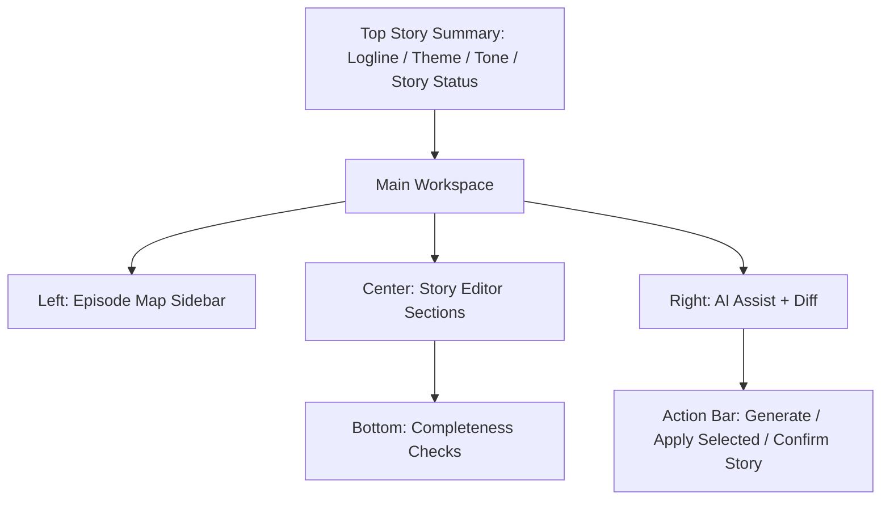

# Story Workspace Spec v1.0

## 1. 文档目标

- 将 `故事开发` 模块细化到可直接进入 UI 设计与接口实现的粒度。
- 覆盖页面结构、字段定义、按钮动作、确认逻辑、空态、错态、抽屉、弹窗和页面原型。
- 让故事开发页真正成为生产前事实层的第一入口。

## 2. 模块定位

故事开发不是“聊天生成页”，而是：

- 项目故事圣经编辑台
- 分集地图与节奏规划台
- 角色关系和主线副线的事实输入页

它负责：

- 维护 logline、theme、tone
- 维护角色关系和冲突轴
- 维护分集地图、钩子和节奏
- 为剧本页提供稳定输入

它不负责：

- 直接分镜
- 直接生成 prompt
- 直接创建任务

## 3. 页面目标

用户进入后需要完成：

1. 定义项目故事定位
2. 补齐角色关系和核心冲突
3. 规划分集地图
4. 规划节奏与钩子
5. 对 AI 建议做 selective apply
6. 确认故事层可进入剧本编辑

## 4. 页面信息架构

### 4.1 页面区块

1. 顶部故事概览栏
2. 左侧分集导航
3. 中央故事编辑区
4. 右侧 AI Assist / Diff 区
5. 底部完整性检查区
6. 全局确认动作栏

## 5. 页面主原型



## 6. 顶部故事概览栏规格

### 6.1 展示内容

- 项目名
- logline 摘要
- theme
- tone
- projectStoryStatus（项目级故事状态，派生 rollup）
- 最近更新时间

### 6.2 字段定义

- `projectName`
- `loglineSummary`
- `theme`
- `tone`
- `projectStoryStatus`
  - `confirmed | partial | draft`（UI 派生态 rollup，见 adr-006 §3）
  - 语义：`confirmed`=项目下存在 ≥1 集且全部集 `Episode.storyStatus=confirmed`；`partial`=部分集 `confirmed`；`draft`=无任何集 `confirmed`
  - **本字段不落库**；故事确认的唯一权威持久态是集级 `Episode.storyStatus`，概览栏由集级状态派生展示
- `currentEpisodeStoryStatus`
  - `draft | confirmed`（当前选中集的持久态，直读 `Episode.storyStatus`）
- `storyReadiness`
  - `incomplete | ready_for_script`（UI 派生态）
  - 由**当前选中集** `Episode.storyStatus=draft` 且该集通过 `story/completeness-check` 无 error 派生（见 §10）
- `updatedAt`

## 7. 左侧分集导航规格

### 7.1 展示字段

- `episodeNo`
- `title`
- `summary`
- `hookType`
- `status`
  - 集级 `Episode.storyStatus`（`draft | confirmed`），逐集展示确认徽标
- `sceneCount`

### 7.2 动作

- 切换 episode（选中集即为后续「确认本集 / 进入剧本编辑」的作用域）
- 新建 episode（`POST /api/projects/:projectId/episodes`）
- 调整集顺序
  - 端点：`POST /api/projects/:projectId/episodes/reorder`
  - 请求体：有序 `episodeId` 列表 `{ episodeIds: Id[] }`，服务端据此重排 `episode_no`
  - 全量顺序提交，非法（缺集 / 混入他项目集）返回 `validation_failed`

### 7.3 空状态

- 文案：`还没有分集，先生成或手动添加。`
- 动作：
  - `AI 生成分集草案`
    - 端点：`POST /api/projects/:projectId/episodes/generate-outline`（异步任务 `story_generate`）
    - 与「生成故事圣经」区分：`story-bible/generate` 产出 bible 段落，本端点产出分集大纲
    - 异步交互见 §12.1（pending / 进度 / 超时 / 取消 / 部分成功）
  - `手动新建第 1 集`（`POST /api/projects/:projectId/episodes`）

## 8. 中央故事编辑区规格

### 8.1 Section A：项目故事定位

字段：

- `logline`
- `theme`
- `tone`
- `genre`
- `audience`
- `worldRules`

字段归属规则：

- `genre` / `audience` 来自 `Project Setup`，此处只读回显，不在故事层重复写入
- `tone` / `worldRules` / `logline` / `theme` 的唯一编辑入口在本页面，持久化到 `project_story_bibles`
  - `logline` / `theme` / `tone` 为标量列；`worldRules` 落 `world_rules_json`
- 本 section 的保存走 `PATCH /api/projects/:projectId/story-bible`，必带 `version`（乐观锁，见 §14.3）

### 8.2 Section B：角色关系与冲突轴

字段：

- `mainCharacter`
- `mainConflict`
- `relationshipMap`
- `villainSystem`
- `motivationChain`
- `characterRelations`

落库映射与 JSON schema（对齐 `project_story_bibles`）：

> 唯一权威 TS 结构见 `data-and-api-v1.md` §6（`WorldRulesJson` / `CharacterRelationsJson` / `VillainSystemJson` / `PacingPlanJson` / `HookSystemJson` / `StoryBibleSourceRef`）；本页各 JSON 块为字段语义与页面落库映射，结构须与之保持一致。

- `villainSystem` → `villain_system_json`
- 其余 5 字段统一落 `character_relations_json`（读出为 `ProjectStoryBible.characterRelations`），内部结构：

```ts
interface CharacterRelationsJson {
  mainCharacter?: {
    characterRef?: Id;        // 关联 characters.id（可空，允许尚未建资产）
    name?: string;
    goal?: string;            // 主角外部目标
    want?: string;            // 表层欲望
    need?: string;            // 深层需求
  };
  mainConflict?: {
    axis: string;             // 冲突轴一句话
    protagonistSide?: string;
    antagonistSide?: string;
    stake?: string;           // 赌注 / 失败后果
  };
  relationshipMap?: Array<{
    fromRef?: Id; toRef?: Id;  // 关联 characters.id
    fromName?: string; toName?: string;
    relationType: string;      // 如 恋人 / 敌对 / 血缘 / 利益
    note?: string;
  }>;
  motivationChain?: Array<{
    characterRef?: Id;
    trigger: string;           // 触发事件
    motivation: string;        // 由此产生的动机
    action: string;            // 采取的行动
    order: number;
  }>;
  characterRelations?: string; // 自由补充说明（非结构化备注）
}
```

- `villain_system_json`（读出为 `ProjectStoryBible.villainSystem`）：

```ts
interface VillainSystemJson {
  villains?: Array<{
    characterRef?: Id;
    name?: string;
    goal?: string;
    method?: string;          // 施压手段
    pressureCurve?: string;   // 对主角的施压节奏
  }>;
}
```

### 8.3 Section C：分集地图

字段：

- `episodeGoal`
- `episodeConflict`
- `episodeTurn`
- `episodeEndingHook`

落库映射：

- 本 section 为**集级字段**，逐集持久化到 `episodes` 表对应列（`episode_goal` / `episode_conflict` / `episode_turn` / `episode_ending_hook`），保存走 `PATCH /api/episodes/:episodeId`，必带该集 `version`
- 与 §8.2 项目级 bible 不同：这里作用域是当前选中集

### 8.4 Section D：节奏与钩子规划

字段：

- `pacingPlan`
- `hookSystem`
- `cliffhangerPlan`

落库映射与 JSON schema（对齐 `project_story_bibles`）：

- `pacingPlan` → `pacing_plan_json`；`hookSystem` 与 `cliffhangerPlan` 统一落 `hook_system_json`（`cliffhangerPlan` 作为其子字段，不新增列）

```ts
interface PacingPlanJson {
  overallCurve?: string;                 // 整体节奏曲线描述
  beatsPerEpisode?: number;              // 每集目标节拍数
  segments?: Array<{ label: string; targetPaceSec?: number; note?: string }>;
}

interface HookSystemJson {
  hooks?: Array<{
    episodeRef?: Id;
    hookType: string;                    // 悬念 / 反转 / 情感 / 信息差
    placement: "cold_open" | "mid" | "ending";
    description: string;
  }>;
  cliffhangerPlan?: Array<{              // 原 cliffhangerPlan，并入本列
    episodeRef?: Id;
    setup: string;
    payoffEpisodeRef?: Id;               // 兑现于哪一集
    intensity?: "low" | "medium" | "high";
  }>;
}
```

### 8.5 操作

- 保存 section
- 生成 AI 建议
- 应用选中建议
- 回退本 section

## 9. 右侧 AI Assist / Diff 区规格

### 9.1 模块目标

- 承接 AI 生成结果，但不允许直接覆盖人工事实。

### 9.2 展示内容

- AI 建议版本
- 与当前人工版本 diff
- 可选择应用的片段

### 9.3 动作

- `生成建议`
- `仅补全缺失`
- `重新生成`
- `应用选中变更`

### 9.4 规则

- 所有 AI 结果默认只读
- 只能通过“选择应用”写回

## 10. 底部完整性检查区规格

### 10.1 检查项

- logline 是否存在
- main conflict 是否存在
- 每集是否存在 goal / hook
- 节奏规划是否完整

### 10.2 状态

- ok
- warning
- error

### 10.3 数据来源与端点

- 端点：`POST /api/projects/:projectId/story/completeness-check`
- 响应结构 `StoryCompletenessResult`（data-api §6.3，权威）：含 `projectSummary` 项目级汇总与 `episodeDetails` 逐集结果
- 作用域：既返回项目级汇总，也返回逐集结果（`episodeId` → 检查项状态），供左侧导航逐集徽标使用
- 该端点是**确认前门禁**与 `ready_for_script` 派生态的唯一来源：
  - 某集全部检查项无 error → 该集派生 `ready_for_script`
  - 存在 error → 不允许对该集执行「确认本集」，也不参与「批量确认」
- 响应错误按 adr-004 `ApiErrorEnvelope` 返回，`details` 携带未通过检查项与定位 ref

### 10.4 规则

- 有 error 不允许确认 story（单集与批量同门禁）

## 11. 全局确认动作栏规格

### 11.1 操作按钮

- `保存故事层`
- `运行完整性检查`（`POST /api/projects/:projectId/story/completeness-check`）
- `确认本集`
  - 端点：`POST /api/episodes/:episodeId/story/confirm`
  - 权威写入当前选中集 `Episode.storyStatus=confirmed`（见 adr-006 §3，为故事确认唯一权威写入）
  - 请求体携带该集 `version`（乐观锁）
- `批量确认全部集`
  - 端点：`POST /api/projects/:projectId/story/confirm`
  - 语义 = 对通过完整性检查的**全部集**执行单集确认（rollup 快捷入口，不是独立真相态）
  - 未通过完整性检查的集被跳过，响应 `details` 列出被跳过集与原因
- `进入剧本编辑`
  - 必须携带当前选中集 `episodeId`（剧本状态 `scriptStatus` 为分集级，见 navigation §5.2）
  - 未选中集时按钮置灰，提示「先在左侧选择要编辑的集」

### 11.2 启用条件

- `确认本集`
  - 当前集完整性检查无 error
- `批量确认全部集`
  - 至少存在 1 集通过完整性检查（可批量确认通过项）
- `进入剧本编辑`
  - 已选中某集，且该集 `Episode.storyStatus=confirmed` 或 `storyReadiness=ready_for_script`

### 11.3 回跳上下文接收（navigation §6.3 握手，来自 Review Center）

- 入参：`scopeRef=episodeId` + `returnTo=review_center` + 固定 `projectId`。
- 接收行为：
  - 定位并选中 `episodeId` 对应集，滚动到相关故事段落。
  - 顶部显示 `返回审查中心` 回跳入口，携带原始 `scopeRef`。
  - 用户修复后回到审查中心，可将对应 issue 标记 resolved / reopened。
- `returnTo` 缺失时不展示该回跳入口。

## 12. 弹窗与抽屉设计

### 12.1 Generate Story Draft Modal

字段：

- `genre`
- `audience`
- `episodeCount`
- `styleConstraint`

动作：

- `生成`
- `取消`

异步交互（AI 生成为异步任务 `story_generate`，非同步返回）：

- 提交后进入 `pending` 态，展示进度 / 排队位置，禁用重复提交
- 通过任务状态获取进度（复用 `GET /api/tasks/:taskId` 兜底轮询）
- 支持 `取消`（终止对应 task）；超时按 adr-004 `provider_unavailable` / `internal_error` 返回并提供 `重试`
- **部分成功**：仅生成部分分集时，落库已成功部分并提示「已生成 N 集，其余可重试」，不整单丢弃
- 结果默认进入右侧 Diff 区待选择应用，不直接覆盖人工事实

### 12.2 Apply AI Changes Drawer

展示：

- 字段级 diff
- 选择应用项

动作：

- `应用选中`
- `取消`

## 13. 状态流转

### 13.1 持久状态：Episode.storyStatus（集级权威）

- `draft`
- `confirmed`
- 故事确认的**唯一权威持久态在集级**，落 `episodes.story_status`（见 adr-006 §3、page-state-machine §5.1）
- 项目级不新增持久列

### 13.2 派生态

- `projectStoryStatus`（项目级 rollup，不落库）
  - `confirmed`：≥1 集且全部集 `confirmed`
  - `partial`：部分集 `confirmed`
  - `draft`：无任何集 `confirmed`
- `storyReadiness`：`incomplete | ready_for_script`（按当前选中集派生，见 §6.2 / §10.3）

### 13.3 规则

- 首次保存该集为 draft
- 该集完整性通过后，UI 派生 `ready_for_script`
- 用户确认本集后该集为 confirmed；批量确认对全部通过集置 confirmed
- **重大改动回退**：已 confirmed 集若其故事关键字段（logline 关联、mainConflict、该集 goal/hook）或所依赖 bible 段落被编辑，则该集回退 `Episode.storyStatus=draft`
  - 「重大改动」判定 = 上述关键字段发生非空变更（纯排版 / 备注不触发）
  - 同时向下游剧本页发 `story_unsynced` 信号（见 page-state-machine §5.6 / §6.2）：已确认剧本进入 `story_unsynced` 派生态，不静默继续下游推进

## 14. 空态 / 错态总表

### 14.1 无故事内容

- 文案：`从 logline 开始定义你的项目。`

### 14.2 AI 建议生成失败

- 文案：`故事建议生成失败。`
- 动作：`重试`

### 14.3 保存失败

- 文案：`故事保存失败。`
- 动作：`重试`
- 若为并发冲突：所有 `PATCH story-bible` / `PATCH episodes` / 确认类动作必带 `version`，版本不匹配返回 `version_conflict`（引用 adr-003）
  - 提供三动作：`比较差异` / `刷新并覆盖本地视图` / `重新编辑`（对齐 adr-003 §4.3）
  - 错误信封携带 `currentVersion` 与对象摘要

### 14.4 错误码映射（引用 adr-004）

- `validation_failed`：完整性检查未过 / reorder 非法 / 必填缺失
- `version_conflict`：乐观锁冲突（见 §14.3）
- `invalid_state`：对未通过完整性检查的集执行确认
- `missing_resource`：episode / story-bible 不存在
- `provider_unavailable` / `internal_error`：AI 生成任务失败（可 `重试`）
- 所有错态统一按 `ApiErrorEnvelope` 返回

### 14.5 首屏加载态

- 进入页面拉取 story-bible + episodes 快照期间：左侧分集导航展示列表骨架行，右侧故事层各 section 展示字段骨架占位，快照返回后替换。
- 局部刷新（切换集 / 运行完整性检查）时展示区域级 loading，不清空已加载内容。
- 加载失败：展示 §14.3 错态，提供 `重试`。

## 15. 页面交互链

1. 输入 logline 和主题
2. 生成或填写角色关系
3. 补齐分集地图
4. 规划钩子与节奏
5. 运行完整性检查
6. 确认本集（或批量确认全部通过集）
7. 选中已确认集，携带 `episodeId` 进入剧本编辑

## 16. 页面级验收标准

- AI 建议不会直接覆盖人工内容
- 每集地图可作为剧本输入
- 缺关键字段时无法确认 story
- 状态流转和回显一致

## 17. 接口契约（强绑定，权威见 data-and-api §7.2/§7.3）

故事圣经：

- `GET /api/projects/:projectId/story-bible`
- `PATCH /api/projects/:projectId/story-bible`（必带 `version`）
- `POST /api/projects/:projectId/story-bible/generate`（异步 `story_generate`）

分集：

- `GET /api/projects/:projectId/episodes`
- `POST /api/projects/:projectId/episodes`
- `PATCH /api/episodes/:episodeId`（必带 `version`，承载 §8.3 集级字段）
- `POST /api/projects/:projectId/episodes/generate-outline`（异步 `story_generate`）
- `POST /api/projects/:projectId/episodes/reorder`

完整性检查与确认：

- `POST /api/projects/:projectId/story/completeness-check`（确认门禁 + `ready_for_script` 派生来源）
- `POST /api/episodes/:episodeId/story/confirm`（**单集确认，权威写入**）
- `POST /api/projects/:projectId/story/confirm`（批量便捷 = 对通过检查的全部集执行单集确认）

## 18. 一句话结论

- 故事开发页必须像编辑器而不是聊天框：所有后续模块都依赖它输出的结构化故事事实。
