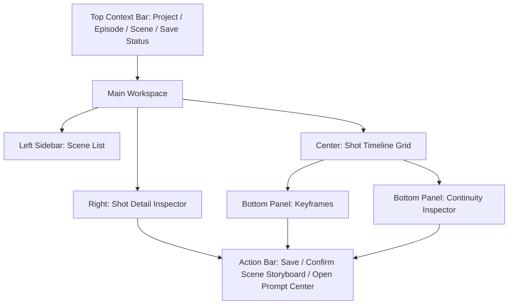
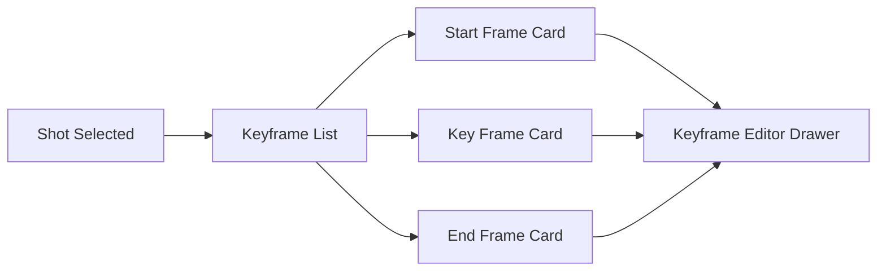

# Storyboard Studio Spec v1.0

## 1. 文档目标

- 将 `分镜导演台` 细化到可直接进入 UI 设计与接口实现的粒度。
- 覆盖页面结构、字段定义、按钮动作、空态、错态、抽屉、弹窗、状态流转和页面原型。
- 以 `CineGen-ShortDrama` 的导演工作台思路为主，但按我们自己的 SSOT 与 contract 重写。

## 2. 模块定位

分镜导演台是平台的核心生产前工作台，用于把：

- `Scene`
- `Shot`
- `Keyframe`
- `Continuity`

组织成可确认、可检查、可进入 Prompt 编译的结构化镜头事实层。

它不负责：

- 直接生成最终 prompt
- 直接创建媒体任务
- 直接改写资产台账

## 3. 页面目标

用户进入该页面后，需要在一个工作台中完成以下动作：

1. 在当前集范围内切换场（本页 **不提供 episode 切换器**：`episodeId` 由上游导航固定携带；跨集需回剧本页 / Dashboard 重新进入，见 §6.3）
2. 查看当前场的 shot 列表
3. 编辑单个 shot 的镜头属性
4. 管理 start / key / end frame
5. 查看 continuity 警告
6. 确认当前场分镜是否可推进到 Prompt 中心

## 4. 页面信息架构

### 4.1 页面区块

分镜导演台页面分为 6 个核心区域：

1. 顶部上下文栏
2. 左侧场景导航栏
3. 中央 shot 时间线 / 网格区
4. 右侧 shot 详情面板
5. 下方关键帧与 continuity 区
6. 全局校验与操作栏

### 4.2 页面布局说明

- 顶部固定显示项目 / 集 / 场上下文。
- 左侧用于场景切换。
- 中间是工作主区，展示 shot 列表。
- 右侧是当前选中 shot 的属性编辑区。
- 下方是 keyframe 和 continuity 面板，可折叠。

## 5. 页面主原型



## 6. 顶部上下文栏规格

### 6.1 展示内容

- 项目名
- 当前集编号与标题
- 当前场编号与标题
- 当前场分镜状态
- 自动保存状态
- 最近保存时间

### 6.2 字段定义

- `projectName`
- `episodeNo`
- `episodeTitle`
- `sceneNo`
- `sceneTitle`
- `storyboardStatus`
  - `draft | confirmed`（持久状态）
- `storyboardStatusSource`
  - 固定来源：`Scene.storyboardStatus`（不是 episode 聚合状态）
- `storyboardReadiness`
  - `incomplete | ready_for_review`（UI 派生态）
- `saveStatus`
  - `saved`
  - `saving`
  - `error`
- `lastSavedAt`

### 6.3 动作

- `切换上一场` / `切换下一场`
  - 仅在当前 `episodeId` 内切换 scene（本页不切集）
- `返回剧本页`
- `打开当前场审查结果`
- `返回 Prompt 中心`
  - 仅当本次进入携带 `returnTo=prompt_center` 时出现（Prompt Center `source_outdated` / source 缺失回跳，见 navigation §6.2）

#### 6.3.1 回跳上下文接收（navigation §6.2 握手）

- 入参：`returnTo=prompt_center`、`keyframeId`（可选）、固定携带的 `projectId` / `episodeId` / `sceneId` / `shotId`。
- 接收行为：
  - 定位并选中 `shotId` 对应 shot；若带 `keyframeId`，同时展开 Keyframes 面板并高亮该 keyframe。
  - 顶部显示 `返回 Prompt 中心` 回跳入口，携带原始上下文。
  - 用户在本页重新 `确认当前场分镜`（§12.3）后，回跳入口可用，回到 Prompt Center 触发重编译。

#### 6.3.2 回跳上下文接收（navigation §6.3 握手，来自 Review Center）

- 入参：`scopeRef=sceneId` / `shotId` + `returnTo=review_center` + 固定 `projectId` / `episodeId`。
- 接收行为：
  - 定位并选中 `scopeRef` 指向的 scene / shot。
  - 顶部显示 `返回审查中心` 回跳入口，携带原始 `scopeRef`。
  - 用户修复后回到审查中心，可将对应 issue 标记 resolved / reopened。
- 与 §6.3.1 的 `返回 Prompt 中心` 互斥展示，以本次进入携带的 `returnTo` 为准。

### 6.4 验收标准

- 切换场景后，全部工作区上下文同步刷新。
- 保存失败时顶部必须明确显示错误状态。

## 7. 左侧场景导航栏规格

### 7.1 功能

- 按当前集展示 scene 列表
- 显示每个 scene 的分镜完成度和问题数量
- 支持切换 scene

### 7.2 每个 scene item 展示字段

- `sceneNo`
- `sceneTitle`
- `locationName`
- `shotCount`
- `storyboardStatus`
- `issueCount`
- `hasUnsyncedChanges`

### 7.3 操作

- 点击场景进入该场
- 快捷创建新 shot
- 查看场景问题摘要

### 7.4 空状态

- 当前集无场景
  - 文案：`当前集还没有场景，请先去剧本页创建 scene。`
  - 动作：`前往剧本页`

## 8. 中央 Shot Timeline Grid 规格

### 8.1 模块目标

- 成为 shot 级操作的主工作区。

### 8.2 视图形态

V1 支持两种视图：

- `timeline view`
- `card grid view`

默认使用 `timeline view`。

### 8.3 Shot 卡片展示字段

每个 shot 卡片展示：

- `shotNo`
- `isKeyShot`
- `shotType`
- `intent`
- `durationSec`
- `version`
- `charactersPreview`
- `lookStatus`
- `keyframeStatus`
- `continuityStatus`
- `promptStatus`
- `productionStatus`

### 8.4 卡片状态说明

- `lookStatus`
  - `ok`
  - `missing`
  - `unsynced`
- `keyframeStatus`
  - `empty`
  - `partial`
  - `ready`
- `continuityStatus`
  - `ok`
  - `warning`
  - `error`
- `promptStatus`
  - `not_compiled`
  - `draft`
  - `confirmed`
- `productionStatus`
  - `idle`
  - `queued`
  - `running`
  - `done`
  - `failed`

### 8.5 支持操作

- 选择 shot
- 拖拽排序
- 新建 shot
- 复制 shot
- 删除 shot
- 标记为关键镜头
- 打开 keyframe 编辑

#### 8.5.1 动作 → 端点强绑定（data-and-api §7.3 / §7.5）

每个动作强绑定到具体端点，均遵守 §17.1 横切契约（写核心事实层的 PATCH / 确认类必带 `version`，错误按 adr-004 信封返回）：

| 动作 | 端点 | 前置条件 | 请求要点 | 响应要点 |
|------|------|----------|----------|----------|
| 新建 shot | `POST /api/scenes/:sceneId/shots` | 当前 scene 存在 | `shotType` / `intent` / `insertPosition`（末尾 / 当前镜头后 / 指定序号） | 返回新建 `Shot`（含 `shotNo` / `version=1` / `sortOrder`），场内后续 shot `sortOrder` 同事务重排 |
| 复制 shot | `POST /api/shots/:shotId/duplicate` | 源 shot 存在 | 无 body（复制其镜头字段与 shot_characters / shot_props；keyframe 不复制状态，新建 shot 的 keyframe 一律回 `draft`） | 返回新 `Shot`，插入源 shot 之后 |
| 删除 shot | `DELETE /api/shots/:shotId` | shot 存在 | body 带当前 `version` | 删除并同事务重排 `sortOrder` / `shotNo`；关联 keyframe / continuity 级联删除 |
| 编辑 shot | `PATCH /api/shots/:shotId` | 见 §9.3 | 见 §9.3（必带 `version`） | 见 §9.3 |
| 标记 / 取消关键镜头 | `PATCH /api/shots/:shotId` | shot 存在 | `isKeyShot` + `version` | `is_key_shot` 仅决定是否强制人工精修 keyframe，不改变 §10.4 门禁 |

- 上述写动作成功后，若当前 `Scene.storyboardStatus=confirmed`，触发 §12.3 回退与下游 prompt 过期传播。

### 8.6 拖拽排序规则

- 只能在当前 scene 内排序
- 绑定端点：`POST /api/scenes/:sceneId/shots/reorder`，请求体为有序 `shotId` 列表
- 服务端按新顺序同事务重算 `sortOrder` 与 `shotNo`（`shotNo` 与 `UNIQUE(scene_id, shot_no)` 一致）
- `shotNo` **不允许在 Inspector 中直接编辑**，只能通过本 reorder 端点变更，避免与唯一约束冲突（见 §9.2 说明）
- reorder 属确认类写动作，请求体携带当前场 `version`；冲突返回 `version_conflict`（见 §17.1）
- 若存在 continuity anchor 关联，需提示用户重新检查
- 排序变更同样触发 §12.3 的场级状态回退与下游传播

### 8.7 空状态

- 当前 scene 没有 shot
  - 文案：`当前场还没有镜头，先生成草稿或手动新建。`
  - 动作：
    - `AI 生成 shot 草稿`
      - 绑定端点：`POST /api/episodes/:episodeId/storyboard/generate`（分镜草稿生成，data-api §7.5）
      - 前置条件：所属集 `scriptStatus=confirmed`（剧本已确认）
      - 该动作为**异步任务**（`storyboard_generate`），进入生成中态；完成后刷新 shot 列表
    - `手动新建第一个 shot`
      - 绑定端点：`POST /api/scenes/:sceneId/shots`（同 §8.5.1）

#### 8.7.1 AI 生成失败态

- 生成失败时按 adr-004 信封展示：`code` 取 `validation_failed`（剧本未确认 / 缺前置）、`provider_unavailable`（模型不可用）、`internal_error` 等
- 文案：`AI 生成分镜草稿失败`，动作：`重试`（`retryable=true` 时可用）、`查看失败原因`

### 8.8 错误状态

- shot 加载失败
  - 文案：`镜头列表加载失败`
  - 动作：`重试`

### 8.9 大列表性能策略

- shot 列表统一走 data-api §7.0 分页约定（`GET /api/scenes/:sceneId/shots` 支持 `page` / `pageSize`，默认 20，最大 100）。
- 单场 shot 数超过阈值（建议 50）时，中央区启用虚拟滚动（仅渲染可视范围卡片），timeline / card grid 两种视图共用同一虚拟化数据源。
- 拖拽排序在虚拟化下仅提交发生位移的连续区间，reorder 请求体仍为完整有序 `shotId` 列表（§8.6）。

## 9. 右侧 Shot Detail Inspector 规格

### 9.1 模块目标

- 编辑当前选中 shot 的核心事实字段。

### 9.2 字段分组

#### A. 基础字段

- `shotNo`
- `shotType`
- `intent`
- `durationSec`

#### B. 镜头语言

- `cameraSize`
  - 特写 / 近景 / 中景 / 全景 / 远景
- `cameraAngle`
  - 平视 / 俯拍 / 仰拍 / 侧拍
- `cameraMovement`
  - 固定 / 推 / 拉 / 摇 / 移 / 跟
- `compositionNotes`

#### C. 表演与动作

- `performanceNotes`
- `actionBeats`
- `emotionTarget`

#### D. 角色与造型

- `shotCharacters[]`
  - `characterId`
  - `lookId`
  - `blockingNote`

#### E. 道具

- `shotProps[]`
  - `propId`
  - `stateNote`

#### F. 起止状态

- `startState`
- `endState`

#### 9.2.1 字段 → 数据列映射（shots 表，data-api §5/§6）

Inspector 字段不与库列一一同名，落库归属如下，避免前后端各拼一套：

- `shotNo`：只读展示，映射 `shots.shot_no`；**不可在 Inspector 直接编辑**，仅由 §8.6 reorder 端点重算（受 `UNIQUE(scene_id, shot_no)` 约束）。
- `shotType` / `intent` / `durationSec`：直接列 `shot_type` / `intent` / `duration_sec`。
- `performanceNotes`：直接列 `performance_notes`。
- 镜头语言（`cameraSize` / `cameraAngle` / `cameraMovement` / `compositionNotes`）+ `actionBeats` / `emotionTarget`：统一落 `camera_plan_json`，内部 schema：

```jsonc
{
  "cameraSize": "close_up | medium_close | medium | full | long",   // 特写/近景/中景/全景/远景
  "cameraAngle": "eye_level | high | low | side",                    // 平视/俯拍/仰拍/侧拍
  "cameraMovement": "static | push | pull | pan | track | follow",   // 固定/推/拉/摇/移/跟
  "compositionNotes": "string",
  "actionBeats": ["string"],
  "emotionTarget": "string"
}
```

- `shotCharacters[]`（`characterId` / `lookId` / `blockingNote`）：落关联表 `shot_characters`。
- `shotProps[]`（`propId` / `stateNote`）：落关联表 `shot_props`。
- `startState` / `endState`：分别落 `start_state_json` / `end_state_json`，结构：

```jsonc
{
  "subject": "string",          // 主体在起/止帧的位置与朝向
  "pose": "string",             // 姿态 / 动作定格
  "gaze": "string",             // 视线方向
  "props": [{ "propId": "id", "state": "string" }],
  "cameraFraming": "string"     // 该帧构图落点
}
```

- `handoffAnchor`（承接上一镜的锚点，不在 Inspector 直接编辑，由 continuity 面板写入）：落 `handoff_anchor_json`，结构对齐 §11.3 `anchorType` / `anchorPayload`。

### 9.3 动作按钮

- `保存 shot`
  - 绑定端点：`PATCH /api/shots/:shotId`
  - 请求体必带最近一次加载的 `version`（adr-003 §5）；服务端仅在版本匹配时写入并 `version += 1`
  - 版本冲突返回 `version_conflict` 信封（含 `currentVersion` 与对象摘要），Inspector 提示 `刷新覆盖 / 比较差异 / 重新编辑`（见 §17.1）
- `重置未保存改动`
- `从上一镜复制角色配置`
- `补齐 look 引用`

### 9.4 校验规则

- `intent` 不能为空
- 至少一个角色或明确标记为空镜
- 若填写 `cameraMovement`，则必须允许填写 `durationSec`
- `lookId` 缺失时不允许进入 confirmed

### 9.5 空状态

- 未选中 shot
  - 文案：`从中间列表选择一个镜头开始编辑。`

## 10. Bottom Panel 1：Keyframes 规格

### 10.1 模块目标

- 管理当前 shot 的 `start / key / end frame`。

### 10.2 Keyframe 列表字段

- `frameType`
  - `start`
  - `key`
  - `end`
- `status`
  - `draft`
  - `confirmed`
- `promptSummary`
- `composition`
- `subjectLayout`
- `backgroundRequirement`

### 10.3 动作

- 新增 keyframe
- 编辑 keyframe
- 删除 keyframe
- 设为 confirmed
- 打开图片 prompt 编译

#### 10.3.1 动作 → 端点绑定（data-api §7.5）

| 动作 | 端点 | 请求要点 |
|------|------|----------|
| AI 生成 keyframe | `POST /api/shots/:shotId/keyframes/generate` | 异步任务（`keyframe_generate`），生成 start/end/key 草稿，状态回 `draft` |
| 查询 keyframe | `GET /api/shots/:shotId/keyframes` | 返回该 shot 全部 `KeyframeSpec` |
| 编辑 / 设为 confirmed | `PATCH /api/keyframes/:keyframeId` | 必带 `version`（adr-003 §5）；`status=confirmed` 走同一端点；冲突返回 `version_conflict` |

- keyframe 的编辑与确认属写核心事实层，遵守 §17.1 横切契约。

### 10.4 keyframe 门禁（可生产 shot 一律 start + end，adr-006 §4）

- **门禁对象是「可生产 shot」**：凡将进入 image / video 生产的 shot，一律要求同时存在 `frameType=start` 与 `frameType=end` 两个 `KeyframeSpec`，且二者 `status=confirmed`。
- **`is_key_shot` 不改变门禁范围**：`is_key_shot` 仅决定是否强制人工精修关键帧；非关键 shot 同样要求 start/end 才可生产，可由 AI 生成后直接确认。
- 该门禁即 data-api §6.2 派生态 `shotProducible`（start + end 均 confirmed → `true`）。
- **落点**：本门禁是场级 `storyboard/validate` / `storyboard/confirm` 的硬校验之一（见 §12.2 / §12.4），保证「已确认的场必然可编译 video」，消除原 §10.4/§12.2 与 Prompt Center §12.2 之间的「已确认但不可编译」静默断链。

### 10.5 空状态

- 文案：`当前镜头还没有关键帧，先建立 start / end frame。`

### 10.6 子原型



## 11. Bottom Panel 2：Continuity Inspector 规格

### 11.1 模块目标

- 显式管理当前镜头与前后镜头之间的承接关系。

### 11.2 展示内容

- 来源镜头
- 承接类型
- 角色连续性
- 服装连续性
- 道具连续性
- 空间连续性
- 动作连续性
- 风险等级

### 11.3 字段定义

- `anchorType`
  - `visual_match`
  - `motion_handoff`
  - `look_continuity`
  - `prop_continuity`
  - `space_continuity`
- `sourceShotId`
- `anchorPayload`
- `strength`
  - `low`
  - `medium`
  - `high`
- `status`
  - `ok`
  - `warning`
  - `error`

### 11.4 动作

- 新建 continuity anchor
  - `POST /api/shots/:shotId/continuity-anchors`
- 编辑 continuity anchor
  - `PATCH /api/continuity-anchors/:anchorId`
- 删除 continuity anchor
  - `DELETE /api/continuity-anchors/:anchorId`
- 从上一镜自动建议 / 运行 continuity 建议生成
  - `POST /api/shots/:shotId/continuity-anchors/suggest`（异步建议生成）

#### 11.4.1 建议生成失败态

- 建议生成失败按 adr-004 信封展示：`code` 取 `provider_unavailable` / `internal_error` / `validation_failed`（缺前置镜头）。
- 文案：`承接建议生成失败`，动作：`重试`（`retryable=true` 时可用）、`手动新建 anchor`。

### 11.5 显示规则

- `error` 用最高优先级展示
- `warning` 可以折叠，但首次进入当前 shot 必须可见

### 11.6 错误类型示例

- 上一镜角色存在，本镜缺失
- 上一镜 look A，本镜引用 look B 且无换装说明
- 上一镜道具状态为“手持”，本镜状态为空

### 11.7 ok / warning / error 判定规则

- **判定产出方**：由场级 `POST /api/scenes/:sceneId/storyboard/validate` 统一计算并回填每个 anchor 的 `status`（`ok | warning | error`）；本页只读展示，不在前端自行判级。深度跨集一致性另由 Review Service 复核（`issueType=continuity`），不覆盖此处场级判级。
- **判定规则集**（按 `anchorType` 与 `strength` 归一）：
  - `error`（高优先级阻塞，对应 §14.4 `blocked`）：角色/空间/动作承接断裂且 `strength=high`——如上一镜在场角色本镜缺失、`look_continuity` 引用了不同 look 且无换装说明、`space_continuity` 与所属 Location `space_rules` 冲突。
  - `warning`：`strength=medium` 的未闭合承接——如 `prop_continuity` 道具状态未接续、`motion_handoff` 缺 start/end 衔接描述。
  - `ok`：anchor 对应的连续性字段已闭合，或 `strength=low` 且无冲突。
- **与门禁关系**：任一 `error` 命中即阻塞 §12.2 `确认当前场分镜`；`warning` 不阻塞但需二次确认（见 §13.3）。

## 12. 全局操作栏规格

### 12.1 操作按钮

- `保存当前场`
- `运行分镜校验`
- `确认当前场分镜`
- `进入 Prompt 中心`

### 12.2 按钮启用条件

- `运行分镜校验`
  - 当前 scene 至少有 1 个 shot
- `确认当前场分镜`
  - 所有 shot 基础字段完整（见 §9.4）
  - 无高优先级 continuity error（§11.7）
  - **该场全部 shot 均通过 keyframe 门禁**：每个 shot 同时存在 `frameType=start` 与 `frameType=end` 且均 `status=confirmed`（`shotProducible=true`，见 §10.4 / adr-006 §4）；`is_key_shot` 不改变此范围
- `进入 Prompt 中心`
  - 当前场分镜状态为 `confirmed`

### 12.3 确认动作后的效果与回退传播

- scene `storyboardStatus` 更新为 `confirmed`；同事务重算所属 `Episode.storyboardStatus`（rollup，data-api §6.2）。
- 当前场允许进入 prompt 编译。
- **回退触发范围**：确认后对该场任一 shot / keyframe / continuity anchor 执行写操作（§8.5.1 增删改、§8.6 reorder、§9.3 保存 shot、§10.3 keyframe 编辑）导致对象 `version` 变更时，`Scene.storyboardStatus` 回退为 `draft`。
- **下游传播链**（对齐 page-state-machine §8.6）：shot / keyframe 的 `version` 变更后，Prompt Center 通过对比 `PromptSpec.source_version_snapshot` 与当前 source `version`，将对应 source 的 confirmed PromptSpec 判为 `source_outdated`（UI 派生态，需重编译）。本页只负责推进 `version` 与场级回退，不直接改写 PromptSpec。

### 12.4 校验 / 确认端点契约（data-api §7.3，adr-006 §4）

- `运行分镜校验` → `POST /api/scenes/:sceneId/storyboard/validate`
  - 返回 `StoryboardValidateResult`（data-api §6.3，权威结构）：该场每个 shot 的 keyframe 门禁校验结果（`keyframeGate`：缺 start / 缺 end / 未 confirmed）、基础字段缺口（`fieldGaps`）、continuity 判级（`continuityStatus`，§11.7）；keyframe 门禁（adr-006 §4）是该结果的 `keyframeGate` 子项，本校验为其超集。
  - 校验动作自身失败（如 source 不存在）按 adr-004 信封返回 `missing_resource` / `internal_error`，页面提示重试。
- `确认当前场分镜` → `POST /api/scenes/:sceneId/storyboard/confirm`
  - 请求体携带当前场 `version`（adr-003 §5）；版本冲突返回 `version_conflict`。
  - keyframe 门禁未全部通过时返回 `invalid_state` 信封，`details` 列出**未达标 shot 列表**（含缺 start / 缺 end / 未 confirmed 原因）；页面据此定位。
  - 存在高优先级 continuity error 时返回 `blocked_by_issue`。
- `进入 Prompt 中心`：携带完整上下文 `projectId` / `episodeId` / `sceneId` / `shotId`（选中 shot），以 `sourceEntityRef` 形式落在具体对象上（对齐 navigation §5.4）。

## 13. 抽屉与弹窗设计

### 13.1 Keyframe Editor Drawer

#### 用途

- 编辑单个 keyframe 详情。

#### 字段

- `frameType`
- `composition`
- `subjectLayout`
- `expressionPose`
- `backgroundRequirement`
- `continuityAnchor`
- `promptSummary`

#### 动作

- `保存`
- `保存并确认`
- `关闭`

### 13.2 Create Shot Modal

#### 用途

- 在当前 scene 下新建 shot。

#### 字段

- `shotType`
- `intent`
- `insertPosition`
  - 当前场末尾 / 当前镜头后 / 指定序号

#### 动作

- `创建`
- `取消`

### 13.3 Confirm Scene Storyboard Modal

#### 用途

- 在确认前展示未完成项和风险项。

#### 展示内容

- 缺失字段数
- warning 数
- error 数
- 未通过 keyframe 门禁的 shot 数（缺 start / 缺 end / 未 confirmed，见 §10.4）
- 重新确认场景（原状态为 `confirmed`）时：下游将过期的 confirmed PromptSpec 数量提示

#### 动作

- `返回修正`
- `忽略 warning 并确认`

#### 规则

- 有 `error` 时不可确认
- 存在未通过 keyframe 门禁的 shot 时不可确认（`confirm` 端点返回 `invalid_state`，见 §12.4）
- 有 `warning` 时可确认，但需二次确认
- **破坏性提示**：当对已 `confirmed` 的场重新确认或修改导致回退时，弹窗必须提示「此操作将使下游对应 prompt 进入 `source_outdated`（过期待重编译）」并要求二次确认（对齐 §12.3 传播链）

## 14. 状态流转

### 14.1 持久状态：Scene Storyboard Status

- `draft`
- `confirmed`

### 14.2 UI 派生态

- `storyboardReadiness`
  - `incomplete`
  - `ready_for_review`

### 14.3 Shot Status 派生规则

shot 状态不单独维护大状态字段，使用派生状态：

- `incomplete`
- `ready`
- `blocked`

### 14.4 派生条件

- `incomplete`
  - 缺少 intent / look / keyframe
- `ready`
  - 基础字段齐全且无 continuity error
- `blocked`
  - 存在高优先级 continuity error

## 15. 页面交互链

### 15.1 标准主链

1. 进入 scene
2. 查看 shot 草稿
3. 编辑 shot
4. 补齐角色、look、道具
5. 建立 keyframe
6. 处理 continuity warning
7. 运行校验
8. 确认当前场分镜
9. 跳转 Prompt 中心

### 15.2 返工链

1. 审查中心发现 continuity 问题
2. 跳回指定 shot
3. 修改 shot / keyframe / continuity
4. 重跑分镜校验
5. 再次确认

## 16. 空态 / 错态总表

### 16.1 无 scene

- 引导回剧本页创建

### 16.2 无 shot

- 引导 AI 生成或手工新建

### 16.3 无 keyframe

- 引导先建立 start / end frame

### 16.4 continuity 报错

- 固定显示错误摘要
- 支持一键定位相关字段

### 16.5 保存失败

- 顶部和右侧 inspector 同时显示错误
- 支持重试

### 16.6 首屏加载态（skeleton）

- 进入本页拉取 scene 导航 / shot timeline / shot detail / keyframes / continuity 快照期间，展示结构化骨架占位，不使用整页 spinner：
  - 顶部上下文栏：路径与状态占位骨架
  - 左侧场景导航栏：3~5 条灰条骨架，保留列表轮廓
  - 中央 Shot Timeline Grid：网格单元骨架，保留时间轴列结构
  - 右侧 Shot Detail Inspector：字段级骨架
  - 底部 Keyframes / Continuity 面板：卡片占位骨架
- 局部刷新（切换 scene/shot、保存后回读、continuity 单独刷新、AI 生成回填）不清空已加载内容，仅对目标区域做局部 loading，避免闪烁与数据丢失
- keyframes 与 continuity 作为独立数据块可与主 timeline 异步加载：timeline 就绪后先展示，底部面板继续骨架直至就绪
- 首屏快照拉取失败时不停留在骨架态，走 §16 错态并提供重试；重试成功后从骨架态平滑切换到真实内容

## 17. 横切契约（乐观锁 / 错误信封 / 状态传播）

本页所有写动作统一遵守 data-api §7.12 横切契约，只引用不另立：

### 17.1 乐观锁与版本冲突（adr-003）

- 写核心事实层的 `PATCH` 与确认类端点（`PATCH /api/shots/:shotId`、`PATCH /api/keyframes/:keyframeId`、`PATCH /api/scenes/:sceneId`、`shots/reorder`、`storyboard/confirm`、`DELETE /api/shots/:shotId`）请求体必带最近加载的 `version`。
- 版本不匹配返回 `version_conflict` 信封（含 `currentVersion` 与对象摘要），提供三动作：`刷新覆盖本地视图` / `比较差异` / `重新编辑`。
- continuity anchor / task / activity 等 append-only 或建议类写入不走乐观锁。

### 17.2 错误信封（adr-004）

- 所有 `POST/PATCH/DELETE` 业务错误按 `ApiErrorEnvelope` 返回，`code` 限定于 adr-004 §4 必备错误码。
- 本页高频 `code`：`validation_failed`（字段校验）、`version_conflict`（并发）、`invalid_state`（keyframe 门禁未过）、`blocked_by_issue`（continuity error）、`missing_resource`（对象不存在）、`provider_unavailable` / `internal_error`（AI 生成 / 建议失败）。

### 17.3 状态传播

- 场级 `version` 变更 → `Scene.storyboardStatus` 回退 → 下游 confirmed PromptSpec 判为 `source_outdated`（见 §12.3），全链以对象 `version` 与 `source_version_snapshot` 对比驱动，不引入额外标志位。

## 18. 页面级验收标准

- 用户可在单页内完成当前场分镜从 `draft` 到 `confirmed` 的全部动作。
- 所有 continuity error 都能定位到 shot / look / prop / state。
- 已 `confirmed` 的场必然通过 keyframe 门禁（全部 shot start/end 均 confirmed），保证可直接编译 video。
- 确认后能直接进入 Prompt 中心并带全上下文。
- 修改已确认分镜后，状态会自动回退并驱动下游 prompt 过期，避免脏数据继续生产。

## 19. 接口映射（动作 → 端点强绑定）

> 由「建议」升级为强绑定：每个页面动作对应 data-api §7.3 / §7.5 的真实端点。

- 场导航 / 列表
  - `GET /api/episodes/:episodeId/scenes`（左侧场列表）
  - `GET /api/scenes/:sceneId/shots`（中央 shot 列表，支持分页）
- shot 增删改 / 排序 / 复制（§8.5.1 / §8.6）
  - `POST /api/scenes/:sceneId/shots`（新建）
  - `PATCH /api/shots/:shotId`（保存 / 标记关键镜头，必带 version）
  - `DELETE /api/shots/:shotId`（删除，必带 version）
  - `POST /api/shots/:shotId/duplicate`（复制）
  - `POST /api/scenes/:sceneId/shots/reorder`（拖拽排序）
- AI 生成分镜草稿（§8.7）
  - `POST /api/episodes/:episodeId/storyboard/generate`
- keyframe（§10.3.1）
  - `POST /api/shots/:shotId/keyframes/generate`
  - `GET /api/shots/:shotId/keyframes`
  - `PATCH /api/keyframes/:keyframeId`（编辑 / 设为 confirmed，必带 version）
- continuity（§11.4）
  - `GET /api/shots/:shotId/continuity-anchors`
  - `POST /api/shots/:shotId/continuity-anchors`
  - `PATCH /api/continuity-anchors/:anchorId`
  - `DELETE /api/continuity-anchors/:anchorId`
  - `POST /api/shots/:shotId/continuity-anchors/suggest`
- 场级校验 / 确认（§12.4）
  - `POST /api/scenes/:sceneId/storyboard/validate`
  - `POST /api/scenes/:sceneId/storyboard/confirm`（必带 version）
- 场复制
  - `POST /api/scenes/:sceneId/duplicate`

## 20. 一句话结论

- 分镜导演台不是“镜头列表页”，而是平台里最核心的生产前工作台：它负责把 story、asset 和未来 prompt / task 之间的桥真正搭稳。
